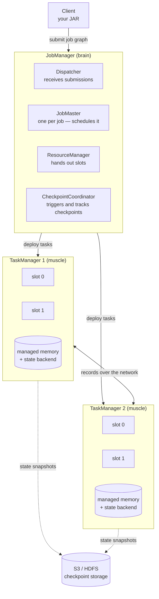

# Flink architecture

<PageMeta level="beginner" time="10 min" prereq={[['Flink in the ecosystem', '/docs/flink/foundations/flink-in-the-ecosystem']]} docs="docs/concepts/flink-architecture/" />

<Objectives>

- Name the two kinds of process in a Flink cluster and what each one owns
- Explain a task slot without using the word "thread pool"
- Predict what happens to a running job when each type of process dies

</Objectives>

## What is it?

A Flink cluster is exactly two kinds of process.

**One JobManager** — the brain. It decides things and remembers nothing about
your data.

**Many TaskManagers** — the muscle. They hold your data and your state and do all
the actual work.



<Callout type="mental">

The JobManager is an **air traffic controller**. It never touches a plane. It
knows where every plane is, tells them where to go, and notices when one stops
responding.

The TaskManagers are the **planes**. They carry the cargo. If one goes down, the
controller reroutes — but only if it wrote down where that plane was.

That "writing down" is checkpointing, and it is why the JobManager holding no
data is safe: the data's durable copy lives in S3, not in the brain.

</Callout>

## The JobManager, component by component

It is one process, but four responsibilities worth separating in your head —
because failure messages name them individually.

| Component | Job | You see it when |
| --- | --- | --- |
| **Dispatcher** | Accepts job submissions, serves the Web UI, spawns a JobMaster per job | Submitting a job; the REST API |
| **JobMaster** | Owns exactly one job: builds the execution graph, schedules tasks, handles failures | "Job failed, restarting (attempt 2/3)" |
| **ResourceManager** | Tracks free task slots, requests new TaskManagers from Kubernetes/YARN | `NoResourceAvailableException` — the single most common first-deploy error |
| **CheckpointCoordinator** | Triggers checkpoints, collects acknowledgements, declares them complete | Every line in the Checkpoints tab |

## The TaskManager

A TaskManager is a JVM. It has:

- **Task slots** — a fixed number of slots, configured with `taskmanager.numberOfTaskSlots`
- **Managed memory** — off-heap memory Flink controls, used by RocksDB and by sorting/hashing
- **Network buffers** — the pools that carry records between tasks (and whose exhaustion *is* [backpressure](/docs/flink/scale/backpressure))
- **A state backend** — where your keyed state actually lives

### What a task slot actually is

This is the most misunderstood concept in Flink, so let us be precise.

<Callout type="key">

A task slot is **a fixed share of the TaskManager's memory**, not a fixed share
of its CPU.

A TaskManager with 4 slots divides its managed memory into 4 equal parts. It does
**not** reserve one core per slot. Slots isolate memory from each other; they
share CPU freely.

</Callout>

Consequences that trip people up:

- Two slots on one TaskManager cannot starve each other of *memory*. They absolutely can starve each other of *CPU*.
- More slots per TaskManager = fewer JVMs = less memory overhead, and tasks in the same TaskManager can exchange data in-process instead of over the network.
- Fewer slots per TaskManager = better isolation, and one crashing task takes fewer other tasks with it.
- A common starting point is **slots = cores per TaskManager**. Then measure.

### Slot sharing: why parallelism 4 does not need 12 slots

By default, subtasks of *different* operators from the *same* job can share one
slot. A pipeline `source → map → window → sink` at parallelism 4 does not need 16
slots — it needs **4**.

```text
slot 0:  source[0] → map[0] → window[0] → sink[0]
slot 1:  source[1] → map[1] → window[1] → sink[1]
slot 2:  source[2] → map[2] → window[2] → sink[2]
slot 3:  source[3] → map[3] → window[3] → sink[3]
```

<Callout type="key">

**The number of slots a job needs equals the parallelism of its highest-parallelism
operator** — not the sum of all parallelisms.

</Callout>

Slot sharing also balances load: a slot ends up with a mix of cheap operators
(source) and expensive ones (window), rather than one slot holding four copies of
the expensive one.

## What happens when things die

This table is worth remembering; it comes up in interviews constantly.

| What dies | Immediate effect | Recovery |
| --- | --- | --- |
| **A TaskManager** | Its tasks fail; the JobMaster fails the job (or just the affected failover region) | Redeploy tasks, restore state from the last checkpoint, rewind sources. Data is safe. |
| **The JobManager, no HA** | The job dies. Nobody is scheduling or triggering checkpoints. | Manual restart from the last **retained** checkpoint or a savepoint. This is why `execution.checkpointing.externalized-checkpoint-retention` matters. |
| **The JobManager, with HA** | A standby acquires the leader lock and recovers job state from the HA store (ZooKeeper or Kubernetes ConfigMaps) | Automatic. The job resumes from the last completed checkpoint. |
| **Checkpoint storage (S3)** | Checkpoints start failing; the job keeps *processing* | It will keep running until the tolerable-failure threshold is exceeded, then fail. Alert on checkpoint failures, not just on job status. |

<Callout type="mistake">

Running production without JobManager high availability. Without it, the
JobManager is a single point of failure for the *whole cluster*, and a routine
node rotation takes down every job on it.

On Kubernetes, `high-availability.type: kubernetes` needs no ZooKeeper — it uses
ConfigMaps for leader election and metadata. There is very little excuse to skip
it.

</Callout>

## Deployment modes

Three ways to arrange the same pieces. Choose per environment.

<Compare>
  <CompareCard title="Application mode" rows={[
    ['Shape', 'One cluster per job; the JobManager runs your main() method'],
    ['Isolation', 'Complete — a crash affects one job'],
    ['Startup', 'Slower: a cluster spins up per job'],
    ['Use for', 'Production. This is the default recommendation.'],
  ]} />
  <CompareCard title="Session mode" rows={[
    ['Shape', 'A long-running cluster; submit many jobs into it'],
    ['Isolation', 'Weak — jobs share TaskManagers and can affect each other'],
    ['Startup', 'Fast: the cluster is already warm'],
    ['Use for', 'Development, ad-hoc SQL, short interactive jobs'],
  ]} />
</Compare>

Per-job mode existed in Flink 1.x and is **deprecated/removed in favour of
application mode** — if you see it in older docs, read "application mode".

<Callout type="hood" title="The path from submit to running">

```text
1. Client runs your main() → builds a StreamGraph
2. StreamGraph → JobGraph  (operator chaining is decided here)
3. JobGraph shipped to the Dispatcher
4. Dispatcher spawns a JobMaster for this job
5. JobMaster expands JobGraph → ExecutionGraph (one node per SUBTASK)
6. JobMaster asks ResourceManager for slots
7. ResourceManager returns slot offers (starting TaskManagers if needed)
8. Tasks deployed to slots; each opens its input and output network channels
9. Sources start reading; records move
10. CheckpointCoordinator starts its timer
```

Steps 1–3 happen in the client (or in the JobManager, in application mode).
Steps 5–8 are where `NoResourceAvailableException` lives.

Detail on steps 1, 2 and 5 is in
[From code to cluster](/docs/flink/basics/from-code-to-cluster).

</Callout>

<Expert>

**Failover regions.** The JobMaster does not always restart the whole job. It
computes *pipelined regions* — maximal subgraphs connected by pipelined
exchanges — and restarts only the affected region. In a streaming job everything
is usually pipelined, so the region is the whole graph and full restart is the
norm. In batch mode, blocking exchanges split the graph into many regions, so a
single stage can be re-run alone.

**Slot sharing groups.** `slotSharingGroup("heavy")` forces an operator into its
own group so it does *not* share a slot with the rest of the pipeline. Use it
when one operator has a genuinely different memory profile — an Async I/O
operator with a huge in-flight capacity, or a join with a large state — so it
gets its own memory budget instead of competing inside a shared slot.

**Adaptive scheduler.** Flink can adjust parallelism to available resources at
runtime (`jobmanager.scheduler: adaptive`), and this is the foundation for
autoscaling with the Kubernetes Operator. It changes the "parallelism is fixed at
submit time" assumption — the job rescales itself from a checkpoint when
resources change.

</Expert>

<Callout type="remember">

JobManager = brain, holds no data. TaskManager = muscle, holds all the data. A
task slot is a memory share, not a CPU share. A job needs as many slots as its
widest operator, because subtasks share slots.

</Callout>

## Next

**[Parallelism and subtasks](/docs/flink/basics/parallelism-and-subtasks)** — what `setParallelism(8)` actually does.
