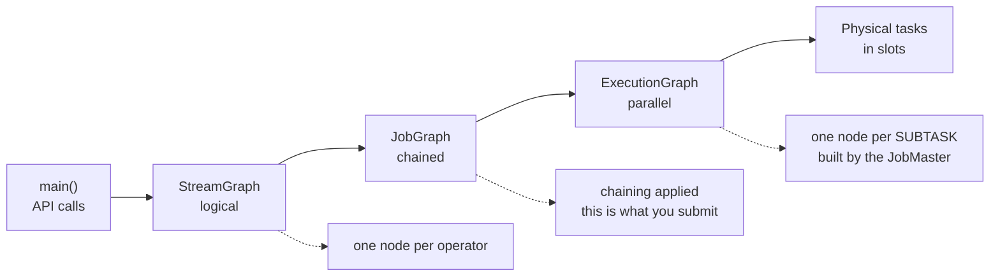

# From code to cluster

<PageMeta level="intermediate" time="8 min" prereq={[['Parallelism and subtasks', '/docs/flink/basics/parallelism-and-subtasks']]} docs="docs/concepts/flink-architecture/" />

<Objectives>

- Explain why a `map()` call does not run your map function
- Name the three graph representations and what each one adds
- Read a Flink UI job graph and know which representation you are looking at

</Objectives>

## The thing that confuses everyone first

```java
DataStream<String> s = env.fromSource(...);
s.map(x -> {
    System.out.println("mapping " + x);   // this NEVER prints here
    return x.toUpperCase();
});
// nothing has run. nothing at all.
env.execute("my job");                    // now it runs — somewhere else
```

Your `main()` method does not process data. It **builds a description of a
dataflow**. Every `.map()`, `.keyBy()`, `.window()` call adds a node to a graph
held in memory. `env.execute()` serialises that graph, ships it to the cluster,
and the cluster runs it on machines that are not this one.

<Callout type="mental">

Writing a Flink job is writing a **recipe**, not cooking.

`main()` writes the recipe. `execute()` posts it to a kitchen. The kitchen has
many cooks (subtasks) who have never met you and cannot see any variable that was
not written into the recipe.

</Callout>

This explains the single most common beginner error:

```java
int threshold = loadFromConfig();       // runs on the CLIENT
List<String> results = new ArrayList<>();

stream.filter(x -> x.value > threshold) // threshold is SERIALIZED into the job ✅
      .map(x -> { results.add(x); return x; });  // ❌ adds to the CLIENT's list,
                                                 //    on a different machine,
                                                 //    which nobody ever reads
```

`threshold` works because it is a value captured into the serialised closure.
`results` does not work because each subtask gets its **own deserialised copy** of
that list on its own machine. The client's list stays empty forever.

<Callout type="mistake">

Anything a lambda or function object touches must be `Serializable`, and any
mutation it performs is local to one subtask on one machine. If you want data to
come back, it must go through a **sink**. If you want data to be remembered, it
must go into **state**.

</Callout>

## The three graphs

Your program is transformed three times on its way to running.



### 1. StreamGraph — logical

Built in the client as you call the API. One node per operator, edges carry the
partitioning strategy. Nothing about parallel instances yet.

### 2. JobGraph — chained

The StreamGraph is optimised into a JobGraph. The important step here is
**operator chaining**: consecutive operators that can share a thread are fused
into one `JobVertex`.

This is the artifact that gets shipped to the cluster. It is also what the Flink
UI shows you as the job graph — which is why the UI shows fewer boxes than you
wrote operators.

### 3. ExecutionGraph — parallel

Built by the JobMaster. Each `JobVertex` is expanded into *parallelism*
`ExecutionVertex` instances — one per subtask — with concrete input and output
channels between them.

This is the graph that gets scheduled onto slots, and the one that gets restarted
on failure.

```text
StreamGraph        JobGraph              ExecutionGraph (parallelism 2)

source             ┌──────────────┐      [source→map 0] ──▶ [window 0]
  │                │ source → map │      [source→map 1] ──▶ [window 1]
map                └──────┬───────┘
  │  keyBy                │ keyBy
window                ┌───▼────┐
                      │ window │
                      └────────┘
```

## Reading a job graph in the UI

Given a box in the Flink UI labelled:

```text
Source: kafka-orders → Map → Filter
Parallelism: 8
```

You now know: this is **one JobVertex** containing **three chained operators**,
running as **8 subtasks**, each in its own thread, with no serialisation between
the three operators.

And a box on its own after a `keyBy` edge is a separate JobVertex — the chain was
broken because records had to be repartitioned across the network.

<Callout type="hood" title="Where the operator name comes from">

The `→` names in the UI are the chained operators' names concatenated. Set them
explicitly and your metrics, logs and UI become dramatically easier to read:

```java
stream.map(new Parse()).name("parse-order").uid("parse-order")
      .filter(new Valid()).name("drop-invalid").uid("drop-invalid");
```

`name()` is cosmetic. **`uid()` is not** — it is the identity Flink uses to match
state in a savepoint back to an operator. Without an explicit `uid()`, Flink
generates one from the graph structure, so *adding an unrelated operator upstream
changes the generated uid and your savepoint no longer restores*.

Set `uid()` on every stateful operator, from day one. It costs nothing now and it
is the difference between a routine upgrade and a lost afternoon later. See
[savepoints](/docs/flink/fault-tolerance/savepoints).

</Callout>

<Expert>

**Where main() runs depends on the deployment mode.** In *session* mode the
client runs `main()` and ships the JobGraph. In *application* mode the JobManager
runs `main()` itself — which means client-side work (reading config files,
resolving schemas) happens on the JobManager, and any file your `main()` reads
must exist there.

**Lazy evaluation has a cost you can see.** Because the graph is built before
anything runs, Flink can apply whole-graph optimisations — chaining, slot sharing
groups, and in the Table API a full cost-based optimiser that may reorder joins
and push filters into sources. It also means an error in your topology (an
unserialisable field, a type it cannot infer) surfaces at `execute()`, not at the
line that caused it. Read those stack traces from the bottom.

**Type erasure.** Flink needs a `TypeInformation` for every stream to pick a
serialiser. Java generics are erased, so lambdas sometimes lose it, producing
`The generic type parameters of 'Collector' are missing`. Fix with an explicit
type hint:

```java
.returns(Types.TUPLE(Types.STRING, Types.LONG))
```

More in [serialization](/docs/flink/state/serialization-and-evolution).

</Expert>

<Callout type="remember">

`main()` builds a graph; it does not process data. StreamGraph → JobGraph
(chaining) → ExecutionGraph (subtasks). Set `uid()` on every stateful operator
before your first production deploy.

</Callout>

## Next

**[Your first job](/docs/flink/basics/first-job)** — a complete, runnable pipeline.
