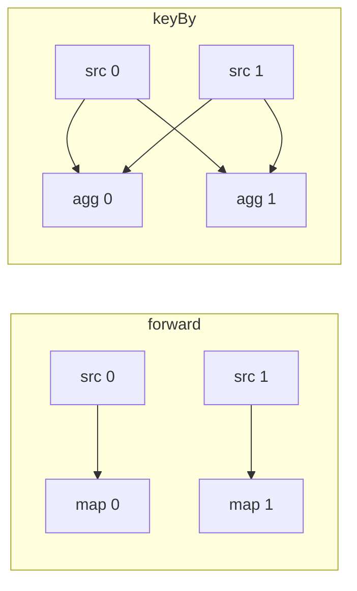

# Parallelism and subtasks

<PageMeta level="beginner" time="11 min" prereq={[['Architecture', '/docs/flink/basics/architecture']]} docs="docs/dev/datastream/execution/parallel/" />

<Objectives>

- Distinguish an operator from a subtask, and a task from a slot
- Explain why operator chaining is the single biggest performance feature in Flink
- Choose between `rebalance`, `rescale`, `shuffle`, `forward` and `keyBy` deliberately

</Objectives>

## Operator vs subtask

You write **operators**. Flink runs **subtasks**.

```java
stream.map(new Parse())      // ONE operator
      .setParallelism(4);    // FOUR subtasks
```

```text
              Operator: Parse
                     │
      ┌──────────┬───┴───┬──────────┐
   Parse[0]   Parse[1] Parse[2]  Parse[3]      ← subtasks
```

Each subtask is:

- an independent instance of your function object
- running in its own thread
- on some TaskManager
- with its **own slice of the state** — subtask 2 cannot see subtask 1's state, ever

<Callout type="key">

The subtask is the unit of everything that matters: parallelism, state ownership,
checkpointing, metrics, and failure.

When a metric says `numRecordsIn`, it is per subtask. When state is snapshotted,
it is per subtask. When something is skewed, it is one subtask.

</Callout>

## Setting parallelism: four levels

From weakest to strongest — the more specific one wins.

```java
// 1. Cluster default (config.yaml)
parallelism.default: 4

// 2. Per submission
flink run -p 8 my-job.jar

// 3. Per job, in code
env.setParallelism(8);

// 4. Per operator — the strongest
stream.map(...).setParallelism(16)
      .addSink(...).setParallelism(2);
```

Per-operator parallelism is not a micro-optimisation. Two very common cases:

- **Sinks lower than the pipeline.** A JDBC sink at parallelism 64 means 64 connections to a database that wanted 8. Set the sink to 8.
- **Sources capped by the input.** A Kafka source at parallelism 32 against a 12-partition topic gives you 12 working subtasks and 20 permanently idle ones — which will also [stall your watermarks](/docs/flink/watermarks/propagation-and-idleness) unless you configure idleness.

<Callout type="mistake" title="Parallelism is not the number of machines">

`setParallelism(64)` on a cluster with 8 cores does not make anything faster. It
creates 64 threads competing for 8 cores, adds 64 sets of network buffers, 64
state partitions to checkpoint, and more serialisation on every shuffle.

Parallelism is **how many independent slices the work is cut into**. It should be
driven by input partitions, state size, and available cores — not by ambition.

</Callout>

## Operator chaining — why your job is faster than it looks

Look at the Flink UI and you will see fewer boxes than operators you wrote. That
is chaining, and it matters enormously.

```text
WITHOUT chaining                    WITH chaining (the default)

source[0]  ──serialize──▶           ┌─────────────────────────┐
            network                 │ source[0] → map[0]      │
map[0]     ──serialize──▶           │        → filter[0]      │
            network                 │        (one thread,     │
filter[0]                           │         method calls)   │
                                    └─────────────────────────┘

3 threads, 2 serialisation          1 thread, zero serialisation,
round-trips, 2 buffer handoffs      zero network, zero buffers
```

Chained operators run **in the same thread, passing objects by method call**. No
serialisation, no network, no buffers. This is routinely a several-times
throughput difference — it is the biggest single performance feature in the
runtime.

Flink chains two operators when **all** of these hold:

1. They have the same parallelism
2. The connection between them is `FORWARD` (no repartitioning)
3. They are in the same slot sharing group
4. Chaining is not explicitly disabled

Which means: **`keyBy` always breaks a chain**, because it repartitions. Every
`keyBy` in your job is a serialisation boundary and a network hop.

```java
// Deliberately break a chain — e.g. to isolate a slow operator in the UI,
// or to give a CPU-heavy operator its own thread
stream.map(new Heavy()).startNewChain();
stream.map(new VerySlow()).disableChaining();
env.disableOperatorChaining();   // whole job — debugging only, never production
```

<Callout type="prod">

Disabling chaining globally is a legitimate *debugging* move: it makes every
operator visible separately in the UI so you can see exactly which one is busy.
It is never a production setting. Turn it back off before you deploy.

</Callout>

## How records get from one operator to the next

Five strategies. Choosing wrongly is a common and expensive mistake.

| Strategy | What it does | Cost | Use when |
| --- | --- | --- | --- |
| `forward` | Subtask *i* → subtask *i* | Free (chainable) | Default when parallelism matches |
| `keyBy(k)` | Hash of the key decides the target subtask | Network + serialisation | You need all records for a key together — **required** for keyed state |
| `rebalance()` | Round-robin across all downstream subtasks | Full network shuffle | Fixing skew after an uneven source |
| `rescale()` | Round-robin, but only within a local subset | Cheaper — often stays on the same machine | Same as rebalance, when a full shuffle is not needed |
| `broadcast()` | Every record to every downstream subtask | Parallelism-times amplification | Small config/rules streams — see [broadcast state](/docs/flink/state/operator-and-broadcast-state) |



<Callout type="mistake">

Adding `rebalance()` "to spread the load" before a `keyBy`. The `keyBy`
immediately repartitions by hash anyway, so the rebalance did nothing except add
a full network shuffle and a serialisation round-trip to every record.

</Callout>

## Try it: keys, subtasks, and skew

The lab below uses Flink's real hashing. Set parallelism and watch how your keys
land — and what happens to that mapping when you rescale.

<KeyByLab />

Things worth doing in it:

- Set parallelism to 3 with the default keys. Notice the distribution is **not** even. Hash partitioning is only even *in expectation*, and with few keys the variance is large.
- Add a key that dominates your traffic (say `guest`) and imagine it is 40% of records. Every record for it goes to one subtask. That is skew, and no amount of parallelism fixes it — see [performance](/docs/flink/scale/performance) for the two-phase aggregation workaround.
- Change parallelism from 3 to 5 and look at how many keys move. Those keys' state must be physically relocated during [rescaling](/docs/flink/fault-tolerance/rescaling).

<Callout type="hood" title="Key groups: the reason rescaling is possible at all">

Flink does **not** map a key directly to a subtask. There is a level of
indirection:

```text
key  ──hash──▶  key group  ──range──▶  subtask
                (0 … maxParallelism-1)
```

- `keyGroup = murmurHash(key.hashCode()) % maxParallelism`
- `subtask  = keyGroup * parallelism / maxParallelism`

Key groups are the **atomic unit of state redistribution**. On rescale, Flink
hands each new subtask a contiguous *range* of key groups, so it can move state
in bulk without rehashing individual keys.

`maxParallelism` therefore has two hard consequences:

1. It is the **hard ceiling** on parallelism, forever.
2. It is **fixed at the first checkpoint and cannot be changed** without discarding state.

Default is 128 for parallelism ≤ 128, otherwise rounded up. Set it explicitly —
`env.setMaxParallelism(720)` is a good default because 720 divides evenly by many
useful numbers, giving balanced key-group ranges at many parallelisms. Too high
(say 32768) and you pay metadata overhead on every checkpoint.

</Callout>

<Expert>

**Why `numberOfTaskSlots` and parallelism interact.** With slot sharing, a job at
parallelism *P* needs *P* slots. With *S* slots per TaskManager you need
`ceil(P/S)` TaskManagers. If you set parallelism to a number that does not divide
evenly, the last TaskManager is partly idle — you pay for a whole pod to run two
subtasks.

**Chaining and checkpoint alignment.** Chained operators share a thread, so a
barrier passes through the whole chain instantly — there is no channel to align.
Longer chains therefore mean fewer alignment points and shorter checkpoints.
Another reason not to disable chaining in production.

**The mailbox model.** Each task runs a single-threaded mailbox loop that
interleaves record processing with control actions (checkpoint triggers, timer
firing, watermark handling). This is why user code must never block: a blocking
call in `map()` blocks the mailbox, which blocks checkpoint barriers, which turns
a slow database call into a checkpoint timeout. That is the reason
[Async I/O](/docs/flink/scale/async-io) exists.

</Expert>

<Callout type="remember">

Operators are what you write; subtasks are what runs, and the subtask owns the
state. Chaining removes serialisation and is why your job is fast. `keyBy` breaks
chains and forces a shuffle — spend them deliberately. And set `maxParallelism`
before your first production checkpoint, because you cannot change it afterwards.

</Callout>

## Next

**[From code to cluster](/docs/flink/basics/from-code-to-cluster)** — the three graphs your program becomes.
