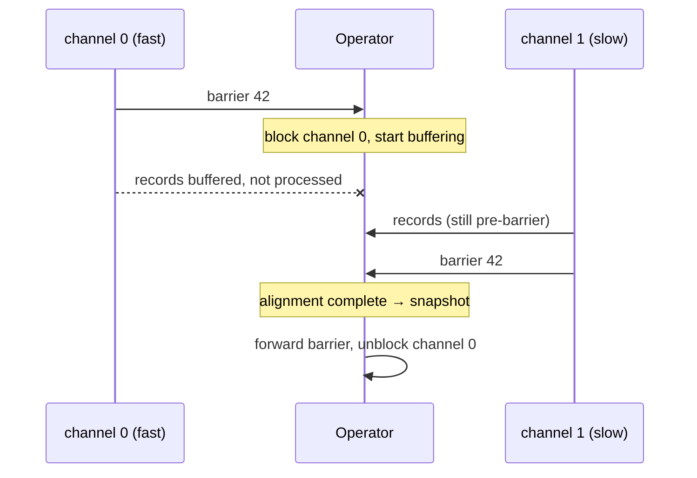
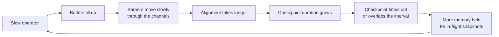

# Barriers and alignment

<PageMeta level="expert" time="12 min" prereq={[['Checkpoints', '/docs/flink/fault-tolerance/checkpoints']]} />

<Objectives>

- Explain alignment precisely, including what happens to the fast channel
- State the exact trade-off between aligned and unaligned checkpoints
- Diagnose a high alignment duration and choose the right remedy

</Objectives>

## The barrier

A checkpoint barrier is a special record injected by the sources, carrying a
checkpoint ID. It travels in the normal data channels, in order, with your
records.

```text
Source output stream:

  … r8  r7  r6  ‖42‖  r5  r4  r3 …
                 ▲
                 barrier for checkpoint 42

  Everything to the RIGHT of the barrier (r5, r4, r3, and earlier)
  is INCLUDED in checkpoint 42.
  Everything to the LEFT (r6, r7, r8) is NOT.
```

<Callout type="key">

The barrier defines the **cut**. Not a moment in time — a position in the stream.

Because the barrier travels in-order in every channel, "before the barrier" is
well-defined at every operator independently, even though those operators process
it at different wall-clock times. That is what makes the snapshot consistent
without a global pause.

</Callout>

## Alignment: the case with two inputs

One input is easy — the barrier arrives, you snapshot. With two or more inputs,
they will not arrive simultaneously.

```text
Time →

channel 0:  … c  b  a  ‖42‖  z  y  x        ← barrier arrives EARLY
channel 1:  … f  e  d   c    b  a  ‖42‖     ← barrier arrives LATE

The operator has received the barrier on channel 0 but not channel 1.
```

If it snapshots now, its state includes `z, y, x` from channel 0 — records that
are *after* the barrier and therefore should not be in checkpoint 42. On restore,
those records would be replayed from the source and counted **twice**.

### Aligned checkpointing

The operator stops consuming channel 0 and buffers whatever arrives there, until
the barrier arrives on channel 1 too.

```text
1. barrier arrives on channel 0  → BLOCK channel 0, buffer its records
2. keep consuming channel 1      → looking for its barrier
3. barrier arrives on channel 1  → alignment complete
4. snapshot state                → contains exactly the pre-barrier prefix of BOTH
5. forward barrier downstream
6. unblock channel 0, process the buffered records
```

The wait in steps 1–3 is the **alignment**, and its duration is the
`checkpointAlignmentTime` metric.



<Callout type="mental">

Alignment is **waiting at a level crossing**.

Two roads merge. A marker has come down one road, but not the other. To photograph
"everything that passed before the marker", you must hold the first road until the
second one's marker arrives.

If the second road is congested, you wait a long time — and traffic backs up on the
first road while you do. That backup is the checkpoint's contribution to
backpressure, and it is exactly why alignment duration and backpressure appear
together.

</Callout>

## Why alignment hurts under backpressure

```text
Healthy job:        alignment = 5–50 ms       (negligible)
Back-pressured job: alignment = 30 s – minutes (dominant)
```

The mechanism is a feedback loop, and it is vicious:



A job that is 20% over capacity does not degrade 20%. It can spiral into
checkpoint timeouts and then into restart loops.

## Unaligned checkpoints

The fix: **do not wait**. Snapshot the in-flight data instead.

```java
env.getCheckpointConfig().enableUnalignedCheckpoints(true);
```

```text
1. barrier arrives on channel 0
2. IMMEDIATELY forward it downstream — overtaking buffered records
3. snapshot operator state
   AND snapshot the in-flight records in ALL input/output buffers
4. done — no waiting for channel 1 at all
```

On restore, those in-flight records are injected back into the channels, so no data
is lost and nothing is duplicated.

<Compare>
  <CompareCard title="Aligned (default)" rows={[
    ['Checkpoint size', 'State only — smaller'],
    ['Duration when healthy', 'Fast'],
    ['Duration under backpressure', 'Very slow — grows with the bottleneck'],
    ['Extra I/O', 'None'],
    ['Recovery', 'Simple; faster'],
    ['Use when', 'The job is not back-pressured, which should be the normal case'],
  ]} />
  <CompareCard title="Unaligned" rows={[
    ['Checkpoint size', 'State + all in-flight buffers — larger'],
    ['Duration when healthy', 'Similar, slightly more I/O'],
    ['Duration under backpressure', 'Roughly CONSTANT — this is the point'],
    ['Extra I/O', 'Writes buffered records on every checkpoint'],
    ['Recovery', 'Must re-inject in-flight data; slower'],
    ['Use when', 'Backpressure is unavoidable, or during backfills'],
  ]} />
</Compare>

<Callout type="key">

Unaligned checkpoints do not make a back-pressured job faster. They make its
**checkpoint duration independent of the backpressure**, so the job can still
recover instead of spiralling into timeouts.

They treat the symptom, deliberately and usefully. The disease is still the
bottleneck operator.

</Callout>

### The setting you actually want

```yaml
execution.checkpointing.unaligned.enabled: true
execution.checkpointing.aligned-checkpoint-timeout: 30s
```

Start every checkpoint **aligned**. If alignment exceeds 30 seconds, switch that
checkpoint to unaligned mid-flight.

You get cheap, small checkpoints when the job is healthy, and automatic protection
when it is not. For most production jobs this is the right configuration.

<Callout type="mistake">

Enabling unaligned checkpoints unconditionally and forgetting about the
backpressure. Checkpoints stop failing, the alert clears, and the job is still
running at 60% of the throughput it should — now with larger checkpoints and slower
recovery.

Unaligned checkpoints buy you time to fix the bottleneck. Use the time.

</Callout>

### Limitations worth knowing

- **Not supported with `AT_LEAST_ONCE`** mode (there is no reason to want it there).
- **Not supported for broadcast channels** — a job with broadcast state falls back to aligned on those edges.
- **Larger recovery cost**, because in-flight data must be re-injected.
- **Interaction with concurrent checkpoints**: unaligned checkpoints require `maxConcurrentCheckpoints = 1`.

## Barriers with multiple sources

Every source subtask injects its own barrier for checkpoint 42. Downstream
operators align across all of them.

```text
source[0] ──‖42‖──┐
source[1] ──‖42‖──┼──▶ operator (aligns across 3 channels) ──‖42‖──▶ …
source[2] ──‖42‖──┘
```

**The slowest source subtask determines the checkpoint's start delay for the whole
job.** A single overloaded source subtask — reading a hot Kafka partition, say —
makes checkpoints slow everywhere downstream of it, even though every other subtask
is idle. This is the same "minimum across inputs" dynamic as
[watermarks](/docs/flink/watermarks/propagation-and-idleness), and it has the same
diagnostic approach: find the one subtask that is behind.

<Callout type="hood" title="AT_LEAST_ONCE mode skips alignment entirely">

```java
cfg.setCheckpointingMode(CheckpointingMode.AT_LEAST_ONCE);
```

The operator does not block the fast channel and does not snapshot in-flight data.
Post-barrier records get folded into the snapshot, so on restore they are processed
a second time. Faster and simpler; duplicates on recovery.

Since unaligned exactly-once checkpoints exist, `AT_LEAST_ONCE` has a much smaller
niche than it used to. It is still occasionally right for jobs where duplicates are
genuinely harmless — say a metrics pipeline feeding an idempotent time-series store
— and where you want the absolute minimum checkpoint overhead.

</Callout>

<Expert>

**Chained operators have no alignment.** Operators in the same chain share a thread
and pass records by method call, so there is no channel and no barrier to align.
Longer chains mean fewer alignment points. Another reason not to disable chaining.

**Barrier handling lives in `CheckpointBarrierHandler`.** `SingleCheckpointBarrierHandler`
tracks which channels have delivered the barrier and drives the switch to unaligned
when the timeout fires. Metrics from here (`checkpointStartDelayNanos`,
`checkpointAlignmentTime`) are the ones in the UI.

**Chandy–Lamport, adapted.** The classic algorithm records channel state for
*every* channel. Flink's aligned variant avoids that by blocking the fast channel,
so channel state is always empty at snapshot time — trading a wait for a smaller
snapshot. Unaligned checkpointing reverts to recording channel state, which is
precisely the original algorithm.

**Barriers and watermarks are unrelated.** Both flow through the same channels;
neither implies anything about the other. A frequent interview trap.

</Expert>

<Callout type="remember">

The barrier defines a cut in the stream, not a moment in time. Alignment waits for
the barrier on every input, and that wait explodes under backpressure. Unaligned
checkpoints snapshot in-flight data instead. Configure aligned with a 30s timeout
and get both.

</Callout>

## Next

**[Savepoints](/docs/flink/fault-tolerance/savepoints)** — the user-controlled sibling.
