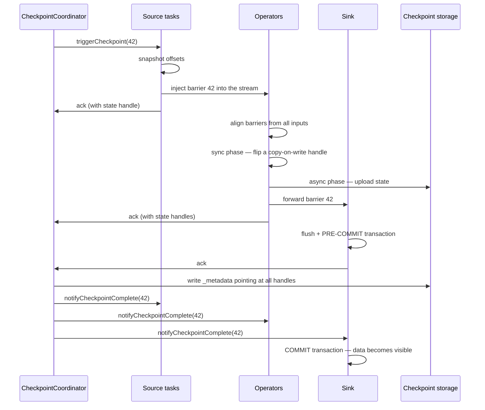

# Checkpoints

<PageMeta level="advanced" time="14 min" prereq={[['Failure model', '/docs/flink/fault-tolerance/failure-model']]} docs="docs/ops/state/checkpoints/" />

<Objectives>

- Narrate a checkpoint from trigger to completion, naming each participant
- Configure the six settings that actually matter, and justify each value
- Decompose a slow checkpoint into its four phases and fix the right one

</Objectives>

## Watch it happen first

Step through the lab. Switch between aligned and unaligned at step 4 to see the
one place they differ, then continue to the crash and the restore.

<CheckpointLab />

## The lifecycle



Two details in that diagram carry most of the weight:

**The sync/async split.** The synchronous phase — the part that blocks record
processing — is deliberately tiny. For RocksDB it takes a native snapshot handle;
for the heap backend it flips a copy-on-write reference. The expensive part,
uploading hundreds of gigabytes to S3, happens **asynchronously** while records
keep flowing.

**`notifyCheckpointComplete` comes last.** The sink pre-commits before
acknowledging, and only commits when told the *whole* checkpoint succeeded. That
ordering is the entire basis of
[end-to-end exactly-once](/docs/flink/fault-tolerance/exactly-once).

## Configuration that matters

```java
CheckpointConfig cfg = env.getCheckpointConfig();

env.enableCheckpointing(60_000);                    // 1. interval
cfg.setCheckpointingMode(CheckpointingMode.EXACTLY_ONCE);   // 2. mode
cfg.setMinPauseBetweenCheckpoints(30_000);          // 3. breathing room
cfg.setCheckpointTimeout(600_000);                  // 4. give up after 10 min
cfg.setMaxConcurrentCheckpoints(1);                 // 5. one at a time
cfg.setTolerableCheckpointFailureNumber(3);         // 6. transient storage errors
cfg.setExternalizedCheckpointRetention(
    ExternalizedCheckpointRetention.RETAIN_ON_CANCELLATION);  // 7. keep them
cfg.enableUnalignedCheckpoints(true);               // 8. see the next page
```

| Setting | Guidance | Why |
| --- | --- | --- |
| **Interval** | 1–5 min for large state; 10–30s for low-latency 2PC sinks | Determines how much work is redone on failure, and with a transactional sink it **is** your end-to-end latency |
| **Min pause** | About half the interval | Guarantees the job gets uninterrupted time to process. Without it, a slow checkpoint is immediately followed by another. |
| **Timeout** | 5–10× your normal duration | Too tight and transient S3 slowness fails the job; too loose and a stuck checkpoint blocks progress for an hour |
| **Max concurrent** | **1** | More than one is almost always a mistake — see below |
| **Tolerable failures** | 2–3 | Object storage has transient errors; a single blip should not kill a job |
| **Retention** | `RETAIN_ON_CANCELLATION` | Without it, cancelling deletes your only restore point |

<Callout type="mistake" title="Raising max concurrent checkpoints to 'fix' slow checkpoints">

If checkpoints take longer than the interval, the instinct is to allow several at
once. This makes things worse: each concurrent checkpoint holds its own state
snapshot, multiplying memory and upload bandwidth, which slows all of them further.

Concurrent checkpoints are for jobs with genuinely long but *stable* checkpoints
where you cannot afford the gap. The normal fix for slow checkpoints is to find out
*why* — see the decomposition below — not to run more of them.

</Callout>

## Reading checkpoint metrics

The Flink UI's Checkpoints tab gives you four numbers per checkpoint. Each points
at a different cause.

| Metric | Meaning | If it is large |
| --- | --- | --- |
| **End to End Duration** | Trigger → all acks | The total. Decompose it with the other three. |
| **Sync Duration** | The blocking part | Rare. Usually a state backend problem or an enormous heap state. |
| **Async Duration** | Uploading state | State is large, or storage is slow. Enable incremental checkpoints. |
| **Alignment Duration** | Waiting for barriers on slow channels | **Backpressure.** Fix the bottleneck, or enable unaligned checkpoints. |
| **Start Delay** | Trigger → the task began | The task was busy. Also backpressure. |

```text
Duration = Start Delay + Alignment + Sync + Async
```

<Callout type="prod" title="Decompose before you tune">

```text
Alignment or Start Delay dominates   →  it is a BACKPRESSURE problem.
                                        Fix the bottleneck operator, or
                                        enable unaligned checkpoints.

Async dominates                      →  it is a STATE SIZE or STORAGE problem.
                                        Enable incremental checkpoints, check
                                        S3 throughput and request rate.

Sync dominates                       →  rare. Check state backend config and
                                        whether heap state has grown too large.
```

Tuning the checkpoint interval when alignment is the problem accomplishes nothing.
Read the breakdown first, every time.

</Callout>

## Incremental checkpoints

```java
env.setStateBackend(new EmbeddedRocksDBStateBackend(true));   // true = incremental
```

Only new and changed RocksDB SST files are uploaded.

```text
Full:        checkpoint 1: 400 GB   2: 400 GB   3: 400 GB
Incremental: checkpoint 1: 400 GB   2:   3 GB   3:   2 GB
```

For any job with more than a few gigabytes of state, this is the single largest
improvement available.

<Callout type="mistake">

Assuming incremental checkpoints also make *recovery* faster. They usually make it
**slower**: restore must fetch many SST files across several checkpoints and
reconstruct the LSM tree, rather than reading one contiguous snapshot.

If restore time is your SLA — and for a job with a strict RTO it should be —
measure it explicitly. Mitigations: enable
[local recovery](/docs/flink/state/state-backends), or accept larger full
checkpoints in exchange for faster restore.

</Callout>

## Checkpoint storage layout

```text
s3://bucket/checkpoints/<job-id>/
  ├── chk-40/_metadata          ← the pointer file: the checkpoint IS this
  ├── chk-41/_metadata
  ├── chk-42/_metadata
  └── shared/                   ← SST files shared across incremental checkpoints
      ├── 000123.sst
      └── 000124.sst
```

`_metadata` is the checkpoint as far as recovery is concerned: it lists the state
handles for every subtask. The `shared/` directory is reference-counted across
retained checkpoints, which is why deleting checkpoint directories by hand is a
good way to corrupt the ones you kept.

```java
cfg.setExternalizedCheckpointRetention(
    ExternalizedCheckpointRetention.RETAIN_ON_CANCELLATION);
```

```yaml
state.checkpoints.num-retained: 3    # keep the last 3 for manual recovery
```

<Callout type="prod" title="Retention is a real setting with real consequences">

Default retention deletes checkpoints when the job is cancelled. So: cancel a job
to fix something, and discover your only restore point is gone.

Set `RETAIN_ON_CANCELLATION`, keep 3, and — importantly — put a **lifecycle policy**
on the bucket. Retained checkpoints from deleted jobs are not cleaned up by Flink,
and this is a classic source of surprising S3 bills.

</Callout>

<Expert>

**The `-1` on the first checkpoint.** Checkpoint IDs start at 1 and increase
monotonically across restores. On restore from checkpoint 42, the next is 43 — IDs
are never reused, which is what makes 2PC transaction IDs safe.

**Checkpoints vs savepoints on disk.** Checkpoints are written in the state
backend's **native format** for speed and incrementality. Savepoints use a
**canonical format** that is backend-independent and rescalable. That is why you
can switch backends via a savepoint but not via a checkpoint — and why savepoints
are slower to take.

**Task-local recovery and checkpoint confirmation.** With local recovery, each task
keeps a secondary local copy. The remote copy remains authoritative; the local one
is an optimisation used only when the task restarts on the same TaskManager.

**Checkpoint alignment timeout.** `execution.checkpointing.aligned-checkpoint-timeout`
starts a checkpoint aligned and *switches it to unaligned* if alignment exceeds the
timeout. This is the best default for most jobs: cheap aligned checkpoints when
healthy, automatic escape when back-pressured.

**Finished tasks.** In a mixed bounded/unbounded job, some tasks finish while
others run. Flink supports checkpointing with finished tasks — a finished task is
excluded from subsequent checkpoints. Older versions could not checkpoint at all in
that situation, which is worth knowing when reading pre-1.14 material.

</Expert>

<Callout type="remember">

Barriers flow with the data; nothing pauses globally. The sync phase is tiny, the
async phase does the work, and the sink commits only after the coordinator
confirms. Always decompose duration into start delay, alignment, sync and async
before changing anything.

</Callout>

## Next

**[Barriers and alignment](/docs/flink/fault-tolerance/barriers-and-alignment)** — the consistent cut, in detail.
