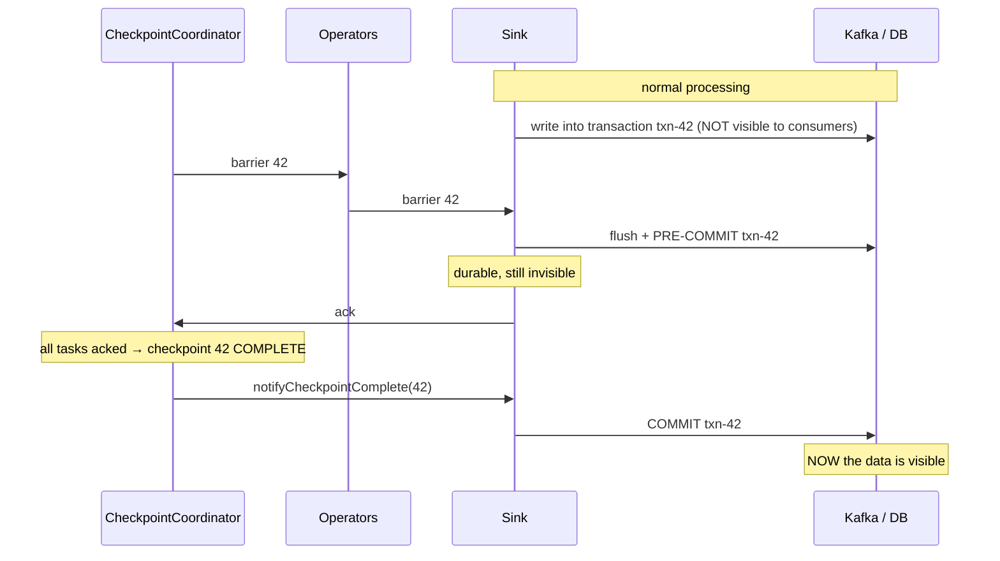

# Exactly-once

<PageMeta level="advanced" time="13 min" prereq={[['Savepoints', '/docs/flink/fault-tolerance/savepoints']]} />

<Objectives>

- State precisely what "exactly-once" guarantees, and what it does not
- Explain end-to-end exactly-once via two-phase commit, in order
- Choose between transactional and idempotent sinks for a given target system

</Objectives>

## Start with the misconception

<Callout type="key">

**Exactly-once does not mean each record is processed exactly once.**

Records absolutely are reprocessed after a failure — that is the whole recovery
mechanism. What is guaranteed is that the **effect on state** is as if each record
had been processed once.

The accurate phrase is *exactly-once state consistency*. Everything confusing about
this topic comes from the shorter name.

</Callout>

```text
crash at record 1,050, last checkpoint at record 1,000

records 1,001–1,050 are READ AGAIN and PROCESSED AGAIN     ← genuinely twice

but state was rewound to its value at record 1,000, so the
final state after reprocessing is identical to the no-crash case
```

## The three delivery guarantees

<Compare>
  <CompareCard title="At-most-once" rows={[
    ['Guarantee', 'Every record processed 0 or 1 times'],
    ['On failure', 'Records may be LOST'],
    ['How', 'No checkpointing at all'],
    ['Cost', 'Zero'],
    ['Use for', 'Almost nothing. Perhaps high-frequency sampled telemetry.'],
  ]} />
  <CompareCard title="At-least-once" rows={[
    ['Guarantee', 'Every record processed 1 or more times'],
    ['On failure', 'Records may be DUPLICATED'],
    ['How', 'Checkpointing without alignment'],
    ['Cost', 'Low — no alignment wait'],
    ['Use for', 'Idempotent downstream systems'],
  ]} />
  <CompareCard title="Exactly-once" rows={[
    ['Guarantee', 'State reflects each record exactly once'],
    ['On failure', 'Reprocessing happens, but state is consistent'],
    ['How', 'Aligned (or unaligned) checkpoints'],
    ['Cost', 'Alignment, or in-flight snapshots'],
    ['Use for', 'The default. Counting, billing, anything audited.'],
  ]} />
</Compare>

## Internal vs end-to-end

This distinction is where most production surprises come from.

```text
┌──────────┐      ┌───────────────────────────┐      ┌──────────┐
│  Kafka   │─────▶│          FLINK            │─────▶│ Postgres │
└──────────┘      └───────────────────────────┘      └──────────┘
     ▲                          ▲                          ▲
     │                          │                          │
 replayable          exactly-once INTERNAL          ??? ← this is the
   source                   state                       hard part
```

Flink's checkpointing gives you exactly-once **inside** the job for free. Getting
it to the outside world is a separate problem, and it requires cooperation from the
target system.

```text
1. checkpoint 42 completes
2. Flink writes rows 1001–1050 to Postgres
3. 💥 crash
4. restore from checkpoint 42
5. reprocess records 1001–1050
6. write rows 1001–1050 to Postgres AGAIN     ← duplicates in your table
```

Flink's state is perfectly consistent. Your table is not.

<Callout type="key">

**End-to-end exactly-once requires the sink to participate.** There are exactly two
ways for it to do so:

1. **Transactions** — write inside a transaction, commit only when the checkpoint completes (two-phase commit)
2. **Idempotency** — make writing the same record twice have the same effect as writing it once

There is no third way, and no Flink setting that provides it for you.

</Callout>

## Two-phase commit, step by step



The critical ordering, and why each step is where it is:

| Step | Why here |
| --- | --- |
| Pre-commit **before** ack | If the job dies now, the transaction is durable but uncommitted, and can be aborted on recovery |
| Ack **before** the coordinator completes | The coordinator must know every participant is ready |
| Commit **only after** `notifyCheckpointComplete` | Data becomes visible only once the *entire* checkpoint is safe |

Failure cases and what happens:

| Crash point | Outcome |
| --- | --- |
| Before pre-commit | Transaction never existed. Restore, reprocess, write again. Clean. |
| After pre-commit, before complete | Checkpoint 42 did not complete. Restore from 41, **abort** txn-42, reprocess. Clean. |
| After complete, before commit | Checkpoint 42 is durable. On restore, Flink **re-commits** txn-42 from the recovered transaction ID. Clean. |
| After commit | Nothing to do. |

That third row is why the sink must persist its transaction IDs in operator state.
Recovery has to be able to finish a commit it never observed succeeding.

## What this costs

<Callout type="mistake" title="Exactly-once sinks make the checkpoint interval your latency">

With a 2PC sink, data is invisible to consumers until the checkpoint that covers it
completes.

```text
checkpoint interval = 60s  →  downstream sees data up to ~60s late
checkpoint interval = 10s  →  ~10s, with 6× the checkpoint overhead
```

If someone asks for "sub-second end-to-end latency" and "exactly-once into Kafka",
those two requirements are in direct tension. The honest answers are: shorten the
interval and pay the overhead, or use an idempotent sink and accept
`read_uncommitted` semantics.

Say this out loud during design, not during the incident.

</Callout>

## Sinks in practice

### Kafka — transactional

```java
KafkaSink<Order> sink = KafkaSink.<Order>builder()
    .setBootstrapServers("kafka:9092")
    .setRecordSerializer(...)
    .setDeliveryGuarantee(DeliveryGuarantee.EXACTLY_ONCE)
    .setTransactionalIdPrefix("orders-sink")   // MUST be unique per job
    .build();
```

Two things that bite people:

- **Consumers must set `isolation.level=read_committed`.** Otherwise they read uncommitted records and see the duplicates you just paid to avoid.
- **`transaction.max.timeout.ms` on the broker must exceed your checkpoint interval plus recovery time.** The default broker maximum is 15 minutes; Flink's default transaction timeout is 1 hour, which the broker will reject. Set both deliberately, or you get `InvalidTxnTimeoutException` at the worst moment.

### Filesystem / S3 — commit on checkpoint

```java
FileSink<Order> sink = FileSink
    .forBulkFormat(new Path("s3://bucket/orders"), ParquetAvroWriters.forSpecificRecord(Order.class))
    .withRollingPolicy(OnCheckpointRollingPolicy.build())
    .build();
```

Files are written as `in-progress`, moved to `pending` at the checkpoint barrier,
and renamed to `finished` on `notifyCheckpointComplete`. Only finished files are
visible to readers. Same protocol, different primitives.

### Databases — idempotency is usually better than transactions

```sql
INSERT INTO daily_totals (day, page, count)
VALUES (?, ?, ?)
ON CONFLICT (day, page) DO UPDATE SET count = EXCLUDED.count;
```

An upsert keyed by a deterministic business key makes reprocessing harmless without
any distributed transaction. It is simpler, faster, and does not couple your
database's transaction lifetime to your checkpoint interval.

<Callout type="prod" title="Prefer idempotency when you can get it">

Two-phase commit is genuinely clever and genuinely operationally heavy: transaction
timeouts, hanging transactions after a crash, broker configuration, and latency
tied to the checkpoint interval.

An idempotent sink with a deterministic key has none of that. Before reaching for
2PC, ask whether the write can be made idempotent:

- Is there a natural business key? (`order_id`, `(day, page)`, `(user, window_start)`)
- Can the target do an upsert or a conditional put?
- Is the operation naturally idempotent already? (setting a value rather than incrementing one)

If yes to any, use it. Reserve 2PC for append-only targets like Kafka topics where
idempotency is not available.

</Callout>

## The full requirement list

For end-to-end exactly-once you need **all** of:

| # | Requirement | If missing |
| --- | --- | --- |
| 1 | A replayable source | Records after the last checkpoint are lost |
| 2 | `EXACTLY_ONCE` checkpointing mode | State is inconsistent after recovery |
| 3 | Deterministic processing logic | Reprocessing produces different results |
| 4 | A transactional or idempotent sink | Duplicates downstream |
| 5 | Consumers reading committed data only | You see the duplicates anyway |

<Callout type="mistake" title="Requirement 3 is the one people forget">

Reprocessing must produce the same output. These break that:

```java
if (System.currentTimeMillis() % 2 == 0) { ... }       // wall clock
UUID.randomUUID()                                       // randomness
externalService.call(record)                            // may return differently
processingTimeWindow(...)                               // non-deterministic assignment
```

A job with a processing-time window can be configured for exactly-once and still
produce different results on replay — because the *windowing* is not deterministic.
Determinism is your responsibility; Flink cannot enforce it.

</Callout>

<Expert>

**Kafka transactional IDs and recovery.** The sink derives transactional IDs from
`transactionalIdPrefix + subtaskIndex + checkpointId`. Two jobs sharing a prefix
will fence each other off — one will be killed by the broker with a producer-fencing
error. Always use a unique prefix per job, and change it when you clone a job.

**Hanging transactions.** If a job is cancelled (not stopped) while a transaction is
pre-committed, that transaction stays open on the broker until it times out. Until
then, `read_committed` consumers **block** at that offset — the topic appears
stalled. This is a genuinely nasty production failure. Mitigations: always use
`flink stop`, and keep the transaction timeout short enough that an abandoned
transaction resolves in minutes rather than hours.

**Restore across a prefix change.** Changing `transactionalIdPrefix` means the new
job cannot abort the old job's pending transactions. Do it only from a cleanly
stopped state.

**Exactly-once with unaligned checkpoints** is fully supported — in-flight records
are part of the snapshot, so the guarantee holds. Only `AT_LEAST_ONCE` mode is
incompatible with unaligned checkpointing.

**Two-phase commit in your own sink.** Implement `TwoPhaseCommitSinkFunction`'s
successor in the Sink V2 API: `Sink` with a `Committer` and, for exactly-once, a
`WithPreCommitTopology`. The contract you must honour is that `commit()` is
**idempotent** — it may be called again after a crash for a transaction that already
committed.

</Expert>

<Callout type="remember">

Exactly-once means exactly-once *state*, not exactly-once processing. End-to-end
needs the sink to participate: transactions or idempotency. 2PC ties your latency
to the checkpoint interval. Prefer an idempotent upsert whenever the target allows
one.

</Callout>

## Next

**[Rescaling](/docs/flink/fault-tolerance/rescaling)** — changing parallelism without losing state.
