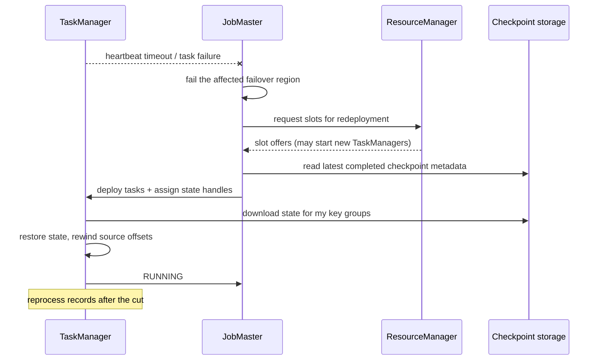

# The failure model

<PageMeta level="advanced" time="8 min" prereq={[['Joins', '/docs/flink/joins']]} />

<Objectives>

- Enumerate what a Flink job actually loses when a machine dies
- Explain why restarting a stateful streaming job is not like restarting a batch job
- Derive the requirements a snapshot mechanism must satisfy — before seeing how Flink meets them

</Objectives>

## Start from the crash

Your job has been running for three weeks. It holds:

- 400 GB of keyed state — per-user sessions, running aggregates, join buffers
- 12 million pending timers
- Kafka read positions across 96 partitions
- Half-full network buffers between operators
- A sink with an open transaction

A TaskManager pod is evicted. What is gone?

```text
LOST                                    SURVIVES
────────────────────────────────        ────────────────────────
JVM heap → in-flight records            Kafka: the input is still there
RocksDB local dir → that subtask's      Sink: whatever was committed
  slice of the 400 GB                   JobManager: it knows the topology
Heap timer queue → its timers
Network buffers → records in transit
The sink's open transaction
```

The input survives. Everything the job *derived* from that input does not.

<Callout type="key">

A batch job can recover by re-running: its input is a file that has not moved.

A streaming job cannot. Its input is a position in a topic that keeps advancing,
and the state it accumulated took three weeks of that topic to build. Re-reading
from the beginning means three weeks of catch-up — assuming the retention even
goes back that far, which it usually does not.

So a streaming engine needs something a batch engine does not: **a periodic,
consistent, restorable snapshot of derived state.**

</Callout>

## What "consistent" has to mean

The word is doing a lot of work. Consider a job with two source subtasks feeding
one aggregator.

```text
At wall-clock instant T:
  source[0] has read 1,000 records
  source[1] has read 1,200 records
  aggregator has processed 1,900 of those 2,200
  300 are sitting in network buffers
```

Snapshot everything "right now" and you get a state that the system was **never
actually in**. Restore it and you either double-count the 300 in-flight records or
lose them.

A correct snapshot must capture the system at a point where every operator's state
corresponds to **the same prefix of the input**:

```text
GOOD:  source offsets (1000, 1200)
       AND aggregator state reflecting exactly those 2,200 records
       AND nothing in flight unaccounted for
```

## Three ways to get one, two of which are bad

**1. Stop the world.** Pause all sources, drain every buffer, snapshot, resume.

Correct, and unusable: at any real scale draining takes seconds to minutes, and
you would pay that latency spike every checkpoint interval.

**2. Snapshot each operator independently.** Fast, and wrong: the states do not
correspond to the same input prefix.

**3. Mark a consistent cut in the data itself.** Inject a marker into the stream
at the sources. Each operator snapshots when the marker reaches it. The marker
divides the stream into "before" (in the snapshot) and "after" (not).

Option 3 is what Flink does. The marker is a **checkpoint barrier**, and the
underlying idea is the Chandy–Lamport distributed snapshot algorithm, adapted for
dataflow graphs.

<Callout type="mental">

Imagine photographing a relay race, where you want every runner's position at "the
same moment in the race" rather than at the same clock time.

Stopping the race works but ruins it. Photographing each runner whenever you feel
like it gives you an incoherent picture.

Instead: hand a baton-marker to each starter. Every runner is photographed the
instant the marker passes them. Nobody stops, and the photos are all of the same
logical moment in the race — the moment the marker passed.

</Callout>

## The requirements, before the mechanism

Any snapshot mechanism for this problem must satisfy:

| Requirement | Why |
| --- | --- |
| **No global pause** | Latency spikes every interval are unacceptable |
| **Consistent cut** | Every operator's state matches the same input prefix |
| **Replayable sources** | On restore, the input after the cut must be re-readable |
| **Durable storage** | Snapshots must survive the machines that made them |
| **Bounded overhead** | Snapshotting must cost far less than the interval |
| **Rescalable output** | The snapshot must restore onto a different parallelism |

The next three pages are how Flink meets each of these:
[checkpoints](/docs/flink/fault-tolerance/checkpoints) (the mechanism),
[barriers and alignment](/docs/flink/fault-tolerance/barriers-and-alignment) (the
consistent cut), and [rescaling](/docs/flink/fault-tolerance/rescaling) (the last
requirement).

## Replayable sources are not optional

Restoring state to the moment of the cut is only half of it. The source must
**rewind** to that same cut and re-read.

| Source | Replayable? | Why |
| --- | --- | --- |
| Kafka | ✅ | Offsets are durable and seekable |
| Kinesis | ✅ | Sequence numbers within retention |
| Filesystem | ✅ | File positions |
| Pulsar | ✅ | Message IDs |
| A socket | ❌ | Data is gone once read |
| An HTTP push endpoint | ❌ | The sender will not resend |

<Callout type="key">

**Without a replayable source, no exactly-once or even at-least-once guarantee is
possible**, no matter what Flink does internally. Records consumed after the last
checkpoint are simply lost.

If your data arrives by push, put a durable log (Kafka, Pulsar, Kinesis) in front
of Flink. That log is not extra architecture — it is the thing that makes recovery
possible at all.

</Callout>

## What Flink does when something fails



Restart behaviour is configurable, and the defaults are not what you want in
production:

```yaml
restart-strategy.type: exponential-delay
restart-strategy.exponential-delay.initial-backoff: 10s
restart-strategy.exponential-delay.max-backoff: 2min
restart-strategy.exponential-delay.backoff-multiplier: 2.0
restart-strategy.exponential-delay.reset-backoff-threshold: 10min
```

<Callout type="mistake">

`fixed-delay` with a small delay and a large number of attempts against a failure
that will not resolve itself — a bad schema, a missing permission, a poison record.
The job restarts every 5 seconds, hammering Kafka and your checkpoint storage, and
the restart *count* obscures the original exception in the logs.

Exponential backoff plus an alert on restart count is the production setting. A
job that has restarted 20 times in an hour needs a human, not another retry.

</Callout>

<Expert>

**Failover regions.** Flink restarts the smallest *pipelined region* containing the
failure, not necessarily the whole job. In streaming mode all exchanges are
pipelined, so the region is usually everything. In batch mode, blocking exchanges
partition the graph and a single stage can be re-run alone.

**Task failure vs TaskManager failure.** A task failure (an exception in your code)
fails the region and restarts it, reusing the same slots. A TaskManager failure
also loses the slot, so the ResourceManager must acquire new resources — which on
Kubernetes means waiting for a pod to schedule. The second is much slower, and it
is why local recovery and a warm pool matter.

**The `tolerable-failed-checkpoints` setting.** By default a *single* failed
checkpoint fails the job. That is usually too strict for object storage, which has
transient failures:

```yaml
execution.checkpointing.tolerable-failed-checkpoints: 3
```

Do not raise it far. A job that cannot checkpoint is a job that cannot recover; you
want it to fail loudly rather than run for hours with no restore point.

</Expert>

<Callout type="remember">

A crash loses everything derived, keeps the input. Recovery needs a consistent cut
plus a replayable source. Flink gets the cut by injecting barriers into the data
rather than pausing the world.

</Callout>

## Next

**[Checkpoints](/docs/flink/fault-tolerance/checkpoints)** — the mechanism, end to end.
