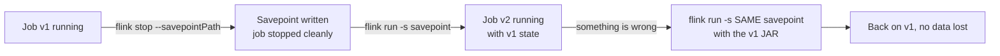

# Savepoints

<PageMeta level="advanced" time="9 min" prereq={[['Barriers & alignment', '/docs/flink/fault-tolerance/barriers-and-alignment']]} />

<Objectives>

- State the four differences between a checkpoint and a savepoint
- Perform a stateful upgrade safely, step by step
- Explain why `uid()` is the single most important line in a long-lived job

</Objectives>

## Same mechanism, different purpose

A savepoint uses the same barrier machinery as a checkpoint. Everything else
about it is different.

<Compare>
  <CompareCard title="Checkpoint" rows={[
    ['Triggered by', 'Flink, automatically, on an interval'],
    ['Owned by', 'Flink — it manages the lifecycle'],
    ['Purpose', 'Automatic recovery from failure'],
    ['Format', 'The state backend native format'],
    ['Optimised for', 'Being written FAST and often'],
    ['Incremental', 'Yes, with RocksDB'],
    ['Deleted', 'Automatically, when superseded'],
  ]} />
  <CompareCard title="Savepoint" rows={[
    ['Triggered by', 'YOU — a person or a deploy pipeline'],
    ['Owned by', 'You — Flink never deletes it'],
    ['Purpose', 'Upgrades, rescaling, migration, A/B, archival'],
    ['Format', 'Canonical, backend-independent (by default)'],
    ['Optimised for', 'Being PORTABLE and restorable anywhere'],
    ['Incremental', 'No (unless you choose native format)'],
    ['Deleted', 'Never, by anyone but you'],
  ]} />
</Compare>

<Callout type="mental">

A **checkpoint** is an autosave. The program made it for itself, in its own format,
and will throw it away when it takes the next one.

A **savepoint** is *File → Save As*. You made it, deliberately, in a portable
format, because you are about to do something risky and want to be able to come
back.

</Callout>

## The operations

```bash
# take a savepoint, keep the job running
flink savepoint <jobId> s3://bucket/savepoints

# stop the job WITH a savepoint — the correct way to shut down a stateful job.
# Drains the pipeline, takes a final savepoint, then stops.
flink stop --savepointPath s3://bucket/savepoints <jobId>

# start from a savepoint
flink run -s s3://bucket/savepoints/savepoint-a1b2c3-abcdef123456 -d my-job.jar

# start from a savepoint at a different parallelism
flink run -s s3://.../savepoint-a1b2c3 -p 16 -d my-job.jar

# dispose of one you no longer need
flink savepoint --dispose s3://.../savepoint-a1b2c3
```

<Callout type="mistake">

`flink cancel` on a stateful job. It stops immediately without a savepoint, and
with default retention it also deletes the checkpoints.

`flink stop --savepointPath ...` is the correct shutdown: it stops the sources,
drains in-flight records, takes a final savepoint, and *then* stops. The
difference is whether you can restart where you left off.

Make this a rule with no exceptions in your runbooks and deploy scripts.

</Callout>

## The stateful upgrade

The single most important operational procedure in Flink. Learn it before you need
it.



The rollback path is the reason this works. Because the savepoint is not consumed
or modified by the restore, you can start v1 from it again at any time.

### Checklist

1. **Every stateful operator has a stable `uid()`.** Non-negotiable — see below.
2. **Take the savepoint and record its path** in your deploy log.
3. **Test the restore in staging** against a production-shaped savepoint, not an empty one.
4. **Restore**, and watch: records processed, watermark progress, checkpoint success, output rate.
5. **Keep the savepoint** until you are confident. Disk is cheaper than an outage.

## Why `uid()` is the most important line in your job

```java
stream.keyBy(Click::userId)
      .process(new SessionTracker())
      .name("session-tracker")      // cosmetic: UI, metrics, logs
      .uid("session-tracker");      // IDENTITY: how state is matched on restore
```

A savepoint is a map from **operator uid** to state. On restore, Flink looks up
each operator's uid and hands it the matching state.

Without an explicit `uid()`, Flink **generates** one by hashing the operator's
position and structure in the graph. So:

```text
v1:  source → map → process(stateful)         generated uid = 0xAB12…
v2:  source → map → FILTER → process(stateful) generated uid = 0xCD34…
                    ↑ you added this
                                              → uid changed
                                              → state no longer matches
                                              → restore fails, or state is silently lost
```

<Callout type="key">

Adding an unrelated, stateless operator anywhere upstream can orphan the state of a
downstream stateful operator, because the generated uid depends on graph structure.

Set `uid()` explicitly on **every** stateful operator, in your very first version.
It costs nothing then and is impossible to add retroactively without losing state.

</Callout>

```bash
# only when you have understood WHICH state is unclaimed and decided it is correct
flink run -s s3://.../savepoint --allowNonRestoredState my-job.jar
```

Legitimate use: you removed an operator on purpose and want its state discarded.
Illegitimate use: making an error message go away.

## Rescaling with a savepoint

```bash
flink stop --savepointPath s3://bucket/savepoints <jobId>
flink run -s s3://bucket/savepoints/savepoint-xyz -p 24 -d my-job.jar
```

Flink redistributes key groups across the new subtask count. This works because
state was partitioned by key group rather than by subtask — see
[rescaling](/docs/flink/fault-tolerance/rescaling).

The hard limit: **you cannot exceed `maxParallelism`**, and you cannot change
`maxParallelism`.

## Savepoint formats

```bash
flink savepoint --type canonical <jobId> s3://...   # default: portable
flink savepoint --type native    <jobId> s3://...   # faster, backend-locked
```

| | Canonical | Native |
| --- | --- | --- |
| Portable across state backends | ✅ | ❌ |
| Speed to write | Slower | Much faster |
| Incremental | ❌ | ✅ (RocksDB) |
| Use for | Upgrades, migrations, archival | Frequent savepoints on very large state |

Use canonical by default. Reach for native when a savepoint on a multi-terabyte
state takes so long that your deploy window cannot accommodate it — and accept that
you have then tied yourself to the current state backend.

<Callout type="prod" title="Savepoints in a deploy pipeline">

```bash
#!/usr/bin/env bash
set -euo pipefail

JOB_ID=$(flink list -r | grep "$JOB_NAME" | awk '{print $4}')

SP=$(flink stop --savepointPath "$SAVEPOINT_DIR" "$JOB_ID" \
     | grep -oP 'savepoint-[a-z0-9-]+')

echo "$SP" >> deploy-history.log       # you WILL need this path later

flink run -s "$SAVEPOINT_DIR/$SP" -d "$NEW_JAR" \
  || {
       echo "new version failed to start — rolling back"
       flink run -s "$SAVEPOINT_DIR/$SP" -d "$PREVIOUS_JAR"
       exit 1
     }
```

Two properties that make this safe: the savepoint path is recorded before anything
risky happens, and the rollback uses the *same* savepoint. Never overwrite or
dispose of a savepoint until the new version has been healthy for a full retention
period.

</Callout>

<Expert>

**Savepoints do not contain watermarks.** On restore the watermark restarts from
`Long.MIN_VALUE` and is rebuilt from replayed data. For long windows there is a
warm-up period after every restore during which results are delayed. Expected, and
frequently reported as a bug.

**Claim modes.** `flink run -s path -claimMode CLAIM|NO_CLAIM|LEGACY` controls
ownership of the restored artifacts. `NO_CLAIM` (the default) makes the new job
take a full first checkpoint so it does not depend on the savepoint's files —
meaning you can safely delete the savepoint afterwards. `CLAIM` lets the new job
reuse the files incrementally, which is faster to start but ties the savepoint's
lifetime to the job. Getting this wrong is how people delete a savepoint and break
a running job.

**Stop-with-savepoint drains.** `flink stop` sends `MAX_WATERMARK` through the
pipeline, which fires all event-time timers and closes all windows before the
savepoint is taken. That means a stop-with-savepoint *emits* pending window
results. If your sink is not idempotent, restoring and reprocessing can duplicate
them. Use `--drain` deliberately, not by default.

**The State Processor API reads savepoints.** Load a savepoint as a `DataStream`,
inspect what is actually in it, modify it, and write a new one. This is the
supported way to audit state, bootstrap a new job from historical data, or repair
a broken savepoint. Knowing it exists turns some incidents from "drop state" into
"write a small batch job".

</Expert>

<Callout type="remember">

Savepoints are yours; checkpoints are Flink's. `flink stop --savepointPath`, never
`flink cancel`. Set `uid()` on every stateful operator from version one. Keep the
savepoint until the new version has proved itself.

</Callout>

## Next

**[Exactly-once](/docs/flink/fault-tolerance/exactly-once)** — what it does and does not mean.
