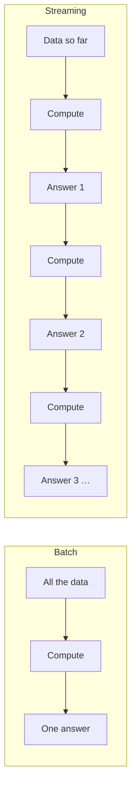

# What is a stream?

<PageMeta level="beginner" time="7 min" prereq={[['What is an event?', '/docs/flink/foundations/what-is-an-event']]} />

<Objectives>

- Define a stream, and say precisely which word in the definition causes all the difficulty
- List the four things you cannot do to an unbounded dataset
- Explain why a stream is closer to a river than to a very long list

</Objectives>

## What is it?

A stream is **a sequence of events that has a beginning but no end**.

```text
… → e7 → e6 → e5 → e4 → e3 → e2 → e1 →  [ your program ]
       more events are still being created right now
```

The word doing all the work is **no end**. Everything else about streaming is a
consequence of it.

## Why is "no end" such a big deal?

Because four operations you take completely for granted become impossible.

| Operation | On a file | On a stream |
| --- | --- | --- |
| `count()` | Read to EOF, return a number | Never returns |
| `sort()` | Load, sort, done | The smallest element might arrive tomorrow |
| `max()` | Compare all, return | You can only ever report "max so far" |
| `join(a, b)` | Load b into a hash map | b is infinite; the map does not fit |

Notice these are not *slow* on a stream. They are **undefined**. There is no
correct answer to "how many events are in this stream" while events are still
arriving.

<Callout type="mental">

A file is a bucket of water. A stream is a river.

You can weigh a bucket. You cannot weigh a river — but you *can* say "1,200
litres flowed past this bridge between 12:00 and 12:01". Every streaming answer
has that shape: a quantity, scoped to a window of time.

</Callout>

## What streaming replaces those four operations with

Since you cannot compute over "all the data", you compute over a *bounded slice*
of it and emit a result, repeatedly, forever.



Concretely, the four impossible operations become:

- `count()` → **count per window**: "purchases in each 1-minute window"
- `sort()` → **event time plus watermarks**: process in time order, with a bounded tolerance for lateness ([Level 3](/docs/flink/watermarks/what-is-a-watermark))
- `max()` → **running max held in state**: a value you keep and update ([Level 5](/docs/flink/state/why-state))
- `join()` → **time-scoped join**: "orders joined to shipments within 24 hours" ([Level 7](/docs/flink/joins))

Each of those is a chapter in this guide. They are all the same trick: **bound
the problem with time or with state, so a finite answer exists.**

## Real-world analogy

A shop's CCTV camera versus a shop's inventory count.

The inventory count is batch: once a month, close the doors, count everything,
produce one number.

The camera is streaming: it never stops, nobody watches all of it, and the useful
questions are always time-scoped — "how many people entered in the last hour?",
"has anyone been in aisle 4 for more than ten minutes?".

You cannot ask the camera "how many people, in total, forever". That question has
no answer while the shop is open.

## Ordering: the uncomfortable truth

People assume a stream is ordered. It is ordered *per partition*, and only per
partition.

```text
Kafka topic "orders", 3 partitions:

partition 0:  e1(12:00:01) → e4(12:00:07) → e9(12:00:22)     ← ordered
partition 1:  e2(12:00:03) → e5(12:00:04) → e7(12:00:19)     ← ordered
partition 2:  e3(12:00:02) → e6(12:00:11) → e8(12:00:15)     ← ordered

merged view:  ??? there is no single order
```

Each partition preserves the order of what was written into it. There is no
global order across partitions, and there cannot be — the partitions are on
different machines, being written by different producers, with no shared clock.

<Callout type="mistake">

"I will just add a global sequence number." This is the most expensive mistake in
distributed data engineering. A global counter means every producer must
coordinate with every other producer on every event, which caps your throughput
at the speed of one machine and reintroduces a single point of failure.

The whole point of partitioning is to avoid that coordination. Flink's answer is
not global ordering — it is [event time plus watermarks](/docs/flink/watermarks/what-is-a-watermark),
which gives you *time-correct* results without global ordering.

</Callout>

## Tiny example

Here is a stream in eight lines of Flink. It never terminates.

```java
StreamExecutionEnvironment env = StreamExecutionEnvironment.getExecutionEnvironment();

env.fromSequence(1, Long.MAX_VALUE)     // a stream that keeps producing
   .map(n -> "event-" + n)
   .print();

env.execute("a stream");                // this call never returns
```

That last line is the difference from every batch job you have written.
`env.execute()` does not mean "run and finish". It means "start, and keep
running until someone stops you or something breaks".

Which immediately raises the question this entire guide is really about:

> If the job runs forever, what happens when the machine it is running on dies?

Hold that thought. It is answered in [Level 8](/docs/flink/fault-tolerance/failure-model),
and the answer shapes everything before it.

<Callout type="hood">

In Flink 2.x, `DataStream<T>` describes both bounded and unbounded data — the
same API, with the runtime switching between `STREAMING` and `BATCH` execution
mode. A bounded source in `BATCH` mode gets sorted shuffles and no checkpoints;
the identical program on an unbounded source gets pipelined shuffles and
checkpointing.

</Callout>

<Callout type="version">

Older material talks about a separate `DataSet` API for batch — you will see it
in the classic "Flink ecosystem" diagrams. **It was removed in Flink 2.0.** There
is one API now: `DataStream`, plus Table/SQL. See
[Flink in the ecosystem](/docs/flink/foundations/flink-in-the-ecosystem).

</Callout>

<Callout type="remember">

A stream is unbounded. Because it is unbounded, every answer must be scoped — by
time, by key, or by both. "Scope it" is the move you will make on every page from
here on.

</Callout>

## Next

**[Batch vs streaming](/docs/flink/foundations/batch-vs-streaming)** — and why the distinction is smaller than it looks.
