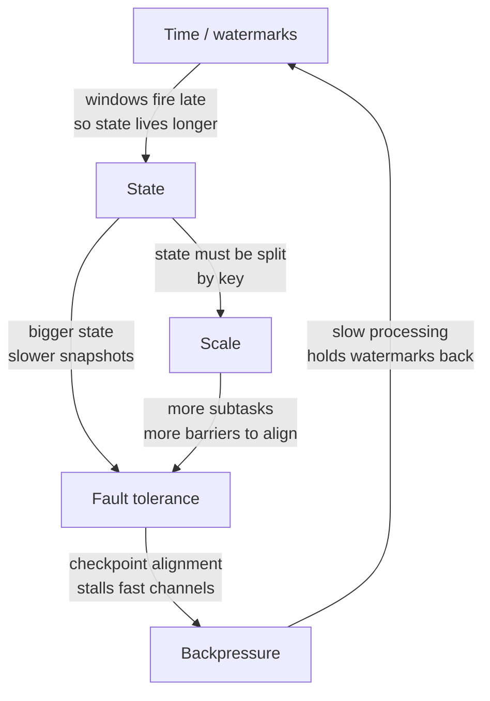

# Why streaming is hard

<PageMeta level="beginner" time="8 min" prereq={[['Batch vs streaming', '/docs/flink/foundations/batch-vs-streaming']]} />

<Objectives>

- Name the four independent problems streaming engines exist to solve
- Explain why solving any one of them naively breaks the other three
- Predict, roughly, which chapter of this guide addresses a given production symptom

</Objectives>

## Start with the naive version

Here is a streaming system. It works.

```java
while (true) {
    Event e = kafka.poll();
    counts.merge(e.userId, 1, Integer::sum);
    if (counts.get(e.userId) > 100) alert(e.userId);
}
```

Genuinely — for a prototype, on one machine, at low volume, this is correct and
you should not over-engineer past it.

Now change four things, one at a time, and watch it fall apart. Each failure
corresponds to one third of this guide.

---

## Problem 1 — Time is not what you think it is

Add a requirement: *"count purchases per minute"*.

Which minute? The minute the purchase happened, or the minute your loop saw it?

```text
User buys at 11:59:58, on a train, in a tunnel.
Phone reconnects and delivers the event at 12:04:11.

Your loop counts it in the 12:04 minute.
Finance counts it in the 11:59 minute.
Now your dashboard disagrees with the ledger, forever.
```

Fixing this means using the event's own timestamp. But then a second problem
appears immediately: **when is the 11:59 minute finished?**

You cannot know. There might be another straggler still in a tunnel. If you wait
forever you never emit a result. If you do not wait at all, you emit wrong
results.

There is no correct answer — only a **tunable trade-off between latency and
completeness**. Flink's name for that dial is the
[watermark](/docs/flink/watermarks/what-is-a-watermark).

> **Chapters:** [Level 2 — Time](/docs/flink/time/three-clocks) · [Level 3 — Watermarks](/docs/flink/watermarks/what-is-a-watermark)

---

## Problem 2 — State grows, and it is not yours to lose

That `counts` HashMap is **state**: memory that must survive between events.

Three things go wrong with it.

**It grows without bound.** One entry per user. A million users is fine. A
hundred million users, each with a 200-byte session object, is 20 GB — on one
heap. Then someone adds a bot that generates a fresh user ID per request, and
your key space becomes infinite.

**It is a single point of failure.** The map lives in one JVM's heap. When that
JVM restarts, every count returns to zero, and nobody downstream is told.

**It cannot be split naively.** Run two copies of the loop for throughput and
each has half the events for each user, so neither has the real count. You need
all events for user `U123` to reach *the same* copy — which is
[`keyBy`](/docs/flink/state/keyed-state), and which then means the state has an
owner, which then means rescaling has to move state between owners.

> **Chapters:** [Level 5 — State](/docs/flink/state/why-state) · [TTL and growth](/docs/flink/state/ttl-and-growth) · [Rescaling](/docs/flink/fault-tolerance/rescaling)

---

## Problem 3 — Failure is normal, not exceptional

Run on 40 machines for 6 months. Something will die: a spot instance reclaimed, a
kernel OOM, a rack losing power, a bad deploy.

A batch job handles this by re-running. A streaming job cannot: **the input has
moved on**, and the state that took three weeks to build is gone.

So you need to periodically save state. And now:

- Save it *when*? The job never stops, and every machine is at a different point in the stream.
- Save it *consistently*? Machine A's state must correspond to the same input prefix as machine B's. If A has processed 1000 records and B has processed 1200, a snapshot of both is a state the system was never actually in.
- Stopping everything to take a clean snapshot means a latency spike every time.

Flink's answer is the **checkpoint barrier**: a marker injected into the data
stream itself that flows with the records, so each operator snapshots at the same
logical point without any global pause.

It is a beautiful idea (Chandy–Lamport, adapted) and it is the single most
important mechanism in the system.

> **Chapters:** [Level 8 — Fault tolerance](/docs/flink/fault-tolerance/failure-model) · [Barriers](/docs/flink/fault-tolerance/barriers-and-alignment)

---

## Problem 4 — At scale, the bottleneck moves

Your loop does 50,000 events/s. You need 2,000,000. Run 40 copies.

Now:

- **Which copy handles which user?** All events for a user must land on one copy, so state stays consistent. That is partitioning, and it is a network shuffle.
- **What if user `U999` is 40% of traffic?** One copy melts while 39 idle. That is **key skew**, and adding machines does nothing.
- **What if the database sink accepts 25,000 writes/s?** The whole pipeline runs at 25,000/s. Everything upstream fills its buffers and blocks. That is **backpressure**, and it silently determines your real throughput.
- **What if you need 60 copies next month?** State must be redistributed across a different number of owners, without losing a single key. That is rescaling, and it is why Flink has [key groups](/docs/flink/state/keyed-state).

> **Chapters:** [Level 9 — Running at scale](/docs/flink/scale/backpressure) · [Performance](/docs/flink/scale/performance)

---

## The reason it is genuinely hard: the four interact

Any one of these is tractable alone. The difficulty is that every solution
constrains the others.



Real examples of that loop biting people:

- You raise **allowed lateness** to catch stragglers → window state is retained longer → **checkpoints grow** → checkpoint duration exceeds the interval → **backpressure** → watermarks advance more slowly → *even more* lateness. A tuning change in one chapter caused an outage in another.
- You add **parallelism** to fix throughput → more subtasks → the watermark is the *minimum* across all of them → one idle subtask now stalls every window in the job.
- You enable **exactly-once** on the sink → transactions commit only on checkpoint completion → your end-to-end latency is now bounded below by the checkpoint interval, not by processing speed.

<Callout type="mental">

Flink is not four features bolted together. It is one coherent answer to the
question:

> *How do you keep consistent, recoverable state over an unbounded, out-of-order,
> partitioned input, on unreliable machines, without ever stopping?*

Every API in the system is a consequence of that sentence. When something in
Flink seems arbitrary, it is usually because it is protecting one of these four
properties.

</Callout>

<Callout type="prod" title="How to use this page later">

When production breaks, identify which of the four you are in. It narrows the
search enormously:

| Symptom | Problem |
| --- | --- |
| Output is empty / stuck | Time — a watermark is not advancing |
| Memory or disk climbing forever | State — something is never cleaned up |
| Checkpoints slow, failing, or timing out | Fault tolerance ∩ backpressure |
| Throughput plateaus below expectation | Scale — find the bottleneck operator |
| Duplicate rows downstream | Fault tolerance — sink semantics on replay |
| One subtask at 100%, rest idle | Scale — key skew |

</Callout>

<Callout type="remember">

Time, state, failure, scale. Four problems, deeply entangled. Everything in this
guide is one of them, and every production incident you will have is one of them.

</Callout>

## Next

**[Flink in the ecosystem](/docs/flink/foundations/flink-in-the-ecosystem)** — where Flink sits, and what the classic diagram gets wrong in 2026.
