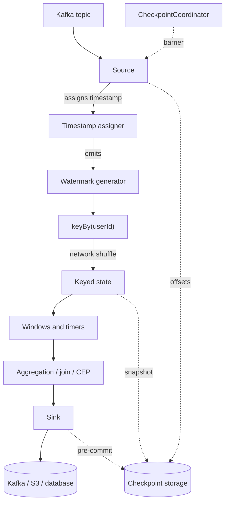

# The Flink Bible

**Apache Flink, explained from zero.**

Not an API reference. A textbook. You start at "what is an event?" and you finish
able to design, tune, debug, recover and rescale a stateful streaming system that
handles real money and real traffic.

Every page follows the same shape: *what is it → why does it exist → an analogy →
a picture → a tiny example → real code → what Flink is actually doing → what
happens when it breaks → what changes at scale.*

<Callout type="version" title="Documentation baseline">

**Apache Flink 2.3** (latest stable, June 2026). Where behaviour differs on the
**1.20 LTS** line — and it differs in some important places, because Flink 2.0
removed the DataSet API, the Scala API, `SourceFunction` and `SinkFunction` —
you will see an explicit version note rather than a silent mix of APIs.

</Callout>

---

## How to read this

You do not have to read it in order, but the order is not arbitrary. Each level
assumes only the levels above it, and nothing else.

<CardGrid>
  <Card to="/docs/flink/foundations/what-is-an-event" level="🟢 Level 0" title="Before Flink">
    What an event is, what a stream is, why batch processing stopped being enough,
    and why streaming is genuinely hard.
  </Card>
  <Card to="/docs/flink/basics/architecture" level="🟢 Level 1" title="Flink basics">
    JobManager, TaskManager, task slots, operators, subtasks. Then your first
    running job.
  </Card>
  <Card to="/docs/flink/time/three-clocks" level="🟡 Level 2" title="Time">
    The single most important idea in the whole guide: there are three different
    clocks and they disagree.
  </Card>
  <Card to="/docs/flink/watermarks/what-is-a-watermark" level="🟡 Level 3" title="Watermarks">
    How Flink decides that it is safe to move forward. Includes an interactive lab.
  </Card>
  <Card to="/docs/flink/windows/why-windows" level="🟡 Level 4" title="Windows">
    Turning an infinite stream into finite answers.
  </Card>
  <Card to="/docs/flink/state/why-state" level="🟡 Level 5" title="State">
    The memory Flink keeps between events — and the thing that makes everything
    else complicated.
  </Card>
  <Card to="/docs/flink/timers" level="🟡 Level 6" title="Timers">
    Scheduling the future. Timeouts, inactivity, delayed alerts.
  </Card>
  <Card to="/docs/flink/joins" level="🔴 Level 7" title="Joins">
    Combining two infinite streams without storing them forever.
  </Card>
  <Card to="/docs/flink/fault-tolerance/failure-model" level="🔴 Level 8" title="Fault tolerance">
    Checkpoints, barriers, savepoints, exactly-once, rescaling. Includes an
    interactive checkpoint lab.
  </Card>
  <Card to="/docs/flink/scale/backpressure" level="🔴 Level 9" title="Running at scale">
    Backpressure, Kafka, async I/O, performance tuning.
  </Card>
  <Card to="/docs/flink/production/deployment" level="🔴 Level 10" title="Production">
    Deployment, observability, and a debugging runbook for seven real failures.
  </Card>
  <Card to="/docs/flink/internals/how-flink-really-works" level="⚫ Level 11" title="Internals">
    One event's complete journey — and what happens to it at every kind of failure.
  </Card>
</CardGrid>

Then four sections that stand on their own:

<CardGrid>
  <Card to="/docs/flink/sql/table-api" level="🟡 Declarative" title="Table API & SQL">
    Dynamic tables, changelogs, retractions, and the queries you will actually write —
    with the state cost of each.
  </Card>
  <Card to="/docs/flink/testing" level="🔴 Practice" title="Testing">
    Operator test harnesses, driving watermarks by hand, and proving your state
    returns to zero.
  </Card>
  <Card to="/docs/flink/projects" level="🧪 Build" title="Five projects">
    Clickstream, sessionization, fraud detection, dynamic rules, exactly-once. Each
    ends with "break it on purpose".
  </Card>
  <Card to="/docs/flink/architecture/patterns" level="🏛 Design" title="Reference architectures">
    Six production designs, each specified as the same eight decisions.
  </Card>
</CardGrid>

---

## The whole system on one page

If you remember nothing else, remember this shape. Every chapter in this guide is
a zoom-in on one box.

Three questions run through the entire guide, and you should be able to answer
them at every box:

1. **Where is my event right now?**
2. **Where is its state, and who owns that state?**
3. **What happens if this machine dies in the next second?**

<Callout type="remember">

Flink is not "a library for processing streams". Flink is a **distributed system
that keeps consistent state while data keeps arriving**. Almost every hard thing
in this guide follows from that one sentence.

</Callout>

---

## What you actually need to know first

Very little.

| You need | You do **not** need |
| --- | --- |
| How to read a Java method | Distributed systems theory |
| What a `for` loop does | Kafka |
| Roughly what a database is | Concurrency or threading |
| Willingness to be confused for ten minutes | Any prior streaming experience |

Everything else — partitions, consensus, event time, exactly-once, state
backends — is introduced here, at the point where you need it, in plain language
first.

<Callout type="try" title="Start here">

If you have never touched streaming: **[What is an event?](/docs/flink/foundations/what-is-an-event)**

If you already write Flink jobs and want the deep material: **[Watermarks](/docs/flink/watermarks/what-is-a-watermark)**, then **[Checkpoints](/docs/flink/fault-tolerance/checkpoints)**, then **[How Flink really works](/docs/flink/internals/how-flink-really-works)**.

If you are preparing for an interview next week: **[Confusions](/docs/flink/reference/confusions)** → **[Cheat sheets](/docs/flink/reference/cheat-sheets)** → **[Interview questions](/docs/flink/reference/interview)**.

</Callout>

---

## Related StreamForge docs

This guide teaches Flink itself. StreamForge is what you build **on top of**
Flink so you stop writing the same scaffolding twice.

- [StreamForge platform overview](https://chanukyagattu.github.io/stream-forge/docs/intro) — the YAML DSL that compiles to the job graph described here
- [Exactly-once design](https://chanukyagattu.github.io/stream-forge/docs/design/exactly-once) — how StreamForge implements the guarantees explained in [Level 8](/docs/flink/fault-tolerance/exactly-once)
- [Deploying to Flink on EKS](https://chanukyagattu.github.io/stream-forge/docs/guides/deploying) — the production deployment this guide's [Level 10](/docs/flink/production/deployment) describes generically
