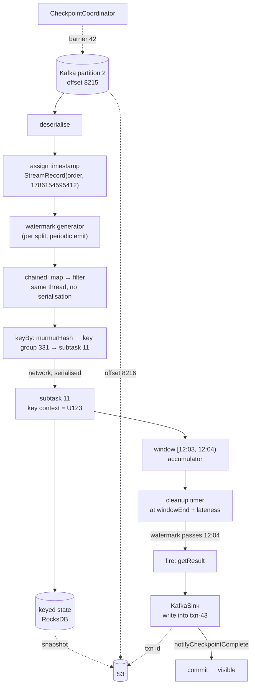

# How Flink really works

<PageMeta level="expert" time="20 min" prereq={[['Runbook', '/docs/flink/production/runbook']]} docs="docs/concepts/stateful-stream-processing/" />

This is the page that ties the guide together. We take **one event** and follow it
all the way through, naming every component it touches. Then we ask sixteen "what
if" questions and answer each from the mechanisms in the preceding chapters.

If you can narrate this page from memory, you understand Flink.

---

## The event

```json
{
  "userId":  "U123",
  "type":    "purchase",
  "amount":  42.50,
  "eventTime": 1786154595412
}
```

Written to `orders`, partition 2, offset 8,215, at 12:03:15.412 event time. It
arrives in Kafka at 12:03:15.9. Our job reads it at 12:03:16.1.

---

## The journey

### 1. Kafka → source subtask

The `KafkaSource` enumerator on the JobManager assigned partition 2 to source
subtask 1 at startup. That subtask's `SplitReader` polls, gets a batch, and our
record is in it.

At this moment the record is **bytes in a JVM buffer**, and its only durable home is
Kafka. If this TaskManager died right now, the record would simply be read again from
offset 8,215 after recovery. Nothing is lost.

### 2. Deserialisation

The `KafkaRecordDeserializationSchema` turns the bytes into an `Order` object. If it
throws here and the exception escapes, the job fails, restarts, replays from the last
checkpointed offset, and hits the same record again — the poison-record restart loop
from [Scenario 7](/docs/flink/production/runbook).

### 3. Timestamp assignment

The `TimestampAssigner` reads `eventTime` and attaches it to the `StreamRecord`. The
record is now a `StreamRecord(order, 1786154595412L)`.

Before this point the record has no event time; the field was just data. After it,
every event-time mechanism in the job can see it.

### 4. Watermark generation

The per-split `WatermarkGenerator` for partition 2 updates its maximum observed
timestamp. It does **not** emit anything — emission happens on the 200ms periodic
timer.

When that timer next fires, it emits `maxTimestamp − 10s − 1ms`. The source operator
takes the **minimum** across its three splits and emits that downstream.

If partition 4 had been silent since 09:00 and `withIdleness` were not configured,
that minimum would be 09:00 and this record's window would never fire.
([Level 3](/docs/flink/watermarks/propagation-and-idleness))

### 5. Chained operators

`map(parse)` and `filter(isValid)` are chained to the source. They run **in the same
thread**, as method calls, with no serialisation and no network. Our record is passed
by object reference.

If we had `disableChaining()`, each of these would be a separate task with a
serialisation round-trip. ([Level 1](/docs/flink/basics/parallelism-and-subtasks))

### 6. `keyBy` — the shuffle

```text
"U123".hashCode()              = 2603187
murmurHash(2603187)            = 1839472051
1839472051 % 720               = 331          ← key group
331 * 24 / 720                 = 11           ← target subtask
```

The record is **serialised**, written to the output buffer for channel 11, and sent
over the network to whichever TaskManager hosts subtask 11 of the process operator.

This is the first time the record has left its thread. It is also the point at which
the chain broke. ([Level 1](/docs/flink/basics/parallelism-and-subtasks) ·
[Level 5](/docs/flink/state/keyed-state))

### 7. Arrival at the keyed operator

Subtask 11 deserialises the record. Its mailbox loop calls `processElement`, having
first **set the key context to `U123`**.

Every subsequent `state.value()` in this call transparently reads `U123`'s state, and
nothing else's.

### 8. State access

```java
Long total = runningTotal.value();     // RocksDB get: keyGroup 331 | U123 | "total"
runningTotal.update(total + 42.50);    // RocksDB put
```

On RocksDB this is a serialise-lookup-deserialise cycle against the memtable, then
the block cache, then an SST file on local disk. On the heap backend it is a hash
lookup returning an object reference. ([Level 5](/docs/flink/state/state-backends))

### 9. Window assignment

`TumblingEventTimeWindows.of(1 min)` computes:

```text
windowStart = 1786154595412 - (1786154595412 % 60000) = …540000   (12:03:00)
windowEnd   = windowStart + 60000                                  (12:04:00)
```

The record's contribution is folded into the accumulator stored under
`(key=U123, namespace=TimeWindow[12:03:00, 12:04:00))`.

With `aggregate`, that is one accumulator. With `process`, the whole record is
buffered. ([Level 4](/docs/flink/windows/window-functions))

### 10. Timer registration

The `WindowOperator` registers a cleanup timer at
`windowEnd - 1 + allowedLateness`. The timer is keyed state, stored in the timer
service, and included in checkpoints. ([Level 6](/docs/flink/timers))

### 11. Waiting

The record's work is done. Its *effect* now lives in:

- an accumulator in the state backend, under key `U123`, namespace `[12:03, 12:04)`
- a pending timer
- source subtask 1's read position, which is past offset 8,215

The record object itself is garbage. Nothing anywhere holds the original bytes.

**This is the answer to "where is my event?" — it is nowhere. Only its effect on
state remains.**

### 12. A checkpoint happens

The `CheckpointCoordinator` triggers checkpoint 42. Barriers are injected at the
sources. Our subtask 11 aligns barriers across its 12 input channels, snapshots its
keyed state (including our accumulator and our timer), and uploads it to S3
asynchronously.

Source subtask 1 records offset 8,216 — the position *after* our record.

Those two facts are now **paired**: the state includes our record's effect, and the
offset is past it. On any future restore they will be restored together, which is
exactly what consistency means here.
([Level 8](/docs/flink/fault-tolerance/checkpoints))

### 13. The window fires

The watermark reaches 12:04:00. The window's event-time timer fires. The
`WindowOperator` reads the accumulator, calls `getResult()`, emits a record — and if
allowed lateness is zero, purges the state.

### 14. The sink

The result reaches the `KafkaSink`, which writes it **inside transaction
txn-43**. Nothing downstream can see it yet.

### 15. Commit

Checkpoint 43 completes. The coordinator calls `notifyCheckpointComplete(43)`. The
sink commits txn-43. A `read_committed` consumer can now see the result.

Our event's entire contribution to the world is one aggregated number in a Kafka
topic. ([Level 8](/docs/flink/fault-tolerance/exactly-once))

---

## The complete picture



---

## Sixteen things that can go wrong

Each answer follows from a mechanism in the guide. Try to answer before reading.

### 1. The event arrives late

The watermark has already passed 12:04. The window fired and, without allowed
lateness, purged.

→ Dropped silently, unless `allowedLateness` keeps the state alive (window re-fires
with a correction) or `sideOutputLateData` captures it.
([Level 2](/docs/flink/time/out-of-order-and-late))

### 2. The event arrives out of order but not late

Nothing happens. It is folded into its correct window by event time. This is the
normal, healthy case — out of order is not a problem.

### 3. Partition 4 goes idle

Its watermark stops advancing. The source's minimum freezes. **No window in the
entire job fires**, state grows, and the job reports RUNNING with no errors.

→ `withIdleness` excludes the silent split from the minimum.
([Level 3](/docs/flink/watermarks/propagation-and-idleness))

### 4. Subtask 11 becomes slow

Its input buffers fill. Credit-based flow control stops upstream from sending.
Backpressure propagates to the source, which stops polling Kafka. Consumer lag grows.

Simultaneously, checkpoint barriers move more slowly, so alignment duration grows and
checkpoints start to time out. ([Level 9](/docs/flink/scale/backpressure))

### 5. A checkpoint starts while we are back-pressured

Aligned mode: subtask 11 blocks its fast channels and waits — for however long the
slow channel takes. Checkpoint duration tracks the backpressure.

Unaligned mode: it forwards the barrier immediately and snapshots the in-flight
buffers instead. Duration becomes roughly independent of the backpressure.
([Level 8](/docs/flink/fault-tolerance/barriers-and-alignment))

### 6. The barrier reaches subtask 11

It aligns across all 12 input channels, then takes a **synchronous** snapshot (a
copy-on-write handle flip, microseconds) and an **asynchronous** upload (potentially
minutes). Records keep flowing during the upload.

### 7. The TaskManager crashes mid-upload

Checkpoint 42 never completes. The coordinator times it out or marks it failed. The
job fails over and restores from checkpoint **41**, not 42. Slightly more
reprocessing; no inconsistency.

### 8. The TaskManager crashes after checkpoint 42 completed

The JobMaster fails the failover region, requests slots, redeploys. Each subtask
downloads its key-group range from `s3://…/chk-42/`. Source subtasks reset their
Kafka offsets to the checkpointed values.
([Level 8](/docs/flink/fault-tolerance/failure-model))

### 9. Records are replayed

Records after the checkpointed offsets are read **again** and processed **again**.

This is not a bug — it is the mechanism. State was rewound to the matching point, so
reprocessing lands the system in the state it would have reached without the crash.
([Level 8](/docs/flink/fault-tolerance/exactly-once))

### 10. The sink had an open transaction when it crashed

If checkpoint 42 completed, the sink recovers its transaction ID from state and
**re-commits**. If it did not complete, the transaction is **aborted**. Either way,
downstream sees each result exactly once.

### 11. The job is rescaled from 24 to 32 subtasks

Stop with a savepoint. Restart with `-p 32`. Key groups are redistributed:
`331 * 32 / 720 = 14`, so `U123` now lives on subtask 14, and its state is copied
there as part of the key-group range transfer.
([Level 8](/docs/flink/fault-tolerance/rescaling))

### 12. Someone adds an operator upstream

If the stateful operators have explicit `uid()`s, nothing changes — state matches by
uid. If they rely on generated uids, the graph structure changed, the uids changed,
and the savepoint no longer matches. State is orphaned.
([Level 8](/docs/flink/fault-tolerance/savepoints))

### 13. The `Order` class gains a field

POJO or Avro: the new field reads as null/default, restore succeeds. Kryo: restore
fails, or silently deserialises garbage.
([Level 5](/docs/flink/state/serialization-and-evolution))

### 14. One record has `eventTime` in the year 2100

The watermark jumps to 2100 and, because watermarks never go backwards, **stays**
there. Every window fires and purges immediately. Every subsequent normal record is
late and dropped. The job stays green and stops being correct.

→ Clamp future timestamps in the assigner, and restart without the poisoned state.
([Level 2](/docs/flink/time/timestamp-assignment))

### 15. `U123` becomes 40% of all traffic

Every one of its records goes to one subtask. That subtask saturates while 23 others
idle. Adding parallelism does nothing.

→ Two-phase aggregation with a salted key.
([Level 9](/docs/flink/scale/performance))

### 16. The job is stopped and restarted from a savepoint

State is restored. Kafka offsets are restored. **Watermarks are not** — they restart
at `Long.MIN_VALUE` and are rebuilt from replayed data. For long windows there is a
warm-up period during which results appear delayed. Expected, frequently reported as
a bug.

---

## The architecture map

```text
                            APACHE FLINK
                                 │
        ┌────────────────────────┼────────────────────────┐
        │                        │                        │
      TIME                     STATE                   COMPUTE
        │                        │                        │
  event time              keyed state              map / filter
  processing time         operator state           windows
  watermarks              broadcast state          joins
  timestamps              key groups               aggregation
  idleness                TTL                      CEP
  lateness                timers                   async I/O
        │                        │                        │
        └────────────────────────┼────────────────────────┘
                                 │
                          FAULT TOLERANCE
                                 │
             barriers ──▶ checkpoints ──▶ savepoints
                                 │
                    exactly-once state consistency
                                 │
              ┌──────────────────┼──────────────────┐
              ▼                  ▼                  ▼
          RECOVERY           RESCALING           UPGRADES
              │                  │                  │
              └──────────────────┼──────────────────┘
                                 │
                            PRODUCTION
                                 │
        ┌────────────────────────┼────────────────────────┐
        │                        │                        │
   OBSERVABILITY            PERFORMANCE              DEPLOYMENT
   watermark lag            backpressure             Kubernetes
   checkpoint metrics       skew                     application mode
   consumer lag             serialisation            high availability
   state size               local disk               savepoint upgrades
```

---

## The five questions

For any Flink concept, these five answers constitute understanding. They are the
questions this guide has been answering, page by page.

```text
1. What problem does this solve?
2. What is the mental model?
3. What is Flink doing internally?
4. What happens when it goes wrong?
5. What changes when the system becomes huge?
```

<Callout type="remember">

An event's data is transient. Its **effect on state** is what persists, and what gets
checkpointed, restored and redistributed.

Flink's entire design follows from keeping that state consistent while data never
stops arriving — on machines that will fail, with clocks that disagree, at a scale
where nothing can ever be paused.

</Callout>

## Next

**[Confusions](/docs/flink/reference/confusions)** — the fifteen pairs of ideas that trip everyone up.
