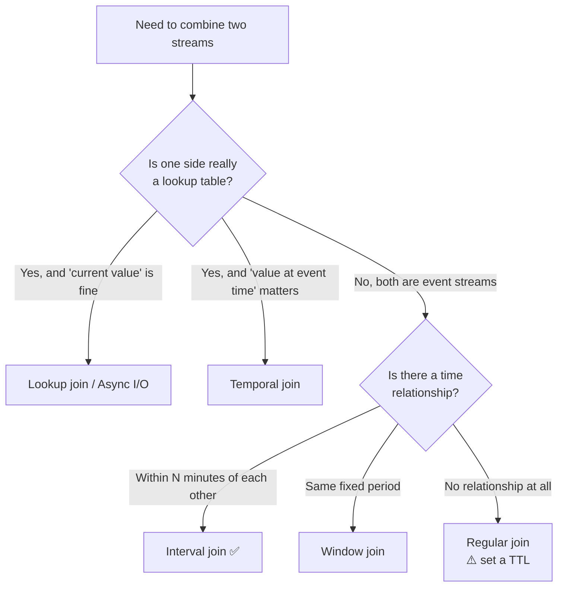

# Joins

<PageMeta level="advanced" time="14 min" prereq={[['Timers', '/docs/flink/timers']]} />

<Objectives>

- Answer, for any join, the question "how long is state retained and what cleans it up?"
- Choose the right join type from the requirement rather than from familiarity
- Recognise the two joins that will grow state without bound

</Objectives>

## The problem

In a database, a join is easy: both tables are finite and sitting on disk.

In a stream, both sides are infinite. To join them you must **remember** one side
while waiting for the other. So every streaming join is really a question about
memory:

<Callout type="key">

For every join, ask these five questions. They matter more than the syntax:

1. **What is stored?** One side, or both?
2. **How long is it retained?**
3. **What removes it?** A watermark, a timer, a TTL, or nothing?
4. **What happens to late data?**
5. **What happens when state gets large?**

If you cannot answer 2 and 3, the join will grow without bound. That is not a
tuning problem; it is a design error.

</Callout>

## Window join — both sides, same window

Records from both streams that fall in the **same window** and share a key.

```java
orders.join(shipments)
      .where(Order::id)
      .equalTo(Shipment::orderId)
      .window(TumblingEventTimeWindows.of(Duration.ofMinutes(5)))
      .apply((o, s) -> new Fulfilled(o, s));
```

| Question | Answer |
| --- | --- |
| Stored | Both sides, for the window duration |
| Retained | Until the watermark passes the window end |
| Cleaned by | The window's cleanup timer |
| Late data | Dropped (or side-outputted) |
| At scale | Bounded and predictable — the safest join |

<Callout type="mistake">

The window boundary problem again: an order at 12:04:59 and its shipment at
12:05:01 fall into **different** 5-minute windows and never match, despite being
two seconds apart.

Window joins are only appropriate when the two events genuinely belong to the same
period by definition. For "within N minutes of each other", use an interval join.

</Callout>

## Interval join — relative time, no boundaries

The one you usually want. Matches records within a time interval *relative to each
other*.

```java
orders.keyBy(Order::id)
      .intervalJoin(shipments.keyBy(Shipment::orderId))
      .between(Duration.ofMinutes(-5), Duration.ofHours(2))
      //      ^ shipment can be 5 min BEFORE  ^ up to 2 hours AFTER the order
      .process(new ProcessJoinFunction<Order, Shipment, Fulfilled>() {
          public void processElement(Order o, Shipment s, Context ctx,
                                     Collector<Fulfilled> out) {
              out.collect(new Fulfilled(o, s));
          }
      });
```

```text
                  order at 12:00
                        │
    ┌───────────────────┼───────────────────────────────┐
 11:55                12:00                          14:00
    lower bound                                    upper bound

 any shipment in this interval matches — no window boundaries
```

| Question | Answer |
| --- | --- |
| Stored | Both sides, for the interval duration |
| Retained | Until the watermark passes `record time + upper bound` |
| Cleaned by | Timers registered per record |
| Late data | Dropped; can be side-outputted per side |
| At scale | Bounded by the interval — **so keep the interval tight** |

<Callout type="prod">

The interval is your state budget. `between(-5 min, +2 hours)` means holding just
over two hours of *both* streams in state, per key, at all times.

Compute it before you deploy:

```text
state ≈ (interval duration) × (records/sec on both streams) × (bytes/record)

2h × 10,000/s × 200 bytes ≈ 14 GB
```

If that number is uncomfortable, narrow the interval — or reconsider whether one
side is really a *table* rather than a stream, in which case you want a temporal
or lookup join instead.

</Callout>

## Temporal join — "as of" a point in time

Join a stream against the version of a table **that was current at the record's
event time**. This is the correct way to enrich with slowly-changing dimensions.

```sql
SELECT o.order_id, o.amount_usd, o.amount_usd * r.rate AS amount_eur
FROM orders AS o
JOIN currency_rates FOR SYSTEM_TIME AS OF o.order_time AS r
  ON o.currency = r.currency;
```

<Callout type="key">

The difference from a plain lookup: a temporal join uses the rate that was valid
**when the order happened**, not the rate that is valid now.

That distinction is the difference between a reproducible financial figure and one
that changes every time you replay the pipeline. If your join is against anything
that changes over time — prices, exchange rates, product catalogues, user tiers —
this is almost certainly the join you want.

</Callout>

| Question | Answer |
| --- | --- |
| Stored | Versioned table state — several versions per key |
| Retained | Until the watermark makes older versions unreachable |
| Cleaned by | Watermarks on the versioned table |
| Late data | Handled by version lookup |
| At scale | Proportional to key count × versions retained |

The versioned table needs a primary key and an event-time attribute:

```sql
CREATE TABLE currency_rates (
  currency STRING,
  rate DECIMAL(10, 4),
  update_time TIMESTAMP_LTZ(3),
  WATERMARK FOR update_time AS update_time - INTERVAL '10' SECOND,
  PRIMARY KEY (currency) NOT ENFORCED
) WITH ('connector' = 'kafka', 'value.format' = 'debezium-json', ...);
```

## Lookup join — query an external system

Enrich from a database or service instead of from Flink state.

```sql
SELECT o.order_id, c.name, c.tier
FROM orders AS o
JOIN customers FOR SYSTEM_TIME AS OF o.proc_time AS c
  ON o.customer_id = c.id;
```

| Question | Answer |
| --- | --- |
| Stored | Nothing in Flink (optionally a small cache) |
| Retained | n/a |
| Cleaned by | n/a |
| Late data | Not applicable — the lookup uses processing time |
| At scale | Bounded by the **external system's** capacity |

Zero Flink state, which is attractive. The costs are real though:

- **Not reproducible** — a replay gets today's customer record, not the one from the time of the order
- **The external system becomes your bottleneck and your availability floor**
- **Latency per record** unless you cache and batch

Use it when the dimension data is large, changes rarely, and "current value" is
acceptable. In DataStream, the equivalent is
[Async I/O](/docs/flink/scale/async-io) — and it must be async, not a blocking
call in `map()`.

## Regular join — the dangerous one

A plain SQL join with no time constraint.

```sql
SELECT * FROM orders o JOIN customers c ON o.customer_id = c.id;
```

| Question | Answer |
| --- | --- |
| Stored | **Both sides, entirely** |
| Retained | **Forever** |
| Cleaned by | **Nothing** — only state TTL, if configured |
| Late data | Always matched — nothing is ever late |
| At scale | **Unbounded growth** |

<Callout type="mistake" title="Regular joins are correct and unsustainable">

Semantically this join is the most correct one: any record can match any other,
at any time, forever. That is exactly why it must keep both sides forever.

It works beautifully in a demo and dies in production. If you use it, you **must**
set a state retention time:

```sql
SET 'table.exec.state.ttl' = '36h';
```

And be clear about what that means: a record older than 36 hours will silently
stop matching. You have traded unbounded memory for silently incomplete results.
That may be the right trade — but make it deliberately, not by omission.

</Callout>

## Choosing



| Requirement | Join |
| --- | --- |
| Order → shipment within 2 hours | Interval |
| Impressions and clicks in the same minute | Window |
| Order value converted at the rate at order time | Temporal |
| Enrich with a customer name from Postgres | Lookup / Async I/O |
| Two CDC streams, no time relationship | Regular + TTL |

## Joins in DataStream vs SQL

| Join | DataStream | SQL |
| --- | --- | --- |
| Window | `.join().where().equalTo().window()` | Windowed join |
| Interval | `.intervalJoin().between()` | `o.time BETWEEN s.time - INTERVAL '5' MINUTE AND s.time` |
| Temporal | Hand-rolled `CoProcessFunction` | `FOR SYSTEM_TIME AS OF` |
| Lookup | Async I/O | `FOR SYSTEM_TIME AS OF proc_time` |
| Regular | Hand-rolled | Plain `JOIN` |

Temporal and lookup joins are considerably easier in SQL, and there is no prize
for hand-rolling them. Mixing is fine: do the joins in SQL, convert to a
`DataStream` for the custom logic.

<Expert>

**Outer joins retract.** A LEFT JOIN emits `(order, null)` when no match has
arrived, then emits a **retraction** of that row followed by `(order, shipment)`
when one does. Your sink must handle retractions — an upsert sink does, an append
sink produces wrong data. This is a very common source of "duplicate rows" reports.

**Interval join state is asymmetric.** Flink buffers each side for the span it
could still be needed. With `between(-5 min, +2 hours)` the left side is retained
for 2 hours and the right side for 5 minutes. Widening only the upper bound
therefore only grows one side — useful when tuning.

**Skew hurts joins disproportionately.** A join key with one dominant value puts
both sides' state for that value on a single subtask. That subtask can hold more
state than the rest of the cluster combined and become impossible to checkpoint.
Detect it early with the [KeyBy lab](/docs/flink/basics/parallelism-and-subtasks)
approach: count records per key and look at the tail.

**Watermarks across both inputs.** A join's watermark is the minimum across both
sides. A low-volume side with a stalled watermark freezes cleanup for the
high-volume side too, so state grows on the *busy* side because of the *quiet* one.
Give both sides a watermark strategy with idleness.

</Expert>

<Callout type="remember">

Every streaming join is a memory question. Interval join for "within N minutes"
— it is the right answer most of the time. Temporal join when the historical
value matters. Regular joins retain both sides forever unless you set a TTL.

</Callout>

## Next

**[Level 8 — the failure model](/docs/flink/fault-tolerance/failure-model)** — what actually happens when a machine dies.
