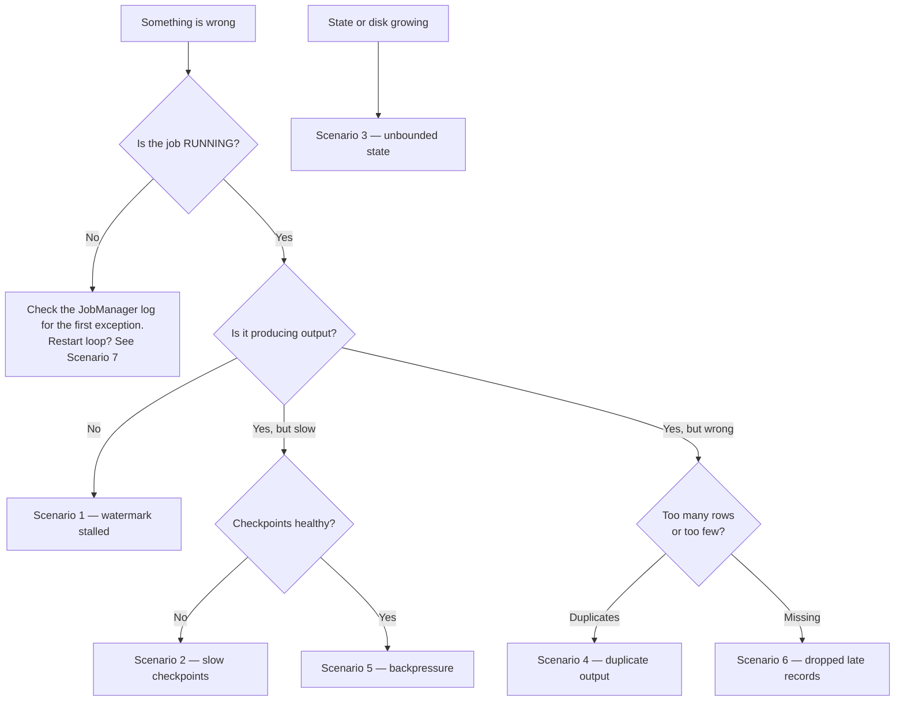

# Production runbook

<PageMeta level="advanced" time="15 min" prereq={[['Observability', '/docs/flink/production/observability']]} />

<Objectives>

- Go from symptom to root cause without changing things at random
- Know which checks are cheap and which are destructive
- Have a script to follow at 3am when you are not thinking clearly

</Objectives>

## Start here



---

## Scenario 1 — Job runs, produces nothing

**Symptoms:** status RUNNING, `numRecordsIn` climbing, `numRecordsOut` at zero, no
errors in the log, state size growing.

This is the most common Flink incident and it has one dominant cause.

### Check, in order

```text
1. UI → the window/aggregation operator → Watermarks tab
   Is currentInputWatermark advancing?

2. If one subtask shows "No Watermark" or is far behind:
   → an idle or dead source split. Go to fix A.

3. If ALL subtasks show "No Watermark":
   → no timestamp assigner at all. Go to fix B.

4. If the watermark is in the future (year 2100 etc):
   → a poisoned timestamp. Go to fix C.

5. If the watermark IS advancing normally:
   → not a watermark problem. Check the window size and that you
     used an EVENT-time assigner, not a processing-time one.
```

### Fixes

**A — idle partition.** The producer for one partition stopped, or that partition
has no traffic at this hour.

```java
.withIdleness(Duration.ofMinutes(1))
```

Deploy, and the remaining active partitions drive event time forward. Also
investigate *why* the partition went quiet — `withIdleness` limits the blast radius
but does not fix a dead producer.

**B — no watermark strategy.** Attach one at the source. See
[timestamp assignment](/docs/flink/time/timestamp-assignment).

**C — poisoned watermark.** One record with an absurd future timestamp pushed the
watermark forward permanently. Watermarks never go backwards, so the job cannot
recover on its own.

```java
// clamp in the assigner
long now = System.currentTimeMillis();
if (t > now + Duration.ofMinutes(5).toMillis()) t = now;
```

Then restart **without** the poisoned state — restoring from a checkpoint replays
the bad record and recreates the problem.

> **Root pages:** [Propagation and idleness](/docs/flink/watermarks/propagation-and-idleness) · [Debugging watermarks](/docs/flink/watermarks/debugging)

---

## Scenario 2 — Checkpoints take ten minutes

**Symptoms:** `lastCheckpointDuration` at minutes, checkpoints occasionally timing
out, possibly a restart loop.

### Check, in order

Open the Checkpoints tab and read the **breakdown**, not the total.

```text
Alignment Duration or Start Delay dominates
   → this is BACKPRESSURE. The checkpoint is a symptom.
   → go to Scenario 5, then enable unaligned checkpoints as a stopgap.

Async Duration dominates
   → state size or storage throughput.
   → is state.backend.incremental true?
   → is checkpoint storage S3 in the same region?
   → is state size unexpectedly large? Go to Scenario 3.

Sync Duration dominates
   → rare. Usually an enormous heap state.
   → move to RocksDB.
```

### Immediate mitigations

```yaml
execution.checkpointing.unaligned.enabled: "true"
execution.checkpointing.aligned-checkpoint-timeout: 30s
execution.checkpointing.interval: 120s        # buy breathing room
execution.checkpointing.min-pause: 60s
state.backend.incremental: "true"
```

<Callout type="mistake">

Raising `max-concurrent-checkpoints` to make checkpoints "keep up". Each concurrent
checkpoint holds its own snapshot, multiplying memory and upload bandwidth, and all
of them get slower. It reliably makes this scenario worse.

</Callout>

> **Root pages:** [Checkpoints](/docs/flink/fault-tolerance/checkpoints) · [Barriers and alignment](/docs/flink/fault-tolerance/barriers-and-alignment)

---

## Scenario 3 — State grows without bound

**Symptoms:** `lastCheckpointSize` rising steadily over days or weeks; eventually
slow checkpoints, disk pressure, OOM.

### Find which operator

```text
UI → Checkpoints → the latest → per-operator state size.
One operator is almost always responsible for nearly all of it.
```

### Then find which cause

| Check | If yes |
| --- | --- |
| What do you `keyBy` on? Is it unbounded — a session ID, a request ID, a UUID? | Unbounded key space. Add TTL, or key on something bounded. |
| Is every `state.update()` matched by a reachable `state.clear()`? | Missing cleanup. Add a timer that clears on inactivity. |
| Are windows actually firing? Compare output rate to input rate. | Stalled watermark — Scenario 1. Windows never purge. |
| Is there a regular (non-windowed) SQL join? | It retains both sides forever. Set `table.exec.state.ttl`. |
| Is there an interval join with a very wide interval? | Narrow the interval, or move one side to a lookup join. |

### Confirm with evidence, not guesses

Take a savepoint and read it with the **State Processor API**: count the keys,
inspect a sample, check how many are stale. This converts "I think it is the session
state" into a number.

### Fixes

```java
// backstop
StateTtlConfig ttl = StateTtlConfig.newBuilder(Duration.ofDays(7))
    .cleanupInRocksdbCompactFilter(1000)
    .build();
descriptor.enableTimeToLive(ttl);
```

```java
// the actual design: a timer that cleans up precisely
ctx.timerService().registerEventTimeTimer(e.eventTime() + IDLE_TIMEOUT);
// in onTimer: state.clear();
```

> **Root pages:** [TTL and growth](/docs/flink/state/ttl-and-growth) · [Timers](/docs/flink/timers)

---

## Scenario 4 — Duplicate rows downstream

**Symptoms:** the same logical record appears more than once in the sink.

### Check, in order

```text
1. Did the job restart recently? (numRestarts)
   → reprocessing after recovery is EXPECTED. The question is why the sink
     did not absorb it.

2. What is the sink's delivery guarantee?
   → AT_LEAST_ONCE, or an append-only sink? That is your answer.

3. Are the consumers reading with isolation.level=read_committed?
   → with a transactional Kafka sink and read_uncommitted consumers,
     you see uncommitted duplicates.

4. Does the job have a window with allowedLateness or an early-firing trigger?
   → then multiple emissions per window are BY DESIGN, and the sink must upsert.

5. Is there a LEFT JOIN in SQL?
   → outer joins emit a row, then a retraction, then a corrected row.
     An append sink turns that into duplicates.
```

### Fixes

- Make the sink **idempotent**: upsert on a deterministic business key (`order_id`, or `(day, page)`, or `(key, window_start)`). Almost always the best answer.
- Or enable **exactly-once** on the sink and set `read_committed` on consumers.
- Or deduplicate downstream on a primary key.

> **Root pages:** [Exactly-once](/docs/flink/fault-tolerance/exactly-once) · [Triggers and lateness](/docs/flink/windows/triggers-and-lateness)

---

## Scenario 5 — Throughput collapsed

**Symptoms:** consumer lag growing, records/s well below normal, no errors.

### Check, in order

```text
1. Backpressure tab. Find the LAST operator that is busy and NOT
   back-pressured. That is the bottleneck.

2. On that operator: is CPU high or low?

   HIGH  → genuinely compute-bound. More parallelism will help.
   LOW   → it is WAITING. More parallelism will NOT help.
           Look for a blocking call, slow state access, or a slow sink.

3. Check per-subtask record counts on that operator.
   One subtask far above the others → key skew, not capacity.
```

### Fixes by cause

| Cause | Fix |
| --- | --- |
| Blocking external call in an operator | [Async I/O](/docs/flink/scale/async-io) |
| Slow sink | Batch writes; raise sink parallelism only within the target's capacity |
| Key skew | [Two-phase aggregation](/docs/flink/scale/performance) |
| Slow state access | `MapState` instead of `ValueState` of a collection; faster local disk |
| Kryo serialisation | Fix the type; `disableGenericTypes` in CI |
| Genuinely under-provisioned | Rescale |

<BackpressureLab />

> **Root pages:** [Backpressure](/docs/flink/scale/backpressure) · [Performance](/docs/flink/scale/performance)

---

## Scenario 6 — Results are missing

**Symptoms:** numbers are lower than they should be; no errors anywhere.

### Check

```text
1. numLateRecordsDropped on the window operator.
   Non-zero → records are arriving behind the watermark and being
   silently discarded. This is the default behaviour.

2. Compare the out-of-orderness bound with the actual lateness
   distribution (the eventTimeLagMs histogram, if you added it).

3. Did an upstream producer change? A new client version, a new region,
   a device fleet with different clock behaviour?
```

### Fixes

```java
// 1. See what you are losing, before deciding what to do about it
OutputTag<Click> lateTag = new OutputTag<>("late"){};
...
.sideOutputLateData(lateTag)
...
results.getSideOutput(lateTag).sinkTo(deadLetterSink);

// 2. Then either widen the bound...
.forBoundedOutOfOrderness(Duration.ofSeconds(30))

// 3. ...or allow lateness so windows emit corrections
.allowedLateness(Duration.ofMinutes(2))
```

Measure before you widen. A larger bound costs latency on every window, forever, to
catch a tail you have not quantified.

> **Root pages:** [Out-of-order and late](/docs/flink/time/out-of-order-and-late)

---

## Scenario 7 — Restart loop

**Symptoms:** `numRestarts` climbing steadily; the job never stays up.

### Check

```text
1. Find the FIRST exception, not the most recent one.
   Restart loops bury the original cause under hundreds of repetitions.
   Search the JobManager log for the earliest "Job ... switched to FAILED".

2. Classify it:
   - Deserialisation error   → a poison record. Go to fix A.
   - OOM                     → memory or state. Scenario 3.
   - Connection refused      → an external dependency is down.
   - Checkpoint failure      → Scenario 2.
   - State restore failure   → a uid or schema change. Go to fix B.
```

### Fixes

**A — poison record.** One malformed record fails deserialisation, the job restarts,
replays from the checkpoint, hits the same record, fails again. Forever.

```java
// make the deserialiser total: never throw on bad input
@Override
public void deserialize(byte[] message, Collector<Order> out) {
    try {
        out.collect(parse(message));
    } catch (Exception e) {
        deserializationErrors.inc();     // count it
        // emit nothing — or emit to a dead-letter side output
    }
}
```

**B — state restore failure.** A `uid()` changed, or a state class changed
incompatibly. Read the error to find *which* operator's state is unclaimed, then
decide deliberately whether to discard it:

```bash
flink run -s s3://.../savepoint --allowNonRestoredState my-job.jar
```

Never reach for that flag before understanding what it is discarding.

### Stop the bleeding

```yaml
restart-strategy.type: exponential-delay
restart-strategy.exponential-delay.max-backoff: 5min
```

A job that has restarted 20 times in an hour needs a human, not another retry.

> **Root pages:** [Failure model](/docs/flink/fault-tolerance/failure-model) · [Serialization and evolution](/docs/flink/state/serialization-and-evolution)

---

## The 3am checklist

When you cannot think clearly, do these in order. All are cheap and none are
destructive.

```text
1.  Is the job RUNNING?                    → UI, or kubectl get flinkdeployment
2.  numRestarts — has it been restarting?  → if yes, find the FIRST exception
3.  Watermark lag — is event time moving?  → if no, Scenario 1
4.  Checkpoints — succeeding? how long?    → if no, Scenario 2
5.  Backpressure — which operator is red?  → if any, Scenario 5
6.  Consumer lag — growing or shrinking?   → growing means under-capacity
7.  State size — normal for this job?      → if not, Scenario 3
8.  Did anything deploy in the last hour?  → upstream producers count as deploys
```

<Callout type="prod" title="Before you change anything">

Take a savepoint if the job is healthy enough to produce one:

```bash
flink savepoint <jobId> s3://bucket/savepoints/incident-$(date +%s)
```

It costs minutes and gives you a rollback point and a forensic artifact you can read
later with the State Processor API. Many incidents are much easier to diagnose
afterwards from a savepoint than from logs.

</Callout>

<Callout type="remember">

Symptom → check → cause → fix, in that order. Job status is not health. Read the
checkpoint *breakdown*, not the total. Find the *first* exception in a restart loop.
And take a savepoint before you change anything.

</Callout>

## Next

**[How Flink really works](/docs/flink/internals/how-flink-really-works)** — one event's complete journey.
