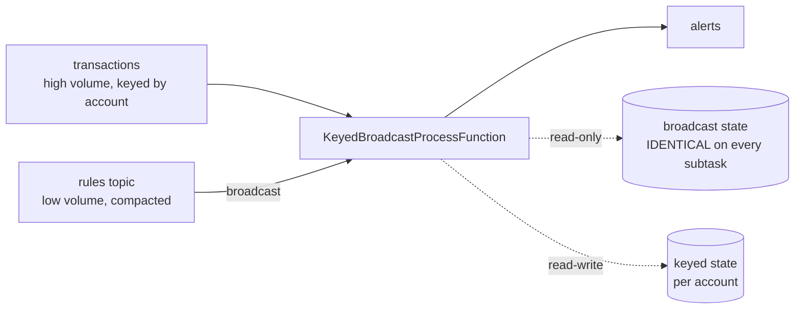

# Project 4 — Dynamic rules engine

<PageMeta level="advanced" time="16 min" prereq={[['Project 3', '/docs/flink/projects/fraud-detection'], ['Broadcast state', '/docs/flink/state/operator-and-broadcast-state']]} />

**Goal:** evaluate transactions against a rule set that the fraud team can change at
runtime, with no redeploy and no state loss.

**Teaches:** broadcast state, the read-only/read-write asymmetry, the bootstrap
problem, and why subtask determinism matters.

---

## Why this project exists

Project 3 hard-coded `PAYOUT_MIN = 500.00`. Every threshold change is a rebuild, a
savepoint, a deploy, and a review — which in practice means the threshold does not get
changed, which means the detector gets worse over time.

This is the single most requested capability in any real streaming fraud, security or
monitoring system.



## The rule model

```java title="Rule.java"
public record Rule(
    String id,
    String field,          // "amount", "count", "sum"
    String op,             // ">", "<", "=="
    double threshold,
    long   windowMs,       // over what period
    String action,         // "ALERT", "BLOCK", "LOG"
    boolean deleted        // tombstone for removal
) {
  public boolean matches(double value) {
    return switch (op) {
      case ">"  -> value >  threshold;
      case "<"  -> value <  threshold;
      case "==" -> value == threshold;
      default   -> false;
    };
  }
}
```

## The job

```java title="DynamicRulesJob.java"
public class DynamicRulesJob {

  public static void main(String[] args) throws Exception {
    StreamExecutionEnvironment env =
        StreamExecutionEnvironment.getExecutionEnvironment();
    env.enableCheckpointing(10_000);
    env.setMaxParallelism(720);

    // The descriptor object must be the SAME wherever it is referenced.
    MapStateDescriptor<String, Rule> rulesDesc =
        new MapStateDescriptor<>("rules", Types.STRING, Types.POJO(Rule.class));

    // ── the rules stream ──────────────────────────────────────────────────
    // Read from EARLIEST on a COMPACTED topic, so the full rule set is
    // replayed on every start. This is the bootstrap fix.
    KafkaSource<Rule> ruleSource = KafkaSource.<Rule>builder()
        .setBootstrapServers("localhost:9092")
        .setTopics("rules")
        .setStartingOffsets(OffsetsInitializer.earliest())
        .setValueOnlyDeserializer(new RuleDeserializer())
        .build();

    BroadcastStream<Rule> rules = env
        .fromSource(ruleSource, WatermarkStrategy.noWatermarks(), "rules")
        .broadcast(rulesDesc);

    // ── the transaction stream ────────────────────────────────────────────
    DataStream<Txn> txns = env
        .fromSource(kafkaSource("transactions"), watermarks(), "txns")
        .map(DynamicRulesJob::parse).name("parse").uid("parse");

    txns.keyBy(Txn::accountId)
        .connect(rules)
        .process(new RuleEvaluator(rulesDesc))
        .name("evaluate-rules").uid("evaluate-rules")
        .print();

    env.execute("dynamic rules");
  }
}
```

```java title="RuleEvaluator.java"
public class RuleEvaluator
    extends KeyedBroadcastProcessFunction<String, Txn, Rule, Alert> {

  private final MapStateDescriptor<String, Rule> rulesDesc;

  /** Per-account rolling window of recent transactions, for count/sum rules. */
  private transient ListState<Txn> recent;
  private transient ValueState<Long> cleanupTimer;

  public RuleEvaluator(MapStateDescriptor<String, Rule> rulesDesc) {
    this.rulesDesc = rulesDesc;
  }

  @Override
  public void open(OpenContext ctx) {
    recent = getRuntimeContext().getListState(
        new ListStateDescriptor<>("recent", Types.POJO(Txn.class)));
    cleanupTimer = getRuntimeContext().getState(
        new ValueStateDescriptor<>("cleanup", Types.LONG));
  }

  /** Per transaction. Broadcast state is READ-ONLY here. Keyed state is available. */
  @Override
  public void processElement(Txn txn, ReadOnlyContext ctx, Collector<Alert> out)
      throws Exception {

    ReadOnlyBroadcastState<String, Rule> rules = ctx.getBroadcastState(rulesDesc);

    // maintain a bounded rolling window of this account's recent transactions
    recent.add(txn);
    long horizon = maxWindow(rules);
    List<Txn> window = new ArrayList<>();
    for (Txn t : recent.get()) {
      if (t.eventTime() >= txn.eventTime() - horizon) window.add(t);
    }
    recent.update(window);                       // prune in place

    // ensure exactly one cleanup timer per account (coalesced)
    Long prev = cleanupTimer.value();
    if (prev != null) ctx.timerService().deleteEventTimeTimer(prev);
    long expiry = txn.eventTime() + horizon;
    ctx.timerService().registerEventTimeTimer(expiry);
    cleanupTimer.update(expiry);

    // evaluate every active rule
    for (Map.Entry<String, Rule> e : rules.immutableEntries()) {
      Rule r = e.getValue();
      double value = switch (r.field()) {
        case "amount" -> txn.amount();
        case "count"  -> window.stream()
                               .filter(t -> t.eventTime() >= txn.eventTime() - r.windowMs())
                               .count();
        case "sum"    -> window.stream()
                               .filter(t -> t.eventTime() >= txn.eventTime() - r.windowMs())
                               .mapToDouble(Txn::amount).sum();
        default -> 0;
      };
      if (r.matches(value)) {
        out.collect(new Alert(txn.accountId(), r.id(), r.action(), value, txn.eventTime()));
      }
    }
  }

  /** Per rule update. Broadcast state is WRITABLE here. There is NO key context. */
  @Override
  public void processBroadcastElement(Rule rule, Context ctx, Collector<Alert> out)
      throws Exception {
    BroadcastState<String, Rule> state = ctx.getBroadcastState(rulesDesc);
    if (rule.deleted()) {
      state.remove(rule.id());
    } else {
      state.put(rule.id(), rule);
    }
    // NOTE: nothing here may depend on subtask-local information — no clocks,
    // no counters, no randomness. Every subtask must converge to the SAME state.
  }

  @Override
  public void onTimer(long ts, OnTimerContext ctx, Collector<Alert> out)
      throws Exception {
    recent.clear();
    cleanupTimer.clear();
  }

  private long maxWindow(ReadOnlyBroadcastState<String, Rule> rules) throws Exception {
    long max = Duration.ofMinutes(1).toMillis();
    for (Map.Entry<String, Rule> e : rules.immutableEntries()) {
      max = Math.max(max, e.getValue().windowMs());
    }
    return max;
  }
}
```

## The three things that make it correct

<Callout type="key">

**1. Broadcast state is read-only in `processElement`.**

This is not an arbitrary restriction. Every subtask must hold **identical** broadcast
state, or two subtasks would evaluate the same transaction against different rules —
producing a non-deterministic job that is close to impossible to debug.

`processBroadcastElement` receives the same records in the same order on every subtask,
so applying updates only there guarantees convergence. Allowing per-key mutation would
break that immediately.

**2. `processBroadcastElement` must be a pure function** of the incoming rule and the
existing broadcast state. No wall clock, no random values, no subtask index. Introduce
any of those and your subtasks diverge silently.

**3. The keyed state must be bounded by the *largest* rule window**, and pruned. A rule
change that widens a window widens your state — which is a resource decision the fraud
team is now making without knowing it. Cap `windowMs` in validation.

</Callout>

## The bootstrap problem

Transactions almost always start flowing before rules arrive, so the first records are
evaluated against an empty rule set and silently pass.

```text
t=0    job starts
t=0.1  first transaction arrives → 0 rules → no alerts (silently wrong)
t=2.0  rules topic finally delivers 40 rules
t=2.1  now correct
```

Three fixes, in order of preference:

1. **Compacted topic, read from `earliest-offset`** — the full rule set is replayed on every start. This is what the job above does, and it also solves the restart case.
2. **Buffer transactions in keyed state** until at least one rule has arrived, then release. Correct, but adds latency and state.
3. **Watermark alignment** between the two streams, so transactions cannot race ahead of rules.

<Callout type="mistake">

Reading the rules topic from `latest-offset`. On every restart the job starts with zero
rules and stays that way until someone republishes them — which nobody will, because the
rules "have not changed".

The failure is silent: no alerts is indistinguishable from no fraud.

</Callout>

## Publishing a rule

```bash
docker compose exec kafka /opt/kafka/bin/kafka-console-producer.sh \
  --bootstrap-server localhost:9092 --topic rules \
  --property parse.key=true --property key.separator=:
```

```text
r1:{"id":"r1","field":"amount","op":">","threshold":500,"windowMs":0,"action":"ALERT","deleted":false}
r2:{"id":"r2","field":"count","op":">","threshold":10,"windowMs":60000,"action":"BLOCK","deleted":false}
r1:{"id":"r1","field":"amount","op":">","threshold":300,"windowMs":0,"action":"ALERT","deleted":false}
r2:{"id":"r2","deleted":true}
```

Watch the alert stream change within a second of each line, with no restart. That is
the whole point of the project.

Using the rule ID as the Kafka **key** is what makes compaction work: the latest value
per rule ID survives, tombstones remove rules, and a replay from earliest reconstructs
exactly the current rule set.

---

## Break it on purpose

### 1. Make `processBroadcastElement` non-deterministic

```java
if (System.currentTimeMillis() % 2 == 0) state.put(rule.id(), rule);
```

**What happens:** some subtasks accept the rule, others do not. Identical transactions
produce alerts or not depending on which account they belong to. There is no error, no
warning, and the behaviour changes on every restart.

**The lesson:** this is why the API forbids writing broadcast state from
`processElement`. → [Broadcast state](/docs/flink/state/operator-and-broadcast-state)

### 2. Switch the rules source to `latest-offset` and restart

**What happens:** zero alerts, indefinitely. The job is healthy, throughput is normal,
and it is doing nothing.

### 3. Publish a rule with a 30-day window

**What happens:** `maxWindow` jumps to 30 days, so every account's `recent` list now
retains a month of transactions. Checkpoint size explodes within hours.

**The lesson:** when business users can change configuration at runtime, they can change
your resource profile at runtime. Validate and cap rule parameters before they reach the
topic. This is a genuine production incident pattern, not a hypothetical.

### 4. Scale the job up

```bash
flink stop --savepointPath file:///tmp/flink-savepoints <jobId>
flink run -s file:///tmp/flink-savepoints/savepoint-xxx -p 8 target/projects.jar
```

**What to look at:** broadcast state rescales trivially — every new subtask simply gets a
copy. Keyed state redistributes by key group. Two different mechanisms, in one operator,
both invisible to you.

---

## Extensions

- **Add rule versioning** so an alert records which rule version fired it. Essential for auditability, and it means rules cannot be mutated in place.
- **Validate rules in the job** and route invalid ones to a side output rather than accepting them. A malformed rule should not be able to break the pipeline.
- **Expose the active rule count as a gauge** so you can alert when it unexpectedly drops to zero — the bootstrap failure, made visible.

## Next

**[Project 5 — exactly-once pipeline](/docs/flink/projects/exactly-once-pipeline)**
