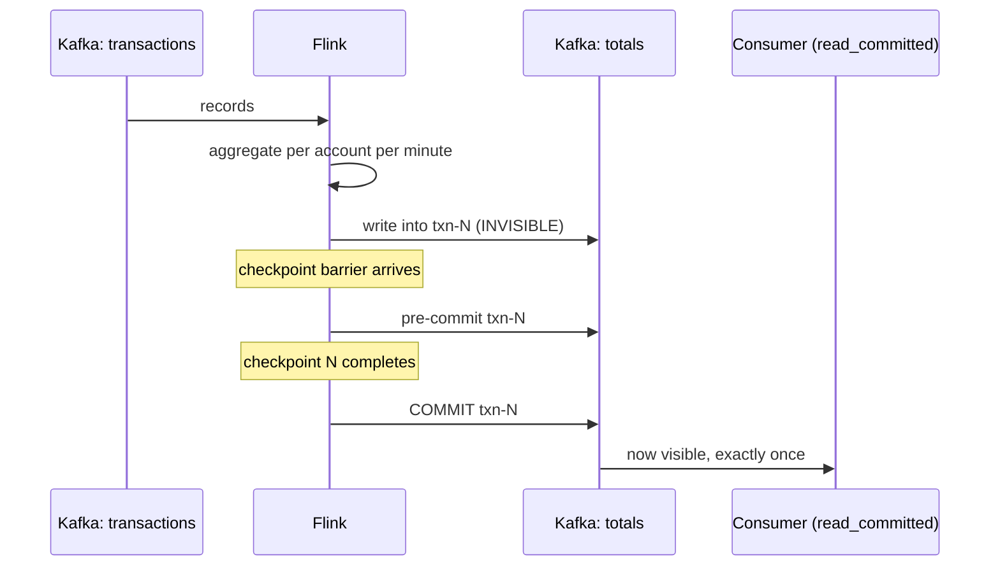

# Project 5 — Exactly-once pipeline

<PageMeta level="advanced" time="18 min" prereq={[['Project 4', '/docs/flink/projects/dynamic-rules'], ['Exactly-once', '/docs/flink/fault-tolerance/exactly-once']]} />

**Goal:** build a Kafka-to-Kafka aggregation pipeline with end-to-end exactly-once,
then break it on purpose and **prove** the guarantee held.

**Teaches:** two-phase commit, transaction lifecycle, `read_committed`, and the
difference between believing a guarantee and verifying it.

---

## The pipeline



## The job

```java title="ExactlyOnceJob.java"
public class ExactlyOnceJob {

  public record Txn(String accountId, double amount, long eventTime) {}
  public record Total(String accountId, long windowStart, double total, long count) {}

  public static void main(String[] args) throws Exception {
    StreamExecutionEnvironment env =
        StreamExecutionEnvironment.getExecutionEnvironment();

    // ── checkpointing: this IS the guarantee ──────────────────────────────
    env.enableCheckpointing(10_000, CheckpointingMode.EXACTLY_ONCE);
    CheckpointConfig cfg = env.getCheckpointConfig();
    cfg.setMinPauseBetweenCheckpoints(5_000);
    cfg.setCheckpointTimeout(120_000);
    cfg.setMaxConcurrentCheckpoints(1);
    cfg.setTolerableCheckpointFailureNumber(2);
    cfg.setExternalizedCheckpointRetention(
        ExternalizedCheckpointRetention.RETAIN_ON_CANCELLATION);
    env.setMaxParallelism(720);

    // restart quickly so the crash test is observable
    env.setRestartStrategy(RestartStrategies.fixedDelayRestart(10, Time.seconds(5)));

    // ── source: replayable. Without this, nothing else matters. ───────────
    KafkaSource<String> source = KafkaSource.<String>builder()
        .setBootstrapServers("localhost:9092")
        .setTopics("transactions")
        .setGroupId("exactly-once-demo")
        .setStartingOffsets(OffsetsInitializer.earliest())
        .setValueOnlyDeserializer(new SimpleStringSchema())
        .build();

    DataStream<Txn> txns = env
        .fromSource(source,
            WatermarkStrategy.<String>forBoundedOutOfOrderness(Duration.ofSeconds(5))
                .withTimestampAssigner((j, ts) -> parse(j).eventTime())
                .withIdleness(Duration.ofSeconds(30)),
            "transactions")
        .map(ExactlyOnceJob::parse).name("parse").uid("parse");

    // ── deterministic processing. No wall clock, no randomness. ───────────
    DataStream<Total> totals = txns
        .keyBy(Txn::accountId)
        .window(TumblingEventTimeWindows.of(Duration.ofMinutes(1)))
        .aggregate(new SumAgg(), new AddWindow())
        .name("aggregate").uid("aggregate");

    // ── sink: two-phase commit ────────────────────────────────────────────
    KafkaSink<Total> sink = KafkaSink.<Total>builder()
        .setBootstrapServers("localhost:9092")
        .setRecordSerializer(KafkaRecordSerializationSchema.<Total>builder()
            .setTopic("totals")
            // deterministic key: makes the output verifiable AND idempotent-friendly
            .setKeySerializationSchema(t ->
                (t.accountId() + "#" + t.windowStart()).getBytes(UTF_8))
            .setValueSerializationSchema(new TotalSerializer())
            .build())
        .setDeliveryGuarantee(DeliveryGuarantee.EXACTLY_ONCE)
        .setTransactionalIdPrefix("totals-sink-v1")        // UNIQUE per job
        .setProperty("transaction.timeout.ms", "300000")   // 5 min, under the broker max
        .build();

    totals.sinkTo(sink).name("totals-sink").uid("totals-sink");

    env.execute("exactly-once pipeline");
  }

  static class SumAgg implements AggregateFunction<Txn, Tuple2<Double, Long>, Tuple2<Double, Long>> {
    public Tuple2<Double, Long> createAccumulator()                    { return Tuple2.of(0.0, 0L); }
    public Tuple2<Double, Long> add(Txn t, Tuple2<Double, Long> a)     { return Tuple2.of(a.f0 + t.amount(), a.f1 + 1); }
    public Tuple2<Double, Long> getResult(Tuple2<Double, Long> a)      { return a; }
    public Tuple2<Double, Long> merge(Tuple2<Double, Long> a, Tuple2<Double, Long> b) {
      return Tuple2.of(a.f0 + b.f0, a.f1 + b.f1);
    }
  }
}
```

## The five requirements, and where each one is in the code

| # | Requirement | Where |
| --- | --- | --- |
| 1 | Replayable source | `KafkaSource` — offsets are checkpointed |
| 2 | `EXACTLY_ONCE` checkpointing | `enableCheckpointing(10_000, EXACTLY_ONCE)` |
| 3 | Deterministic processing | Event-time windows; no clock, no randomness |
| 4 | Transactional sink | `DeliveryGuarantee.EXACTLY_ONCE` + a unique prefix |
| 5 | Consumers read committed only | **Not in the job** — it is the consumer's setting |

<Callout type="mistake" title="Requirement 5 is not yours, and it is the one that fails">

You can do everything right in Flink and still see duplicates, because a downstream
consumer used the default `isolation.level=read_uncommitted`.

That consumer sees records inside uncommitted transactions — including transactions that
are later aborted. The duplicates are real, and they are not Flink's.

End-to-end exactly-once is a property of the **whole pipeline**, and it includes people
who are not on your team. Document it.

</Callout>

---

## Prove it

This is the part that matters. Anyone can configure exactly-once; the exercise is
verifying it.

### 1. Produce a known, finite dataset

```java
// exactly 100,000 transactions, 1,000 accounts, deterministic amounts
for (int i = 0; i < 100_000; i++) {
    String account = "acct-" + (i % 1000);
    double amount = 1.00;                  // every transaction is exactly 1.00
    long eventTime = start + i * 10L;
    producer.send(new ProducerRecord<>("transactions", account, json(account, amount, eventTime)));
}
```

Every account gets exactly 100 transactions of 1.00 each. **The correct total per
account is 100.00, and the correct count is 100.** Any deviation is a bug you can see.

### 2. Run the job and crash it repeatedly

```bash
flink run -d target/projects.jar

# kill a TaskManager every 20 seconds, five times
for i in 1 2 3 4 5; do
  sleep 20
  docker compose kill --signal=SIGKILL taskmanager-1
  docker compose up -d --scale taskmanager=2
done
```

Watch the UI: the job fails, restarts, restores, rewinds offsets, and reprocesses. The
restart count climbs to 5.

### 3. Verify with a `read_committed` consumer

```bash
docker compose exec kafka /opt/kafka/bin/kafka-console-consumer.sh \
  --bootstrap-server localhost:9092 \
  --topic totals --from-beginning \
  --consumer-property isolation.level=read_committed \
  --property print.key=true \
  > /tmp/totals.txt

# every account must sum to exactly 100.00 across its windows
sort /tmp/totals.txt | awk -F'\t' '{ ... }' | sort | uniq -c
```

**Expected:** every account totals exactly 100.00 across all its windows, and each
`(account, windowStart)` key appears exactly once, despite five crashes.

### 4. Now do it wrong, and see the difference

Change one thing at a time and re-run the verification.

```java
// (a) at-least-once sink
.setDeliveryGuarantee(DeliveryGuarantee.AT_LEAST_ONCE)
```

→ Totals exceed 100.00. The duplicates are the records reprocessed after each crash.

```bash
# (b) exactly-once sink, but a read_uncommitted consumer
--consumer-property isolation.level=read_uncommitted
```

→ Duplicates reappear, even though Flink did everything correctly. Requirement 5.

```java
// (c) non-deterministic processing
.window(TumblingProcessingTimeWindows.of(Duration.ofMinutes(1)))
```

→ Window contents differ between the original run and the reprocessed run, so the totals
are wrong in a way that no sink configuration can fix. Requirement 3.

<Callout type="key">

Experiment (c) is the important one. The job is configured for exactly-once. The sink is
transactional. The consumer is `read_committed`. And the output is still wrong.

Determinism is **your** responsibility. Flink guarantees that state is consistent with
the input prefix; it cannot guarantee that your logic produces the same output from the
same input.

</Callout>

---

## The latency you just bought

```text
checkpoint interval = 10s  →  results are invisible for up to ~10s after the
                              window closes, on top of the watermark delay
```

Measure it: timestamp each record on production and on `read_committed` consumption.
The gap is roughly `out-of-orderness bound + time to next checkpoint + commit time`.

Then try `enableCheckpointing(2_000)` and measure again. Latency falls; checkpoint
overhead rises. That is the trade, and there is no way around it with a 2PC sink.

<Callout type="prod" title="When to reach for idempotency instead">

If the target supports an upsert, you can usually get the same end result with less
machinery and less latency:

```sql
INSERT INTO totals (account_id, window_start, total, cnt)
VALUES (?, ?, ?, ?)
ON CONFLICT (account_id, window_start) DO UPDATE
  SET total = EXCLUDED.total, cnt = EXCLUDED.cnt;
```

No transactions, no transaction timeouts, no hanging-transaction incidents, no coupling
between checkpoint interval and visibility. Reprocessing simply rewrites the same row
with the same value.

Reserve 2PC for append-only targets like Kafka topics, where idempotency is not
available. → [Exactly-once](/docs/flink/fault-tolerance/exactly-once)

</Callout>

---

## Break it on purpose

### 1. `flink cancel` instead of `flink stop`

Cancel the job while a transaction is pre-committed.

**What happens:** the transaction stays open on the broker until it times out. Until
then, `read_committed` consumers **block at that offset** — the topic appears completely
stalled to everyone downstream.

**The lesson:** this is the nastiest exactly-once production failure, and it is caused by
an operator habit rather than by code. Always `flink stop --savepointPath`.

### 2. Run two copies with the same `transactionalIdPrefix`

**What happens:** one is fenced off by the broker with a `ProducerFencedException` and
dies. If you cloned a job to test something, you have just killed production.

### 3. Set `transaction.timeout.ms` above the broker maximum

```java
.setProperty("transaction.timeout.ms", "3600000")   // 1 hour
```

**What happens:** the broker rejects it (`transaction.max.timeout.ms` defaults to 15
minutes) and the sink fails to initialise — often only under load, when the first
transaction is opened.

### 4. Set the checkpoint interval to 5 minutes

**What happens:** everything still works. Your end-to-end latency is now five minutes,
and nobody will understand why until they read this page.

---

## Extensions

- **Add a second sink** — a JDBC upsert alongside the Kafka topic — and verify both. Notice that the JDBC sink needs no transactions to be correct.
- **Measure the checkpoint overhead** at 2s, 10s and 60s intervals: throughput, p99 latency, and checkpoint duration. Plot the trade-off for your own hardware.
- **Force a checkpoint failure** by pointing checkpoint storage at a path that becomes unwritable, and observe `tolerable-failed-checkpoints` in action.

## Next

**[Reference architectures](/docs/flink/architecture/patterns)** — how these pieces fit together at company scale.
