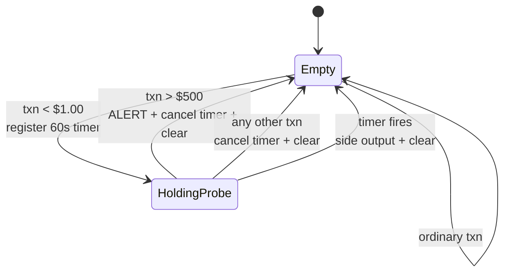

# Project 3 — Fraud detection

<PageMeta level="intermediate" time="15 min" prereq={[['Project 2', '/docs/flink/projects/sessionization']]} />

**Goal:** detect the classic card-testing pattern — a small "probe" transaction
followed within a minute by a large one — and alert on it.

**Teaches:** per-key state machines, timer lifecycle, side outputs, and the state
hygiene that separates a demo from something you can leave running.

---

## The rule

```text
Transaction < $1.00        ← the probe: is this card live?
        ↓ within 60 seconds
Transaction > $500.00      ← the payout
        ↓
ALERT
```

If the large transaction does not arrive within 60 seconds, forget the probe entirely.

## The job

```java title="FraudJob.java"
public class FraudJob {

  public record Txn(String accountId, double amount, String merchant, long eventTime) {}
  public record Alert(String accountId, double probeAmount, double payoutAmount,
                      long detectedAt, String merchant) {}

  public static void main(String[] args) throws Exception {
    StreamExecutionEnvironment env =
        StreamExecutionEnvironment.getExecutionEnvironment();
    env.enableCheckpointing(10_000);
    env.setMaxParallelism(720);

    OutputTag<Txn> expiredProbes = new OutputTag<>("expired-probes"){};

    SingleOutputStreamOperator<Alert> alerts = env
        .fromSource(kafkaSource("transactions"), watermarks(), "txns")
        .map(FraudJob::parse).name("parse").uid("parse")
        .keyBy(Txn::accountId)
        .process(new FraudDetector(expiredProbes))
        .name("fraud-detector").uid("fraud-detector");

    alerts.sinkTo(alertSink());

    // useful for tuning: how often does a probe NOT lead to a payout?
    alerts.getSideOutput(expiredProbes)
          .map(t -> "probe expired: " + t.accountId())
          .print();

    env.execute("fraud detection");
  }
}
```

```java title="FraudDetector.java"
public class FraudDetector extends KeyedProcessFunction<String, Txn, Alert> {

  private static final double PROBE_MAX  = 1.00;
  private static final double PAYOUT_MIN = 500.00;
  private static final long   WINDOW     = Duration.ofMinutes(1).toMillis();

  private final OutputTag<Txn> expiredProbes;

  private transient ValueState<Txn>  probe;     // the small transaction we saw
  private transient ValueState<Long> timerTs;   // the timer that will forget it

  private transient Counter alertCount;
  private transient Counter probeCount;

  public FraudDetector(OutputTag<Txn> expiredProbes) {
    this.expiredProbes = expiredProbes;
  }

  @Override
  public void open(OpenContext ctx) {
    probe = getRuntimeContext().getState(
        new ValueStateDescriptor<>("probe", Txn.class));
    timerTs = getRuntimeContext().getState(
        new ValueStateDescriptor<>("timer", Types.LONG));

    MetricGroup g = getRuntimeContext().getMetricGroup().addGroup("fraud");
    alertCount = g.counter("alerts");
    probeCount = g.counter("probes");
  }

  @Override
  public void processElement(Txn txn, Context ctx, Collector<Alert> out)
      throws Exception {

    Txn pending = probe.value();

    // ── STATE 2: we are holding a probe. Is this the payout? ───────────────
    if (pending != null) {
      if (txn.amount() > PAYOUT_MIN) {
        alertCount.inc();
        out.collect(new Alert(txn.accountId(), pending.amount(),
                              txn.amount(), txn.eventTime(), txn.merchant()));
      }
      // Either way the pattern is RESOLVED. Clean up immediately rather than
      // waiting for the timer — this is what keeps state bounded.
      cleanUp(ctx);
    }

    // ── STATE 1: is this a new probe? ──────────────────────────────────────
    if (txn.amount() < PROBE_MAX) {
      probeCount.inc();
      probe.update(txn);

      long expiry = txn.eventTime() + WINDOW;
      ctx.timerService().registerEventTimeTimer(expiry);
      timerTs.update(expiry);
    }
  }

  @Override
  public void onTimer(long ts, OnTimerContext ctx, Collector<Alert> out)
      throws Exception {
    Txn expired = probe.value();
    if (expired != null) {
      ctx.output(expiredProbes, expired);   // measurable: your false-positive rate
    }
    probe.clear();
    timerTs.clear();
  }

  private void cleanUp(Context ctx) throws Exception {
    Long t = timerTs.value();
    if (t != null) ctx.timerService().deleteEventTimeTimer(t);
    probe.clear();
    timerTs.clear();
  }
}
```

## The state machine



<Callout type="key">

Look at how many arrows point back to `Empty`. **Every path out of `HoldingProbe`
clears the state.** There is no way to leave state behind.

That property — every state transition has a cleanup path — is what you should look for
when reviewing any stateful Flink operator. Draw the diagram; if any arrow is missing,
you have a leak.

</Callout>

## Why not CEP?

You could express this as a CEP pattern:

```java
Pattern.<Txn>begin("probe").where(t -> t.amount() < 1.00)
       .followedBy("payout").where(t -> t.amount() > 500.00)
       .within(Duration.ofMinutes(1));
```

Shorter, and genuinely readable. Reasons the hand-written version is often the better
choice here:

- **You can see the state.** Two `ValueState` entries per active probe, and you know exactly when they clear. CEP's `SharedBuffer` is opaque.
- **The timeout is a first-class output.** Expired probes go to a side output where you can count them, which is how you tune the thresholds.
- **The thresholds can become dynamic.** `PROBE_MAX` and `PAYOUT_MIN` are constants today; in [Project 4](/docs/flink/projects/dynamic-rules) they come from broadcast state and change without a redeploy. A CEP pattern is compiled into the job graph and cannot.

That last point is the one that matters in practice. Fraud thresholds *always* end up
needing to change at 2am. → [CEP](/docs/flink/patterns/cep)

---

## Break it on purpose

### 1. Remove `cleanUp` from the resolved path

Keep only the timer-based cleanup. The job still works — every probe eventually
expires.

**What to look at:** `numKeyedStateEntries` (in a test harness) or checkpoint size.
State is now held for the full 60 seconds even after the pattern resolved.

**The lesson:** correctness and efficiency are different. Clean up at the earliest
point you *know* the state is dead, not at the latest point it is *guaranteed* to be.

### 2. Remove the timer entirely

**What happens:** every account that ever makes a sub-$1 transaction holds a probe in
state forever. State grows monotonically with your customer base.

**The lesson:** this is [Scenario 3](/docs/flink/production/runbook), and it takes
weeks to become visible.

### 3. Make the alert non-idempotent

Point the sink at an append-only topic and then kill a TaskManager just after an alert
is emitted.

**What happens:** recovery replays the transactions, the pattern matches again, and the
alert appears twice.

**The fix:** key the alert on `(accountId, payoutTxnId)` and use an upsert sink, or
enable exactly-once on the sink. → [Exactly-once](/docs/flink/fault-tolerance/exactly-once)

### 4. Change the thresholds and try to upgrade

Change `PAYOUT_MIN` to 300, then:

```bash
flink stop --savepointPath file:///tmp/flink-savepoints <jobId>
flink run -s file:///tmp/flink-savepoints/savepoint-xxx target/projects.jar
```

**What happens:** it works — because we set `uid("fraud-detector")`. Now remove the
`.uid()` call, add a `.filter()` operator upstream, and try again. The restore fails or
silently discards state.

**The lesson:** the generated uid depends on graph structure. → [Savepoints](/docs/flink/fault-tolerance/savepoints)

---

## Extensions

- **Add a third stage:** probe → payout → payout within 5 minutes, escalating the alert severity. Notice how quickly the hand-written state machine gets unwieldy, and how CEP starts to look attractive.
- **Add a velocity rule:** more than N transactions in 60 seconds, using `ListState` of timestamps plus a timer to expire old ones. Compare with a sliding window.
- **Enrich the alert** with the customer's tier via [Async I/O](/docs/flink/scale/async-io), and measure the throughput difference against a blocking lookup.

## Next

**[Project 4 — dynamic rules](/docs/flink/projects/dynamic-rules)**
