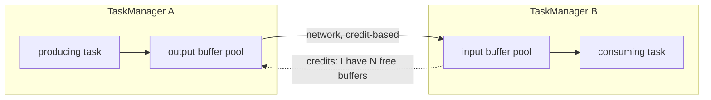

# Backpressure

<PageMeta level="advanced" time="10 min" prereq={[['Rescaling', '/docs/flink/fault-tolerance/rescaling']]} />

<Objectives>

- Find the bottleneck operator from the Flink UI without guessing
- Explain the mechanism: network buffers, credit-based flow control, the mailbox
- Choose the right remedy for each class of bottleneck

</Objectives>

## What is it?

Backpressure is a **slow operator telling its upstream to stop sending**. It is not
a bug. It is a safety feature, and without it a fast source would overwhelm a slow
sink and the job would OOM.

```text
Source        Map          Window       Sink
120k/s   →   150k/s   →    80k/s   →   25k/s
                                        ▲
                                     bottleneck

Actual pipeline throughput: 25k/s. Everything upstream blocks.
```

<Callout type="key">

**A pipeline runs at the speed of its slowest stage.** Making anything else faster
changes nothing.

That sentence sounds obvious and is violated constantly — teams add parallelism to
the source, optimise the parsing, tune the state backend, and see no improvement,
because none of those were the bottleneck.

</Callout>

## Find it

<BackpressureLab />

Drag the sliders and watch the bars. The rule for reading them:

<Callout type="key">

**The bottleneck is the last operator that is BUSY and NOT back-pressured.**

- Upstream of the bottleneck → high `backPressuredTimeMsPerSecond` (red)
- At the bottleneck → high `busyTimeMsPerSecond`, zero backpressure
- Downstream of the bottleneck → high `idleTimeMsPerSecond`

Read the chain from left to right and stop at the first operator with no red. That
is your target.

</Callout>

In the Flink UI, the Backpressure tab colours each operator, and the three metrics
are:

| Metric | Meaning |
| --- | --- |
| `busyTimeMsPerSecond` | ms per second doing useful work |
| `backPressuredTimeMsPerSecond` | ms per second blocked waiting for a downstream buffer |
| `idleTimeMsPerSecond` | ms per second waiting for input |

These three sum to roughly 1000.

## The mechanism



**Credit-based flow control.** The consumer tells the producer how many free
buffers it has. The producer never sends more than that. When the consumer is slow,
its buffers fill, credits drop to zero, and the producer's write blocks — which
blocks its own mailbox loop, which fills *its* input buffers, and so on backwards
to the source.

That is the whole mechanism. It propagates naturally, with no coordination and no
control messages beyond the credits.

**Why it matters for checkpoints.** A blocked mailbox loop cannot process a
checkpoint barrier. So backpressure directly causes long
[alignment durations](/docs/flink/fault-tolerance/barriers-and-alignment) and,
eventually, checkpoint timeouts. Backpressure and checkpoint problems are almost
always the same incident.

## The eight causes, and what to do

| Cause | How to confirm | Remedy |
| --- | --- | --- |
| **Slow sink** | Sink is busy ~100%, everything upstream red | Increase sink parallelism (within the target's capacity), batch writes, or use Async I/O |
| **Blocking call in user code** | A `map`/`process` is busy but CPU is low | Move it to [Async I/O](/docs/flink/scale/async-io). Never block the mailbox. |
| **Key skew** | One subtask busy, siblings idle | [Two-phase aggregation](/docs/flink/scale/performance) or a salted key |
| **Not enough parallelism** | All subtasks of one operator busy, CPU saturated | Rescale that operator |
| **State backend I/O** | Busy but low CPU; high RocksDB read latency | Faster local disk, more managed memory, better access patterns |
| **GC pauses** | Sawtooth throughput, long GC times | Move state to RocksDB, reduce object churn, fix serialisers |
| **Serialisation cost** | High CPU in the operator, Kryo in the type info | [Fix the serialiser](/docs/flink/state/serialization-and-evolution) |
| **Skewed network shuffle** | Uneven `numBytesOut` across subtasks | Check the partitioner; consider `rescale()` over `rebalance()` |

<Callout type="mistake" title="The reflex that wastes the most time">

Increasing parallelism when the bottleneck is external.

If the JDBC sink is capped by the database, going from 8 to 32 sink subtasks gives
you 32 connections fighting over the same capacity — usually *reducing* throughput
through lock contention and connection overhead, while quadrupling the load on a
database that was already the problem.

Identify *what* is slow before deciding *how much more* of it to run.

</Callout>

## Distinguishing the two kinds of slow

An operator can be slow because it is CPU-bound or because it is waiting.

```text
busy = 100%, CPU high    →  genuinely compute-bound.
                            More parallelism helps.

busy = 100%, CPU low     →  it is WAITING on something:
                            a database, a disk, a lock, an API.
                            More parallelism does NOT help.
                            Make the waiting asynchronous instead.
```

The second case is the common one, and the one people misdiagnose. A synchronous
database lookup inside `map()` shows as 100% busy while the CPU sits at 5%. Thirty
more copies of a thread that is asleep achieves nothing except thirty more
connections.

## Reducing the pressure

Sometimes the right answer is to send less.

```java
// 1. Filter early — before the shuffle, before the state
stream.filter(this::isRelevant)      // ← do this first
      .keyBy(...)
      .process(...);

// 2. Pre-aggregate before the shuffle
stream.keyBy(...)
      .window(TumblingEventTimeWindows.of(Duration.ofSeconds(10)))
      .aggregate(new PartialAgg())   // shuffle 1 record per key per 10s,
      .keyBy(...)                    //   not every record
      .process(new FinalAgg());

// 3. Project away fields you do not need before they hit state
stream.map(o -> new Slim(o.id(), o.amount()))
```

Filtering before a `keyBy` is the highest-leverage change in this list and the most
commonly missed: every record you drop is one you do not serialise, do not send
over the network, and do not store.

<Callout type="prod" title="Tuning buffers changes latency, not throughput">

```yaml
execution.buffer-timeout: 100ms   # default
```

Records are batched into network buffers and flushed on this timer.

- `0` → flush immediately. Lowest latency, meaningfully lower throughput.
- `100ms` → the balanced default.
- Higher → better throughput, higher latency.

There is also **buffer debloating**, which sizes buffers dynamically to a target
time-to-drain:

```yaml
taskmanager.network.memory.buffer-debloat.enabled: true
taskmanager.network.memory.buffer-debloat.target: 1s
```

This does not increase throughput — it reduces the *amount of data in flight*,
which shortens checkpoint alignment under backpressure. Worth enabling on jobs that
back-pressure regularly.

</Callout>

<Expert>

**Backpressure metrics are sampled.** `busyTimeMsPerSecond` and friends come from
periodic stack-trace sampling of the mailbox thread. Short spikes can be missed, and
very short tasks can be misattributed. For fine-grained work, look at
`numRecordsInPerSecond` per subtask rather than the sampled ratios.

**`isBackPressured` vs the time metrics.** Older Flink exposed a boolean from
thread-dump sampling. The `*TimeMsPerSecond` metrics are far more precise and are
what the modern UI uses. Ignore older blog posts describing the sampling approach.

**Chained operators share a fate.** Operators in the same chain run in one thread,
so the UI reports one set of metrics for the whole chain. If you cannot tell which
operator inside a chain is slow, temporarily `disableChaining()` in a staging
environment to separate them.

**Backpressure from checkpointing itself.** Aligned checkpointing blocks fast
channels during alignment, which *is* backpressure caused by the checkpoint. If
backpressure spikes exactly at checkpoint intervals, that is the cause — enable
unaligned checkpoints rather than hunting for a slow operator.

**Sources back-pressure by not reading.** A back-pressured Kafka source simply stops
polling, so pressure appears as growing consumer lag rather than as memory growth.
Consumer lag is therefore the best end-to-end backpressure signal you have, and the
one to alert on.

</Expert>

<Callout type="remember">

The bottleneck is the last busy, non-back-pressured operator. Busy with low CPU
means waiting, not computing — and more parallelism will not help. Filter before you
shuffle. Alert on consumer lag.

</Callout>

## Next

**[Kafka and Flink](/docs/flink/scale/kafka-and-flink)** — the relationship between offsets, checkpoints and state.
