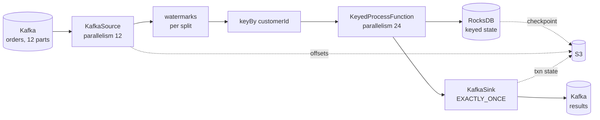

# Kafka and Flink

<PageMeta level="advanced" time="11 min" prereq={[['Backpressure', '/docs/flink/scale/backpressure']]} docs="docs/connectors/datastream/kafka/" />

<Objectives>

- Explain how Kafka offsets, Flink checkpoints and state stay consistent
- Size source parallelism against partition count correctly
- Configure a Kafka source and sink for exactly-once without the classic traps

</Objectives>

## The relationship that matters

Four things, and the invariant that binds them:

```text
Kafka offset  ──▶  where the source will read next
Checkpoint    ──▶  a durable record of that offset PLUS all derived state
Flink state   ──▶  everything computed from records before that offset
Watermark     ──▶  how far event time has progressed given those records
```

<Callout type="key">

**Flink does not use Kafka consumer groups for offset management.**

Offsets are stored in Flink's **checkpoints**, not in Kafka's `__consumer_offsets`.
That is the only way offsets and state can be rewound together — committing to
Kafka independently would let them diverge, and recovery would be inconsistent.

Flink *optionally* commits offsets back to Kafka on checkpoint completion, but
purely for external monitoring. It never reads them back on restore.

</Callout>

Consequences that catch people out:

- Resetting a consumer group's offsets does nothing to a running Flink job
- Two Flink jobs with the same `group.id` do **not** share partitions — each gets all of them
- Consumer-lag dashboards keyed on the group still work, because Flink commits for monitoring
- To make a job re-read from the beginning you must start it **without** a checkpoint/savepoint, or explicitly reset the offsets initializer

## Partitions and parallelism

```text
Topic with 12 partitions

Flink source parallelism 4:    each subtask reads 3 partitions   ✅
Flink source parallelism 12:   each subtask reads 1 partition    ✅ ideal
Flink source parallelism 24:   12 subtasks read 1 each,
                               12 subtasks read NOTHING          ⚠️
```

<Callout type="mistake" title="Source parallelism above partition count">

The 12 idle subtasks are not merely wasteful. Without `withIdleness`, each one
contributes `Long.MIN_VALUE` to the watermark minimum and **freezes event time for
the entire job** — no windows fire, no timers fire, and state grows forever.

Two rules:

1. Keep source parallelism at or below the partition count.
2. Always set `withIdleness` anyway, because partitions also go quiet for business
   reasons.

</Callout>

Partition count is the ceiling on source parallelism, so choose it with headroom
when you create the topic. Downstream operators can have any parallelism — a `keyBy`
after the source decouples them entirely.

## Configuring the source

```java
KafkaSource<Order> source = KafkaSource.<Order>builder()
    .setBootstrapServers("kafka:9092")
    .setTopics("orders")
    .setGroupId("orders-pipeline")               // for monitoring only
    .setStartingOffsets(OffsetsInitializer.committedOffsets(
        OffsetResetStrategy.EARLIEST))           // used ONLY on a fresh start
    .setDeserializer(new OrderDeserializer())
    .setProperty("partition.discovery.interval.ms", "60000")  // pick up new partitions
    .build();

DataStream<Order> orders = env.fromSource(
    source,
    WatermarkStrategy.<Order>forBoundedOutOfOrderness(Duration.ofSeconds(10))
        .withTimestampAssigner((o, ts) -> o.eventTime())
        .withIdleness(Duration.ofMinutes(1))
        .withWatermarkAlignment("orders", Duration.ofSeconds(30), Duration.ofSeconds(1)),
    "orders-source");
```

| Option | Effect |
| --- | --- |
| `OffsetsInitializer.earliest()` | Always from the beginning — for backfills |
| `OffsetsInitializer.latest()` | Only new records — dangerous default; you skip anything produced during a deploy gap |
| `OffsetsInitializer.committedOffsets(...)` | From the group's committed offsets on a fresh start, with a fallback |
| `OffsetsInitializer.timestamp(ms)` | From a point in time — useful for targeted reprocessing |
| `partition.discovery.interval.ms` | Detects partitions added after the job started. **Off by default** — set it. |

<Callout type="prod">

**Starting offsets only apply on a fresh start.** When restoring from a checkpoint
or savepoint, the checkpointed offsets always win.

This surprises people during incidents: changing `setStartingOffsets` and restarting
from a savepoint has no effect whatsoever. To genuinely re-read, start without a
savepoint, or use the State Processor API to rewrite the source's offsets.

</Callout>

## Configuring the sink for exactly-once

```java
KafkaSink<Result> sink = KafkaSink.<Result>builder()
    .setBootstrapServers("kafka:9092")
    .setRecordSerializer(KafkaRecordSerializationSchema.builder()
        .setTopic("results")
        .setValueSerializationSchema(new ResultSerializer())
        .build())
    .setDeliveryGuarantee(DeliveryGuarantee.EXACTLY_ONCE)
    .setTransactionalIdPrefix("results-sink-v1")     // unique per job
    .setProperty("transaction.timeout.ms", "900000") // 15 min
    .build();
```

Three traps, all of which produce production incidents:

**1. Consumers must set `isolation.level=read_committed`.** Otherwise they read
uncommitted records and see exactly the duplicates you configured 2PC to prevent.

**2. `transaction.timeout.ms` must be less than the broker's
`transaction.max.timeout.ms`** (default 15 minutes) and greater than your checkpoint
interval plus expected recovery time. Flink's default is 1 hour, which most brokers
reject outright.

**3. `transactionalIdPrefix` must be unique per job.** Two jobs sharing a prefix
fence each other — one dies with a producer-fencing error. Clone a job without
changing the prefix and you break both.

<Callout type="mistake" title="Hanging transactions">

If a job is **cancelled** (not stopped) while a transaction is pre-committed, that
transaction remains open on the broker until it times out. Until then,
`read_committed` consumers **block at that offset** — the topic looks completely
stalled to every downstream consumer.

Defences: always `flink stop --savepointPath` instead of `flink cancel`; keep the
transaction timeout in the minutes, not hours; and alert on consumer lag that stops
advancing while the producer is still writing.

</Callout>

## The complete architecture



Note what is in the checkpoint: **state, offsets, and transaction IDs together**.
That single fact is what makes the whole thing recoverable.

<Callout type="prod" title="Kafka-side settings that affect your Flink job">

| Setting | Why it matters |
| --- | --- |
| `retention.ms` | Must exceed your worst-case recovery time. If a job is down longer than retention, restore reads offsets that no longer exist. |
| Partition count | The ceiling on source parallelism, forever — increasing it later breaks key ordering |
| `max.poll.records` | Affects source batch size and latency |
| `transaction.max.timeout.ms` | Must exceed the sink's transaction timeout |
| Key choice by the **producer** | Determines partition skew, which becomes Flink subtask skew |

That last row is worth emphasising: if the producer keys by `country` and 60% of
your traffic is one country, no amount of Flink tuning fixes the resulting skew. The
fix is upstream.

</Callout>

<Expert>

**`OffsetsInitializer.timestamp()` and event time.** It seeks by the *broker's*
record timestamp, not by your event-time field. If they differ — and with
`LogAppendTime` they always do — seeking to "12:00" gives you the records the broker
received at 12:00, not the ones that happened at 12:00.

**Partition discovery and rescaling.** New partitions are assigned by the enumerator
on the JobManager and distributed to subtasks. Without `partition.discovery.interval.ms`,
partitions added after the job started are **never read** — silently. This is a
genuinely common cause of missing data after a topic expansion.

**Per-split watermarks require `fromSource`.** The `KafkaSource` tracks a watermark
per partition and emits the minimum. That is only possible when the `WatermarkStrategy`
is passed to `fromSource`. Assigning downstream loses this, as covered in
[timestamp assignment](/docs/flink/time/timestamp-assignment).

**Kafka connector versioning.** The connector is released independently of Flink:
`flink-connector-kafka:4.0.0-2.0` means connector 4.0.0 for Flink 2.0.x. Do not
assume the versions match, and check the compatibility matrix when upgrading Flink.

**Exactly-once and Kafka Streams interop.** Records committed by a Flink 2PC sink
are transactional. Any consumer — including Kafka Streams applications — must use
`read_committed` to see them correctly. Mixed-isolation consumers on the same topic
will disagree about what exists.

</Expert>

<Callout type="remember">

Offsets live in Flink checkpoints, not in Kafka. Source parallelism must not exceed
partition count, and idle splits freeze event time. `read_committed` on consumers,
unique transactional ID prefix, transaction timeout below the broker maximum, and
never `flink cancel` a transactional job.

</Callout>

## Next

**[Async I/O](/docs/flink/scale/async-io)** — calling external systems without destroying throughput.
