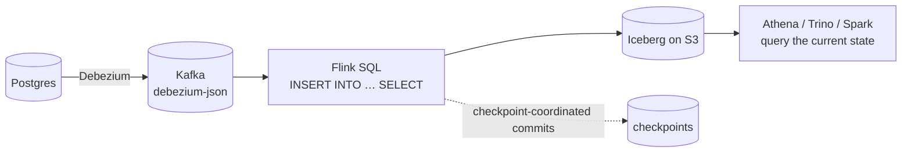

# Streaming SQL patterns

<PageMeta level="advanced" time="11 min" prereq={[['Table API & SQL', '/docs/flink/sql/table-api']]} docs="docs/dev/table/sql/queries/overview/" />

<Objectives>

- Write the five queries that cover most streaming SQL work
- State the state cost of each before deploying it
- Build a CDC pipeline from a database into a lakehouse table

</Objectives>

## 1. Deduplication

Keep the first (or last) row per key. Extremely common, and the idiom is not obvious.

```sql
-- keep the FIRST row per order_id
SELECT order_id, customer_id, amount, event_time
FROM (
  SELECT *,
         ROW_NUMBER() OVER (
           PARTITION BY order_id
           ORDER BY event_time ASC        -- ASC = first, DESC = last
         ) AS rn
  FROM orders
)
WHERE rn = 1;
```

| | Keep first (`ASC`) | Keep last (`DESC`) |
| --- | --- | --- |
| Output | **Append-only** | Upsert / retract |
| State | One boolean-ish marker per key | The full latest row per key |
| Use for | Idempotent ingestion, exactly-once dedup | "Latest known state of X" |

<Callout type="prod">

Prefer `ASC` when you can. It emits append-only results and stores far less per key —
Flink only needs to know that a key has been seen, not what its row was.

Both grow with key cardinality and need `table.exec.state.ttl`.

</Callout>

## 2. Top-N

```sql
-- top 3 pages by clicks, per minute
SELECT window_start, page, cnt
FROM (
  SELECT *,
         ROW_NUMBER() OVER (
           PARTITION BY window_start
           ORDER BY cnt DESC
         ) AS rn
  FROM (
    SELECT window_start, page, COUNT(*) AS cnt
    FROM TABLE(TUMBLE(TABLE clicks, DESCRIPTOR(event_time), INTERVAL '1' MINUTE))
    GROUP BY window_start, page
  )
)
WHERE rn <= 3;
```

Because this is a **windowed** Top-N (partitioned by `window_start`), the result is
append-only and the state is bounded to the open windows.

An **unbounded** Top-N — `PARTITION BY category` with no window — is a retract stream
and retains the top N plus enough context to update it, per partition, forever. Set a
TTL, and make sure your sink handles retractions.

## 3. Temporal join — enrich with the historically correct value

```sql
-- versioned table: the rate as it was at each point in time
CREATE TABLE currency_rates (
  currency    STRING,
  rate        DECIMAL(10, 4),
  update_time TIMESTAMP_LTZ(3),
  WATERMARK FOR update_time AS update_time - INTERVAL '10' SECOND,
  PRIMARY KEY (currency) NOT ENFORCED
) WITH (
  'connector' = 'kafka',
  'topic' = 'rates',
  'value.format' = 'debezium-json'
);

SELECT
  o.order_id,
  o.amount_usd,
  o.amount_usd * r.rate AS amount_eur
FROM orders AS o
JOIN currency_rates FOR SYSTEM_TIME AS OF o.order_time AS r
  ON o.currency = r.currency;
```

<Callout type="key">

This uses the rate that was valid **when the order happened** — not the rate that is
valid now.

That is the difference between a financial figure that reproduces on replay and one
that changes every time you rerun the pipeline. Any join against something that
changes over time — prices, tiers, catalogues, exchange rates — should be a temporal
join.

</Callout>

State cost: the versioned table retains versions per key until the watermark makes
older ones unreachable. Bounded by key count × versions in flight.

## 4. Lookup join — enrich from an external system

```sql
CREATE TABLE customers (
  id     STRING,
  name   STRING,
  tier   STRING,
  PRIMARY KEY (id) NOT ENFORCED
) WITH (
  'connector' = 'jdbc',
  'url' = 'jdbc:postgresql://db:5432/app',
  'table-name' = 'customers',
  'lookup.cache' = 'PARTIAL',
  'lookup.partial-cache.max-rows' = '50000',
  'lookup.partial-cache.expire-after-write' = '10min',
  'lookup.max-retries' = '3'
);

SELECT o.order_id, c.name, c.tier
FROM orders AS o
JOIN customers FOR SYSTEM_TIME AS OF o.proc_time AS c
  ON o.customer_id = c.id;
```

Zero Flink state. The costs: the database becomes your throughput ceiling and your
availability floor, and the result is **not reproducible** — a replay gets today's
customer row, not the one from the time of the order.

The `lookup.cache` options matter a great deal. Without a cache this issues one query
per record; with one, a realistic access distribution eliminates most of them.

## 5. CDC into a lakehouse table

The pattern StreamForge exists to make routine, expressed directly in SQL.

```sql
-- source: change events from Postgres via Debezium
CREATE TABLE orders_cdc (
  order_id    BIGINT,
  customer_id BIGINT,
  status      STRING,
  amount      DECIMAL(10,2),
  updated_at  TIMESTAMP_LTZ(3),
  PRIMARY KEY (order_id) NOT ENFORCED
) WITH (
  'connector' = 'kafka',
  'topic' = 'dbserver1.public.orders',
  'value.format' = 'debezium-json',
  'scan.startup.mode' = 'earliest-offset'
);

-- sink: an Iceberg table that supports upserts and deletes
CREATE TABLE orders_lake (
  order_id    BIGINT,
  customer_id BIGINT,
  status      STRING,
  amount      DECIMAL(10,2),
  updated_at  TIMESTAMP_LTZ(3),
  dt          STRING,
  PRIMARY KEY (order_id) NOT ENFORCED
) PARTITIONED BY (dt)
WITH (
  'connector' = 'iceberg',
  'catalog-name' = 'glue',
  'warehouse' = 's3://lake/warehouse',
  'write.upsert.enabled' = 'true'
);

INSERT INTO orders_lake
SELECT order_id, customer_id, status, amount, updated_at,
       DATE_FORMAT(updated_at, 'yyyy-MM-dd') AS dt
FROM orders_cdc;
```



<Callout type="prod" title="What makes this work">

- **`debezium-json` produces a changelog**, so `-D` and `+U` rows flow through as real deletes and updates rather than as extra inserts.
- **The Iceberg sink commits on checkpoint**, which is what gives it exactly-once semantics — the same 2PC protocol as everything else in [Level 8](/docs/flink/fault-tolerance/exactly-once).
- **Partitioning by a derived date column** keeps the query engine's scan bounded.
- **Small-file compaction is a separate, scheduled job.** A streaming CDC sink writes many small files; every lakehouse deployment needs compaction, and forgetting it is the most common way these pipelines degrade over months.

</Callout>

## 6. Interval join in SQL

```sql
SELECT o.order_id, s.shipped_at
FROM orders o, shipments s
WHERE o.order_id = s.order_id
  AND s.shipped_at BETWEEN o.order_time
                       AND o.order_time + INTERVAL '2' HOUR;
```

The `BETWEEN` on time attributes is what makes this an interval join rather than a
regular one, and therefore what bounds its state. Remove it and you have an unbounded
regular join that will consume the cluster.

## 7. Pattern matching

```sql
SELECT *
FROM logins
MATCH_RECOGNIZE (
  PARTITION BY user_id
  ORDER BY event_time
  MEASURES
    FIRST(F.event_time) AS first_failure,
    S.ip               AS success_ip
  ONE ROW PER MATCH
  AFTER MATCH SKIP PAST LAST ROW
  PATTERN (F{3} S) WITHIN INTERVAL '1' MINUTE
  DEFINE
    F AS F.type = 'FAILED',
    S AS S.type = 'SUCCESS'
) AS m;
```

Same engine as the [CEP library](/docs/flink/patterns/cep), far less code.
`AFTER MATCH SKIP PAST LAST ROW` prevents the overlapping-match problem, and `WITHIN`
bounds the state.

## State cost summary

Keep this table to hand when reviewing a streaming SQL job.

| Pattern | State bound | Result kind |
| --- | --- | --- |
| Windowed aggregation | Open windows only | Append |
| Windowed Top-N | Open windows only | Append |
| Deduplicate, keep first | Key cardinality (small per key) | Append |
| Deduplicate, keep last | Key cardinality (full row per key) | Upsert |
| Unbounded `GROUP BY` | **Key cardinality, forever** — needs TTL | Upsert/retract |
| Unbounded Top-N | **Partition count × N, forever** — needs TTL | Retract |
| Interval join | The interval | Append |
| Temporal join | Versions in flight | Append |
| Lookup join | None in Flink | Append |
| **Regular join** | **Both sides, forever** — needs TTL | Retract |
| `MATCH_RECOGNIZE` | Partial matches within `WITHIN` | Append |

<Callout type="mistake">

Reviewing a streaming SQL job the way you would review a batch query — for
correctness of the logic only.

The logic is usually fine. The failure mode is state. For every query in a review,
ask: *is any operator here unbounded, and if so, what bounds it?* Four rows in that
table say "forever". Those four are where the outages come from.

</Callout>

<Expert>

**`EXPLAIN PLAN FOR` is the review tool.** It shows the physical operators, including
`ChangelogNormalize`, `Deduplicate`, `Rank`, and whether an aggregation is one-phase
or two-phase. If an operator you did not expect appears in the plan, it has state you
did not budget for.

**`table.exec.state.ttl` is global.** It applies to every unbounded operator in the
job, not per query. If one query needs 1 hour and another needs 30 days, split them
into separate jobs rather than setting the maximum for both.

**Rank vs windowed rank.** The optimiser produces `Rank` (unbounded, retract) or
`WindowRank` (bounded, append) depending on whether the `PARTITION BY` includes a
window boundary. Check the plan — the difference is unbounded versus bounded state,
and the query text differs by one column.

**Idle sources in SQL.** `table.exec.source.idle-timeout` is the equivalent of
`withIdleness`. Without it, a quiet partition freezes every windowed query in the job,
exactly as in DataStream.

</Expert>

<Callout type="remember">

Dedup-keep-first is append-only and cheap; keep-last is not. Temporal joins for
historically correct enrichment. Four constructs retain state forever — set a TTL and
know what you are trading. And read the plan.

</Callout>

## Next

**[Testing Flink jobs](/docs/flink/testing)** — proving it works before production does.
