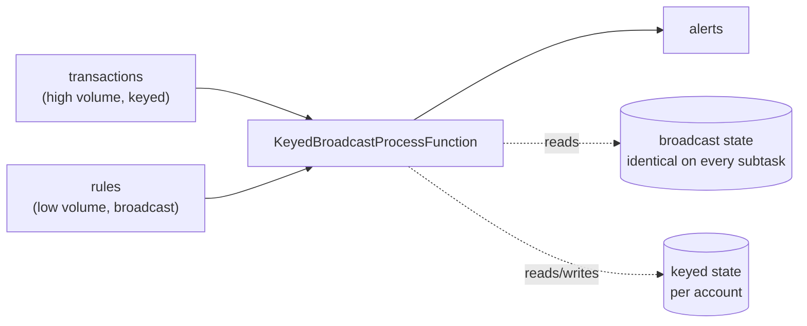

# Operator and broadcast state

<PageMeta level="advanced" time="9 min" prereq={[['Keyed state', '/docs/flink/state/keyed-state']]} docs="docs/dev/datastream/fault-tolerance/broadcast_state/" />

<Objectives>

- Implement `CheckpointedFunction` and choose the right redistribution mode
- Build a dynamic-rules pipeline with broadcast state
- Explain why broadcast state must be updated identically on every subtask

</Objectives>

## Operator state

Not scoped to a key. Scoped to a **subtask**. You use it when the thing you are
remembering belongs to the operator instance itself.

Canonical uses: a Kafka source remembering its offsets, a sink buffering records
between checkpoints, a connector tracking file splits.

```java
public class BufferingSink implements SinkFunctionV2<Order>, CheckpointedFunction {

    private final List<Order> buffered = new ArrayList<>();
    private transient ListState<Order> checkpointed;

    @Override
    public void snapshotState(FunctionSnapshotContext ctx) throws Exception {
        checkpointed.update(buffered);      // called on EVERY checkpoint
    }

    @Override
    public void initializeState(FunctionInitializationContext ctx) throws Exception {
        checkpointed = ctx.getOperatorStateStore().getListState(
            new ListStateDescriptor<>("buffered", Order.class));

        if (ctx.isRestored()) {             // only true after a restore
            checkpointed.get().forEach(buffered::add);
        }
    }
}
```

### The two redistribution modes

When parallelism changes, Flink must decide who gets what. You choose:

<Compare>
  <CompareCard title="ListState — even split" rows={[
    ['On rescale', 'The union of all subtasks lists is split round-robin'],
    ['Each subtask gets', 'A DISJOINT subset'],
    ['Analogy', 'Deal a deck of cards'],
    ['Use for', 'Work items: Kafka partitions, file splits, buffered records'],
    ['Size', 'Scales with the work — can be moderately large'],
  ]} />
  <CompareCard title="UnionListState — full copy" rows={[
    ['On rescale', 'Every subtask receives the ENTIRE union'],
    ['Each subtask gets', 'EVERYTHING, and decides what to keep'],
    ['Analogy', 'Photocopy the deck for everyone'],
    ['Use for', 'Global metadata every subtask must see'],
    ['Size', 'Must be SMALL — it is replicated P times'],
  ]} />
</Compare>

```java
ctx.getOperatorStateStore().getListState(descriptor);       // even split
ctx.getOperatorStateStore().getUnionListState(descriptor);  // full copy
```

<Callout type="mistake" title="UnionListState is a scaling landmine">

At parallelism 200, a `UnionListState` containing 100,000 entries means **each of
the 200 subtasks receives all 100,000 entries** on restore — 20 million entries
materialised, and the JobManager must assemble and ship that metadata.

This is a known way to make a job impossible to restore: the checkpoint succeeds,
but recovery OOMs the JobManager. If you find yourself reaching for
`UnionListState` with more than a few hundred entries, reconsider the design.

</Callout>

## Broadcast state

A special, much more commonly useful form: **the same state on every subtask**,
fed by a broadcast stream.

The classic use is **dynamic rules** — change business logic without redeploying.



```java
// The descriptor must be identical everywhere it is referenced
MapStateDescriptor<String, Rule> rulesDesc =
    new MapStateDescriptor<>("rules", String.class, Rule.class);

BroadcastStream<Rule> rules = ruleStream.broadcast(rulesDesc);

transactions
    .keyBy(Txn::accountId)
    .connect(rules)
    .process(new RuleEvaluator(rulesDesc));
```

```java
public class RuleEvaluator
        extends KeyedBroadcastProcessFunction<String, Txn, Rule, Alert> {

    private final MapStateDescriptor<String, Rule> rulesDesc;
    private transient ValueState<Double> accountTotal;

    @Override
    public void open(OpenContext ctx) {
        accountTotal = getRuntimeContext().getState(
            new ValueStateDescriptor<>("total", Types.DOUBLE));
    }

    /** One per transaction. READ-ONLY access to broadcast state. */
    @Override
    public void processElement(Txn txn, ReadOnlyContext ctx, Collector<Alert> out)
            throws Exception {
        double total = Optional.ofNullable(accountTotal.value()).orElse(0.0) + txn.amount();
        accountTotal.update(total);

        for (Map.Entry<String, Rule> e : ctx.getBroadcastState(rulesDesc).immutableEntries()) {
            if (e.getValue().matches(txn, total)) {
                out.collect(new Alert(txn.accountId(), e.getKey()));
            }
        }
    }

    /** One per rule update. WRITE access to broadcast state, no key context. */
    @Override
    public void processBroadcastElement(Rule rule, Context ctx, Collector<Alert> out)
            throws Exception {
        BroadcastState<String, Rule> state = ctx.getBroadcastState(rulesDesc);
        if (rule.isDeleted()) state.remove(rule.id());
        else                  state.put(rule.id(), rule);
    }
}
```

### The asymmetry, and why it exists

| | `processElement` | `processBroadcastElement` |
| --- | --- | --- |
| Broadcast state | **read-only** | read-write |
| Keyed state | yes — for the current key | **no** — there is no current key |
| Called for | every high-volume record | every broadcast record |

<Callout type="key">

Broadcast state is read-only in `processElement` **by design**. Every subtask must
end up with **identical** broadcast state, or two subtasks would evaluate the same
transaction against different rules — a non-deterministic job that is nearly
impossible to debug.

Since `processBroadcastElement` receives the *same* broadcast records in the *same
order* on every subtask, applying updates only there guarantees convergence.
Allowing per-key mutation would break that guarantee immediately.

</Callout>

<Callout type="mistake">

Iterating broadcast state and mutating it in `processBroadcastElement` in a way
that depends on subtask-local information — the current time, a counter, a random
value. That makes subtasks diverge, and the divergence appears as intermittently
wrong results with no error.

Keep `processBroadcastElement` a pure function of the broadcast record and the
existing broadcast state.

</Callout>

<Callout type="prod" title="The bootstrap problem">

Transactions usually start flowing before the rules do, so early records are
evaluated against an empty rule set and silently pass.

Three practical fixes:

1. **Compacted Kafka topic for rules**, read from `earliest-offset`, so the full rule set is replayed on every start.
2. **Buffer high-volume records in keyed state** until at least one rule has arrived, then release them. Correct, but adds latency and state.
3. **Watermark alignment** between the two streams, so the transaction stream cannot race ahead of the rules stream.

Option 1 is nearly always right, and it also solves the restart case.

</Callout>

<Expert>

**Broadcast state is always in memory.** It is stored on the heap even when your
keyed state backend is RocksDB. It is replicated to every subtask, so total memory
is `size × parallelism`. Keep it to megabytes, not gigabytes — a few thousand
rules is comfortable, a million is not.

**Broadcast state must be `MapState`-shaped.** The API only offers
`MapStateDescriptor`. If you need a single object, use a map with one well-known
key.

**Rescaling broadcast state** is trivial — every new subtask simply gets a copy.
This is one of the few pieces of state where rescaling costs nothing.

**Ordering is not guaranteed across the two inputs.** Flink makes no promise about
the interleaving of `processElement` and `processBroadcastElement`. A rule update
and a transaction that "should" be ordered may not be. If exact ordering matters,
it must come from event time and buffering, not from arrival.

</Expert>

<Callout type="remember">

Operator state belongs to a subtask, not a key — mostly connectors. `ListState`
splits on rescale, `UnionListState` replicates (and does not scale). Broadcast
state is the dynamic-rules pattern: read-only where you have a key, writable where
you do not.

</Callout>

## Next

**[State TTL and growth](/docs/flink/state/ttl-and-growth)** — stopping state from eating your cluster.
