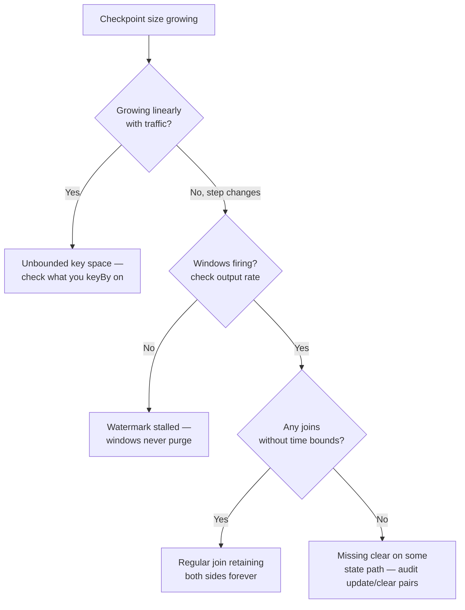

# State TTL and growth

<PageMeta level="advanced" time="9 min" prereq={[['Operator & broadcast state', '/docs/flink/state/operator-and-broadcast-state']]} />

<Objectives>

- Configure state TTL and predict when entries are actually removed
- Identify which of the four growth sources a given job suffers from
- Explain why TTL is a backstop and not a design

</Objectives>

## The four sources of unbounded growth

Almost every runaway-state incident is one of these.

### 1. Unbounded key space

```java
.keyBy(Event::sessionId)     // a new UUID per visit — forever
.keyBy(Event::requestId)     // unique per request. never repeats.
.keyBy(Event::userId)        // fine — until bots create fresh IDs per call
```

One state entry per key. If keys never repeat, state grows linearly with total
traffic and never shrinks. This is the most common cause, and it is usually
invisible in testing because test data has few distinct keys.

### 2. State that is never cleared

```java
// Update path exists. Clear path does not.
lastSeen.update(now);   // ← for every key that ever appears
```

Covered in [keyed state](/docs/flink/state/keyed-state): every `update()` needs a
reachable `clear()`.

### 3. Windows that never close

A stalled watermark means windows never fire and never purge. State accumulates
for every open window, for every key.

This is the [idle partition problem](/docs/flink/watermarks/propagation-and-idleness),
and it produces two symptoms at once — no output *and* growing state. If you see
both together, look at the watermark first.

### 4. Joins with no time bound

```java
// regular (non-windowed) join in SQL — BOTH sides retained forever
SELECT * FROM orders o JOIN customers c ON o.customer_id = c.id;
```

Without a time constraint, both sides must be kept indefinitely because a match
could arrive at any point in the future. See [joins](/docs/flink/joins).

## State TTL

TTL expires state entries after a period. It is configured per state descriptor.

```java
StateTtlConfig ttl = StateTtlConfig
    .newBuilder(Duration.ofDays(7))
    .setUpdateType(StateTtlConfig.UpdateType.OnCreateAndWrite)
    .setStateVisibility(StateTtlConfig.StateVisibility.NeverReturnExpired)
    .cleanupFullSnapshot()
    .cleanupInRocksdbCompactFilter(1000)
    .build();

ValueStateDescriptor<Long> desc = new ValueStateDescriptor<>("count", Long.class);
desc.enableTimeToLive(ttl);
```

### The options that change behaviour

| Option | Values | Effect |
| --- | --- | --- |
| `setUpdateType` | `OnCreateAndWrite` (default) | The clock resets on writes only |
| | `OnReadAndWrite` | Reads also reset it — a true LRU |
| `setStateVisibility` | `NeverReturnExpired` (default) | Expired-but-not-yet-deleted entries read as null |
| | `ReturnExpiredIfNotCleanedUp` | You may read stale data. Rarely what you want. |
| `setTtlTimeCharacteristic` | Processing time only | **TTL is not event-time aware.** See below. |

<Callout type="mistake" title="TTL uses processing time, and that matters during replay">

State TTL is measured in **wall-clock processing time**, not event time.

Replay a week of history in twenty minutes and *nothing* expires, because only
twenty minutes of wall clock passed. Your backfill can therefore use vastly more
state than the live job it is reproducing — and OOM where the live job is
comfortable.

Plan backfills accordingly: either give them more memory, throttle them with
[watermark alignment](/docs/flink/watermarks/propagation-and-idleness), or use
event-time timers for cleanup instead of TTL.

</Callout>

### When entries are actually removed

This is the subtlety that surprises people: **TTL marks entries expired; it does
not delete them immediately.**

| Strategy | When it runs | Cost |
| --- | --- | --- |
| **Lazy (always on)** | On access — an expired entry is deleted when read | Free, but only touches entries you read |
| `cleanupFullSnapshot()` | When a full snapshot is taken | Reduces checkpoint size; does **not** shrink local state |
| `cleanupInRocksdbCompactFilter(n)` | During RocksDB background compaction | The main mechanism for RocksDB. `n` = entries checked per compaction step. |
| `cleanupIncrementally(n, runOnRecord)` | Heap backend only, `n` entries per access | Small continuous CPU cost |

<Callout type="key">

An entry that is never read and never compacted **stays on disk indefinitely**,
even though it is logically expired.

So TTL bounds *logical* state but only loosely bounds *physical* state. If disk
usage matters, enable the compaction filter and expect cleanup to lag behind
expiry by hours.

</Callout>

## Timers: the precise alternative

TTL is a backstop. A timer is a decision.

```java
public class SessionTracker extends KeyedProcessFunction<String, Event, Session> {

    private transient ValueState<Session> session;

    @Override
    public void processElement(Event e, Context ctx, Collector<Session> out)
            throws Exception {
        Session s = session.value();
        if (s == null) s = new Session(e);
        else           s.add(e);
        session.update(s);

        // move the expiry forward: cancel the old timer, set a new one
        if (s.timerTs() > 0) ctx.timerService().deleteEventTimeTimer(s.timerTs());
        long expiry = e.eventTime() + Duration.ofMinutes(30).toMillis();
        ctx.timerService().registerEventTimeTimer(expiry);
        s.setTimerTs(expiry);
        session.update(s);
    }

    @Override
    public void onTimer(long ts, OnTimerContext ctx, Collector<Session> out)
            throws Exception {
        out.collect(session.value());   // emit the completed session
        session.clear();                // and free the state — precisely
    }
}
```

Timers are **event-time aware**, so they behave identically live and during
replay. They also let you *do something* on expiry — emit the session, write a
final record — which TTL cannot.

<Callout type="prod" title="Use both">

- **Timers** for the intended lifecycle: emit the session, then clear.
- **TTL** as a backstop, set generously — say 3× the expected timer horizon — to catch keys whose timer was somehow lost (a bug, a state migration, an operator that changed).

Belt and braces. The timer is the design; the TTL is the insurance.

</Callout>

## Diagnosing growth



Then, to find *which* operator:

- Flink UI → Checkpoints → the latest checkpoint → per-operator state size. One operator is usually responsible for nearly all of it.
- Take a savepoint and read it with the **State Processor API**. This tells you exactly what is in state — how many keys, what they look like, which ones are stale. It converts guessing into measurement.

<Callout type="prod" title="Three alerts that catch this before it is an incident">

```text
1. checkpoint size grew more than 20% week-over-week
2. checkpoint duration exceeds 50% of the checkpoint interval
3. distinct key count per operator is trending upward
```

State growth is slow and boring, right up until it is a 3am page. The first alert
gives you weeks of warning.

</Callout>

<Expert>

**TTL adds bytes per entry.** Each entry stores a timestamp alongside the value —
8 extra bytes plus serialisation overhead. On a state with tiny values (a
`ValueState<Boolean>`) that can be a large relative increase. Measure before and
after enabling it.

**TTL and schema evolution.** Enabling TTL on an existing state descriptor changes
its serialiser. Restoring a savepoint written *without* TTL into a job *with* TTL
is supported, but the reverse is not — you cannot remove TTL and restore. Decide
early.

**Incremental checkpoints and deletes.** With RocksDB incremental checkpoints,
deleting state does not immediately shrink checkpoint size: deletes are tombstones
in new SST files, and old files are only dropped once compaction removes them and
no retained checkpoint references them. Expect the size curve to fall in steps,
hours after the cleanup.

**Key cardinality is the number to watch.** Not record rate — key count. A job
processing a billion records a day across 10,000 stable keys has trivial state. A
job processing a million records a day across a million unique keys has a problem.

</Expert>

<Callout type="remember">

Four growth sources: unbounded keys, missing clears, stalled watermarks,
unbounded joins. TTL is processing-time based and lazy — a backstop, not a design.
Timers are the design. Alert on checkpoint size growth long before it hurts.

</Callout>

## Next

**[State backends](/docs/flink/state/state-backends)** — heap versus RocksDB, and how to choose.
