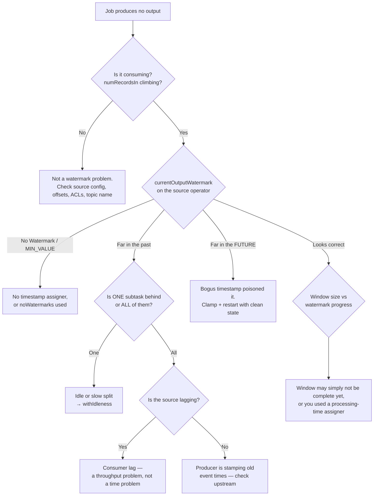

# Debugging watermarks

<PageMeta level="advanced" time="8 min" prereq={[['Propagation & idleness', '/docs/flink/watermarks/propagation-and-idleness']]} docs="docs/ops/monitoring/" />

<Objectives>

- Follow a decision tree from symptom to root cause without guessing
- Instrument a job so watermark problems are visible before they are reported
- Know the three metrics that matter and what "healthy" looks like for each

</Objectives>

## The decision tree



## The three metrics

| Metric | Meaning | Healthy |
| --- | --- | --- |
| `currentOutputWatermark` | Event-time progress this operator has announced | Within `bound + a few seconds` of wall clock |
| `currentInputWatermark` | The minimum of its inputs | Tracks the output watermark |
| `numLateRecordsDropped` | Records silently discarded by a window | 0, or a small stable number you have decided is acceptable |

The derived number that actually belongs on your dashboard:

```text
watermarkLag = currentProcessingTime - currentOutputWatermark
```

For a healthy live job this sits at roughly your out-of-orderness bound and stays
flat. A rising line means event time is falling behind, and it will show up here
minutes before it shows up as a missing dashboard.

## Making it visible from inside the job

Two techniques worth having in your toolkit.

**A probe operator** that logs watermark progress per subtask:

```java
public class WatermarkProbe<T> extends ProcessFunction<T, T> {

    private transient long lastLogged = 0;

    @Override
    public void processElement(T value, Context ctx, Collector<T> out) {
        long now = System.currentTimeMillis();
        if (now - lastLogged > 10_000) {          // log at most every 10s
            long wm = ctx.timerService().currentWatermark();
            LOG.info("subtask={} watermark={} lag={}ms recordTs={}",
                     getRuntimeContext().getTaskInfo().getIndexOfThisSubtask(),
                     wm, now - wm, ctx.timestamp());
            lastLogged = now;
        }
        out.collect(value);
    }
}
```

Insert it after the source and again after the shuffle. Comparing the two tells
you immediately whether the problem is upstream or created by the shuffle.

**A lag histogram** in the timestamp assigner, so you can tune the bound with
evidence instead of intuition:

```java
.withTimestampAssigner((event, recordTs) -> {
    long t = event.eventTime();
    lagHistogram.update(System.currentTimeMillis() - t);
    return t;
})
```

Ship the p50/p95/p99 of that histogram. Your out-of-orderness bound should sit
just above p99. When the histogram shifts, you know before your numbers do.

## Reproducing it in a test

Watermark bugs are cheap to unit-test and expensive to debug in production.
`MiniCluster` plus a source that emits explicit watermarks gives you exact
control:

```java
@Test
void lateEventGoesToSideOutput() throws Exception {
    StreamExecutionEnvironment env =
        StreamExecutionEnvironment.getExecutionEnvironment();
    env.setParallelism(1);

    OutputTag<Click> late = new OutputTag<>("late"){};

    // Hand-built stream: timestamps and watermarks under your control
    SingleOutputStreamOperator<Long> counts = env
        .fromData(
            click("a", 1_000L),
            click("a", 2_000L),
            click("a",   500L))     // arrives after the watermark passes it
        .assignTimestampsAndWatermarks(
            WatermarkStrategy.<Click>forMonotonousTimestamps()
                .withTimestampAssigner((c, ts) -> c.eventTime()))
        .keyBy(Click::page)
        .window(TumblingEventTimeWindows.of(Duration.ofSeconds(1)))
        .sideOutputLateData(late)
        .aggregate(new CountAgg());

    // assert the side output received exactly the 500ms record
}
```

<Callout type="prod" title="Test the failure, not just the happy path">

Three tests every event-time job should have:

1. An out-of-order record inside the bound lands in the correct window.
2. A record beyond the bound lands in the **side output**, not silently nowhere.
3. With one of two sources producing nothing, windows still fire — this is the `withIdleness` regression test, and it is the one that catches the outage.

</Callout>

## Symptom table

| Symptom | Most likely cause | Confirm by | Fix |
| --- | --- | --- | --- |
| No output, job healthy | Idle partition | One subtask shows `No Watermark` | `withIdleness` |
| Output stopped at a specific time | Producer for one partition died | Watermark frozen at that timestamp | Fix producer; `withIdleness` limits blast radius |
| Everything is late after a deploy | Watermark jumped to the future | `currentOutputWatermark` is absurd | Clamp timestamps; restart without the poisoned state |
| Output correct but very delayed | Bound too large | Watermark lag ≈ the bound | Lower the bound; side-output the tail |
| Some results missing, no errors | Late records dropped silently | `numLateRecordsDropped` is non-zero | `sideOutputLateData` and measure |
| OOM during a replay | One partition racing ahead | Huge state, uneven source progress | `withWatermarkAlignment` |
| Windows fire immediately with tiny counts | Processing-time assigner used by mistake | `TumblingProcessingTimeWindows` in the code | Use the event-time assigner |
| Watermark advances then stalls forever | Bounded source finished, unbounded one did not | Mixed source types | Check for a `fromData`/finite source left in the job |

<Callout type="mistake" title="The one that wastes the most time">

Assuming the problem is the window when it is the watermark.

If windows are not firing, **do not** start changing window sizes, triggers, or
lateness settings. Look at `currentOutputWatermark` first. Nine times in ten the
window logic is perfectly correct and event time simply is not moving.

</Callout>

<Expert>

**Watermarks in a savepoint.** They are not stored. On restore, the watermark
restarts from `Long.MIN_VALUE` and is rebuilt from replayed data. For a job with
long windows this means a period after every restart where the watermark climbs
back up — during which timers that were about to fire do not, and results appear
delayed. Expected behaviour, frequently mistaken for a bug.

**Watermarks in `BATCH` execution mode.** There are none during execution; a
single watermark of `Long.MAX_VALUE` is emitted at the end, firing every window at
once. So an event-time job that "works in batch mode" has not proved anything
about its watermark configuration.

**Two-input operators.** `CoProcessFunction` and interval joins take the minimum
across *both* inputs. A common bug is joining a high-volume stream with a
low-volume config stream and forgetting the config stream needs a watermark
strategy too — it will pin the whole join at `Long.MIN_VALUE`.

**`processWatermark` for custom operators.** If you implement `AbstractStreamOperator`
directly, you must override `processWatermark(Watermark)` and forward it, or
downstream event time stops at your operator. Missing this is a classic
custom-operator bug.

</Expert>

<Callout type="remember">

Check `currentOutputWatermark` before you change anything else. Alert on watermark
lag. And a job with zero late records might be perfectly tuned — or its event time
might be frozen.

</Callout>

## Next

**[Level 4 — why windows?](/docs/flink/windows/why-windows)** — turning an infinite stream into finite answers.
