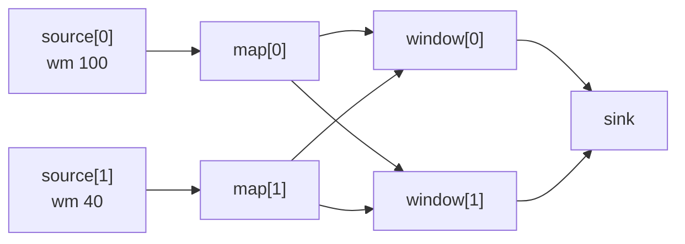

# Watermark propagation and idleness

<PageMeta level="advanced" time="11 min" prereq={[['Watermark generation', '/docs/flink/watermarks/generation']]} docs="docs/dev/datastream/event-time/generating_watermarks/" />

<Objectives>

- Apply the minimum rule to a multi-input operator and predict the result
- Diagnose "job is healthy but emits nothing" in under a minute
- Choose between `withIdleness` and `withWatermarkAlignment` — they solve opposite problems

</Objectives>

## The minimum rule

An operator with several input channels has one watermark, and it is the
**minimum** of what its inputs have told it.

```text
                 ┌──────────────┐
  wm=100s ──────▶│              │
  wm= 40s ──────▶│   operator   │──────▶ emits wm = 40s
  wm=105s ──────▶│              │
                 └──────────────┘
```

It has to be. The operator cannot claim "everything up to 100s has arrived" while
one input might still deliver a record from 45s.

<Callout type="key">

**Event time in a Flink job moves at the speed of its slowest input.** Not the
average. Not the majority. The slowest.

Every watermark incident you will ever debug is a corollary of this sentence.

</Callout>

Where this applies:

- A `keyBy` shuffle — every downstream subtask has an input channel from *every* upstream subtask, so it is the minimum across the whole upstream operator
- A `union` of two streams
- A `connect` / `CoProcessFunction`
- A source subtask reading several splits (minimum across per-split generators)

## Failure mode 1 — the idle partition

This is the most common Flink support ticket in existence.

```text
Kafka topic "orders", 4 partitions:

partition 0:  ████████████  active, wm = 12:05:00
partition 1:  ████████████  active, wm = 12:04:58
partition 2:  ████████████  active, wm = 12:05:01
partition 3:  (nothing since 09:00 — a region with no night traffic)
                            wm = 09:00:00
                                   ↓
                job watermark = 09:00:00
                                   ↓
        no window has fired in three hours
```

The symptoms are unusually nasty:

- The job status is **RUNNING**
- Records are being consumed; `numRecordsIn` climbs steadily
- Checkpoints succeed
- CPU looks normal
- **No output. No errors. No warnings.**
- State grows continuously, because no window ever closes

Nothing in the default dashboards says anything is wrong.

### The fix

```java
WatermarkStrategy
    .<Order>forBoundedOutOfOrderness(Duration.ofSeconds(10))
    .withTimestampAssigner((e, ts) -> e.eventTime())
    .withIdleness(Duration.ofMinutes(1));      // ← this line
```

After one minute without a record, that split marks itself **idle** and is
excluded from the minimum. The remaining active partitions drive event time
forward, windows fire, output resumes.

When the idle partition produces again it rejoins — and its first records may be
late, because time moved on without it. That is the trade, and it is nearly always
the right one.

In SQL:

```sql
SET 'table.exec.source.idle-timeout' = '1min';
```

<Callout type="mistake">

Setting `withIdleness` shorter than your traffic's natural quiet periods. If a
partition normally goes 30 seconds between records and you set idleness to 10
seconds, it will be repeatedly marked idle and its records will be repeatedly
late — you have created the very problem you were avoiding.

Rule of thumb: idleness should be comfortably larger than the p99 inter-arrival
gap on your quietest partition, and larger than your out-of-orderness bound.

</Callout>

## Failure mode 2 — the racing partition

The opposite problem, and it appears whenever you replay history.

```text
Replaying 30 days of history from the earliest offset:

partition 0:  fast consumer, already at day 30, wm = Aug 07
partition 1:  slow consumer, still at day 2,    wm = Jul 10

Window operator: minimum = Jul 10 (fine, correct)

But the operator BUFFERS everything partition 0 has sent — 28 days of
records — waiting for partition 1 to catch up. State explodes, the job
OOMs or checkpoints time out.
```

Here the watermark is *correct*; the problem is resource consumption. One input
raced ahead and everything it produced has to be held.

### The fix

```java
WatermarkStrategy
    .<Order>forBoundedOutOfOrderness(Duration.ofSeconds(10))
    .withTimestampAssigner((e, ts) -> e.eventTime())
    .withWatermarkAlignment(
        "orders",                    // alignment group
        Duration.ofSeconds(30),      // max drift between sources in the group
        Duration.ofSeconds(1));      // how often to check
```

Any source more than 30 seconds of event time ahead of the group **pauses
reading** until the others catch up. Memory stays bounded and the backfill
completes instead of dying.

<Callout type="prod" title="Backfills are where this bites">

Under normal live traffic all partitions advance together and alignment rarely
triggers. The moment you replay from `earliest-offset` — a new pipeline, a
reprocessing run, a recovery after a long outage — partitions diverge wildly.

Enable alignment on any job that will ever be backfilled, which is every job.
The cost when it is not needed is essentially zero.

</Callout>

<Compare>
  <CompareCard title="withIdleness" rows={[
    ['Problem', 'A source produces NOTHING and freezes event time'],
    ['Effect', 'Excludes silent splits from the minimum'],
    ['Symptom it fixes', 'No output at all, indefinitely'],
    ['Cost', 'Records from a resumed partition may be late'],
  ]} />
  <CompareCard title="withWatermarkAlignment" rows={[
    ['Problem', 'A source races AHEAD and forces others to be buffered'],
    ['Effect', 'Pauses sources that drift too far forward'],
    ['Symptom it fixes', 'State explosion / OOM during replay and backfill'],
    ['Cost', 'Throughput of the fastest source is throttled'],
  ]} />
</Compare>

Use both. They are not alternatives.

## Propagation through the topology



After the `keyBy` shuffle, **both** window subtasks receive channels from **both**
map subtasks. So both compute `min(100, 40) = 40`.

This is the important consequence: **one slow subtask holds back every subtask
downstream of the shuffle, not just the ones "near" it**. There is no locality to
exploit; a shuffle makes the whole operator move at the pace of the slowest
upstream subtask.

A chained operator is different: no channel, no minimum, the watermark passes
straight through in the same thread.

## Diagnosing it in 60 seconds

When a job produces no output:

1. **Flink UI → the operator → Watermarks tab.** It lists `currentInputWatermark` per subtask. Look for the one that is wildly behind, or shows `Long.MIN_VALUE` (displayed as `No Watermark`).
2. Trace it upstream. Which source subtask, which split?
3. Then ask the three questions:

| Finding | Cause | Fix |
| --- | --- | --- |
| One subtask has `No Watermark` | A split has never produced a record | `withIdleness` |
| One subtask is hours behind, others current | Idle or very slow partition | `withIdleness`, or fix the producer |
| **All** subtasks show `No Watermark` | No timestamp assigner at all, or `noWatermarks()` | Attach a `WatermarkStrategy` |
| Watermark is in the year 2100 | A bogus future-dated record | Clamp timestamps; the job must be restarted with clean state |
| Watermark advances, windows still do not fire | Window is longer than you think, or the wrong assigner | Check the window size and that it is an *event-time* assigner |

<Callout type="prod" title="The alert every Flink job should have">

```text
alert: EventTimeStalled
expr:  time() - (flink_taskmanager_job_task_operator_currentOutputWatermark / 1000) > 600
for:   10m
```

"Event time is more than 10 minutes behind wall clock." This single alert catches
idle partitions, dead producers, stuck watermarks, and severe lag — the entire
class of silent failures — long before anyone notices missing dashboards.

</Callout>

<Expert>

**`Long.MIN_VALUE` vs idle.** A channel that has never emitted a watermark
contributes `Long.MIN_VALUE` to the minimum, freezing the operator's watermark
completely. A channel marked *idle* is removed from the minimum calculation
entirely. These are different states with very different effects, and the UI shows
`No Watermark` for the first.

**Status propagation.** Idleness is not just a source-local concept — a
`WatermarkStatus` element flows downstream, so an operator whose inputs are all
idle becomes idle itself and propagates that. This lets idleness travel through a
multi-stage topology rather than being lost at the first shuffle.

**Alignment groups span sources.** The first argument to `withWatermarkAlignment`
is a group name. Two *different* sources (say Kafka and a CDC stream) placed in
the same group are aligned against each other. This is exactly what you want for
a stream-stream join where one side replays much faster than the other.

**Interaction with backpressure.** A back-pressured operator processes records
slowly, so its watermark advances slowly, so downstream windows fire late and
retain state longer, which enlarges checkpoints, which worsens backpressure. If
watermark lag and backpressure appear together, fix the backpressure first — the
watermark symptom is usually secondary.

</Expert>

<Callout type="remember">

Watermark = minimum across all inputs. One silent partition freezes the whole
job with no error. `withIdleness` for silence, `withWatermarkAlignment` for
racing. Alert on watermark lag, not just on job status.

</Callout>

## Next

**[Debugging watermarks](/docs/flink/watermarks/debugging)** — a systematic procedure.
