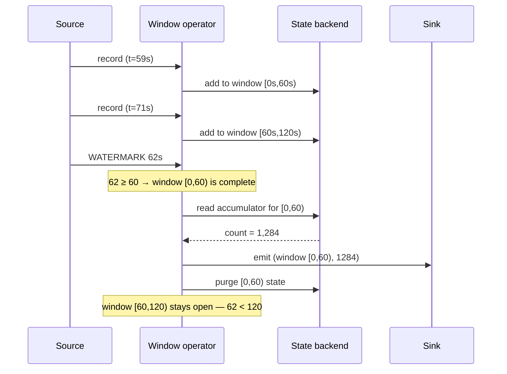

# What is a watermark?

<PageMeta level="intermediate" time="12 min" prereq={[['Timestamp assignment', '/docs/flink/time/timestamp-assignment']]} />

<Objectives>

- State what a watermark asserts, in one sentence, precisely
- Explain why a watermark is a decision rather than a fact
- Predict what happens to a window, a timer, and a join when the watermark advances

</Objectives>

## In one sentence

<Callout type="mental" title="Mental Model — the watermark">

A watermark is Flink saying:

> **"I believe I have now seen everything with an event time up to T."**

It is a claim, travelling through the stream alongside your records. It is not a
fact, and Flink knows it is not a fact.

</Callout>

## Why does it exist?

Because of an impossible question.

You want counts per minute. At some point you must emit the count for the
`12:00–12:01` minute. To do that, you must answer:

> "Has everything from 12:00–12:01 arrived?"

On an unbounded, distributed, out-of-order stream, **this question is
unanswerable**. There is no message saying "that was the last one". A phone might
still be in a tunnel. A partition might be lagging. A producer might be retrying.

So Flink does not answer it. Flink *decides* it, using a rule you configure, and
announces the decision. That announcement is the watermark.

<Callout type="key">

The watermark converts an **unanswerable question** ("is it complete?") into a
**tunable engineering trade-off** ("how long am I willing to wait?").

This is the whole idea. Everything else in event-time processing is a consequence.

</Callout>

## Real-world analogy

An exam invigilator.

The exam starts at 9:00. At 9:05 nobody has arrived for three minutes. The
invigilator must decide: start now, or keep waiting?

- Wait forever → the exam never starts.
- Start immediately at 9:00 → anyone stuck in traffic fails.
- **Wait 10 minutes past the start, then begin** → the sensible policy. Latecomers get handled by a separate rule: maybe they still sit the exam in another room, maybe they do not.

"Wait 10 minutes" is the bounded out-of-orderness. "Begin" is the window firing.
"Another room" is the side output for late data. And the invigilator is not
*right* — they made a defensible decision under uncertainty, which is exactly
what a watermark is.

## The rule

For the strategy you will use almost always:

```text
watermark = (largest event timestamp seen so far) − (out-of-orderness bound) − 1ms
```

```text
Events arrive:  t=10   t=12   t=8    t=15   t=14
max seen:        10     12     12     15     15
watermark(b=3):   6      8      8     11     11
                  ↑
        "everything up to t=6 has arrived"
        — an assumption, based on the bet that
          nothing is more than 3s out of order
```

Notice: the watermark **lags** the newest data by exactly the bound. That lag is
your latency floor for event-time results, and you chose it.

Notice also: `t=8` arrived after `t=12` and caused no problem at all. It was out
of order but not late — the watermark was still at 8, not past it.

## See it move

<WatermarkLab />

Step through and watch three things:

1. The **grey dashed line** (max timestamp seen) jumps forward whenever a new maximum arrives.
2. The **blue line** (the watermark) follows it, exactly `bound` behind.
3. A window band turns green the instant the blue line passes its right edge. That is the window firing — and nothing else causes it.

## What the watermark actually triggers

A watermark reaching an operator is not decorative. It causes work.



Concretely, a watermark of value *W* arriving at an operator:

| Operator | What it does |
| --- | --- |
| **Window** | Fires and purges every window whose `end ≤ W` |
| **Event-time timers** | Fires every registered timer with `time ≤ W`, in timestamp order |
| **Interval join** | Cleans up buffered records that can no longer match |
| **Any operator** | Forwards the watermark downstream, after doing its own work |
| **Sorting operators (batch)** | Releases records now known to be in order |

And once the watermark has passed *W*, any record arriving with timestamp `≤ W`
is **late**, with the consequences from
[the previous chapter](/docs/flink/time/out-of-order-and-late).

## Three properties that catch people out

### 1. Watermarks never go backwards

By construction. `BoundedOutOfOrdernessWatermarks` tracks the *maximum* timestamp
ever seen, so the watermark is monotonically non-decreasing.

This is why one bogus future-dated record poisons a job permanently: the watermark
jumps to the year 2100 and there is no mechanism to bring it back. Restarting from
a checkpoint does not help either — the watermark is recomputed from data, and
the bad record gets replayed.

### 2. The watermark is a minimum across inputs

An operator with multiple input channels sets its watermark to the **minimum**
across all of them. It must: it cannot claim completeness for time *T* if any
input might still deliver something older.

```text
channel 0 watermark: 100s
channel 1 watermark:  40s   ← the slow one
channel 2 watermark: 105s
                     ────
operator watermark:   40s
```

This one rule causes most watermark incidents in production: **the slowest input
sets the pace for everyone**. It is important enough to have its own page:
[propagation and idleness](/docs/flink/watermarks/propagation-and-idleness).

### 3. A watermark is a promise Flink cannot keep

`forBoundedOutOfOrderness(10s)` does not *make* events arrive within 10 seconds.
It asserts that they will, and processes accordingly. When the assertion is
wrong, the record is late.

<Callout type="mistake">

"I set the bound to 10 seconds, so events arriving after 10 seconds are
impossible."

The bound is a **policy**, not a guarantee about the world. Nothing stops a phone
from being offline for a week. The bound decides what Flink does about it.

</Callout>

## Choosing the bound

| Bound | Latency | Correctness | Use when |
| --- | --- | --- | --- |
| `0` / monotonous | Lowest | Any reordering is lost | Single ordered partition, or you truly do not care |
| **1–10s** | Low | Good | **Most streaming jobs.** Start here. |
| 1–5 min | Noticeable | Very good | Mobile clients, unreliable networks, IoT |
| Hours | Bad | Nearly complete | Almost never — use a batch backfill instead |

<Callout type="prod">

Do not pick this number by intuition, and do not pick it once. Measure
`processingTime - eventTime` as a histogram, set the bound near p99, side-output
the rest, and alert when the distribution shifts.

A bound is a statement about your *current* upstream. When mobile clients change,
or a producer is rewritten, or you add a region, the statement stops being true —
and the metric is how you find out.

</Callout>

<Expert>

**Watermarks are records on the wire.** A `Watermark` is a subclass of
`StreamElement`, serialised into the same network buffers as your data and
broadcast to every downstream channel. They cost bandwidth: at the default 200ms
interval with high parallelism you get a lot of tiny control messages. Raising
`pipeline.auto-watermark-interval` reduces that overhead at the cost of coarser
event-time granularity.

**The `-1` millisecond.** `BoundedOutOfOrdernessWatermarks` emits
`maxTimestamp - outOfOrderness - 1`. The semantics of watermark *W* are "no more
events with timestamp **≤ W**", so subtracting one keeps an event arriving exactly
at `maxTimestamp - bound` on time. Off-by-one errors here produce boundary bugs
that only show up on round timestamps.

**Idle vs. empty.** A source with no data emits no watermark at all — it is not
that the watermark is old, it is that there is none. Downstream, the minimum rule
treats that channel as `Long.MIN_VALUE`, freezing event time completely. This is
different from a *slow* channel, and it is why `withIdleness` exists as a separate
mechanism.

**Watermarks and checkpoints are independent.** A watermark is not part of a
checkpoint barrier and carries no consistency meaning. They flow through the same
channels and are otherwise unrelated — a common interview trap.

</Expert>

<Callout type="remember">

A watermark says "I believe I have seen everything up to T". It is a decision
under uncertainty, tuned by you. It fires windows, fires timers, cleans up joins,
and defines what "late" means. And it is always the minimum across all inputs.

</Callout>

## Next

**[Watermark generation](/docs/flink/watermarks/generation)** — the code behind the rule, including custom generators.
