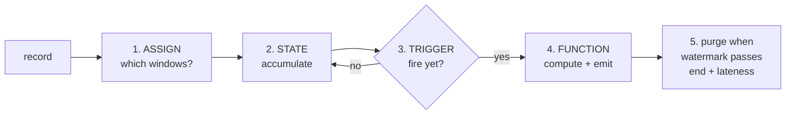

# Why windows?

<PageMeta level="intermediate" time="7 min" prereq={[['Debugging watermarks', '/docs/flink/watermarks/debugging']]} />

<Objectives>

- Explain why aggregation over an unbounded stream requires scoping
- Describe the four stages every windowed record passes through
- Recognise when you should use a `ProcessFunction` instead of a window

</Objectives>

## The problem

You have an infinite stream of purchases. Your manager asks for "total revenue".

You cannot answer. The stream never ends, so the total never exists. Any number
you produce is out of date the instant you produce it.

So you change the question until it has an answer:

> "Total revenue **per minute**."

Now every answer is finite, computable, and correct forever. That reframing — from
"all the data" to "a bounded slice of the data" — is what a window is.

<Callout type="mental">

A window is a **bucket with a rule for when it is full and gets emptied**.

Records fall into buckets. When Flink believes a bucket has everything it is going
to get — which is what the [watermark](/docs/flink/watermarks/what-is-a-watermark)
tells it — the bucket is computed, emitted, and thrown away.

Every window type in Flink is just a different rule for which bucket a record
falls into.

</Callout>

## The four-stage machine

Every windowed record goes through exactly these stages. Knowing them makes every
window bug diagnosable.



| Stage | Decided by | You control it with |
| --- | --- | --- |
| **1. Assign** | `WindowAssigner` | `TumblingEventTimeWindows.of(...)`, session windows, etc. |
| **2. Accumulate** | The window function's type | `reduce` / `aggregate` (one accumulator) vs `process` (every record) |
| **3. Trigger** | `Trigger` | Default: fire when watermark passes the window end. Override for early results. |
| **4. Compute** | `WindowFunction` | `ReduceFunction`, `AggregateFunction`, `ProcessWindowFunction` |
| **5. Purge** | Watermark + allowed lateness | `allowedLateness(...)` |

When a window misbehaves, identify the stage:

- Wrong records in the result → **stage 1** (assignment)
- State too large → **stage 2** (you buffered instead of aggregating)
- Never fires → **stage 3**, and almost always because the watermark is stuck
- Fires more than once → **stage 3** (a custom trigger or allowed lateness)
- Memory grows forever → **stage 5** (nothing is being purged)

## A window is always keyed (or you will regret it)

```java
// ✅ Keyed — parallel, scales, one bucket per key
stream.keyBy(Click::page)
      .window(TumblingEventTimeWindows.of(Duration.ofMinutes(1)))
      .aggregate(new CountAgg());

// ⚠️ Non-keyed — parallelism 1. The whole stream through one subtask.
stream.windowAll(TumblingEventTimeWindows.of(Duration.ofMinutes(1)))
      .aggregate(new CountAgg());
```

`windowAll` forces parallelism 1, because a global window over a partitioned
stream cannot be computed in parallel. On any real volume it becomes the
bottleneck for the entire job.

If you genuinely need a global aggregate, do it in two phases: aggregate per key
in parallel, then aggregate the (much smaller) per-key results. See
[performance](/docs/flink/scale/performance).

## When *not* to use a window

Windows are the right tool for "aggregate over a time slice". They are the wrong
tool for a surprising number of things people use them for.

| You want | Use | Not |
| --- | --- | --- |
| Count per minute | Window | — |
| "Alert if 3 failures within 60s" | `KeyedProcessFunction` + timer | A 60s window — the pattern can straddle two window boundaries and be missed |
| "Alert if no heartbeat for 5 min" | `KeyedProcessFunction` + processing-time timer | A window — an *absence* of events never creates a window |
| Running total, emitted per record | `keyBy().sum()` or a `ValueState` | A window — you do not want to wait |
| Deduplicate within 10 minutes | `KeyedProcessFunction` + state TTL | A window — deduplication is not an aggregate |
| Session activity | Session windows | Fixed windows |

<Callout type="mistake" title="The window-boundary trap">

"Alert if 3 failed logins in 60 seconds", implemented as a 60-second tumbling
window:

```text
window [12:00, 12:01)   failures at 12:00:58, 12:00:59  → count 2, no alert
window [12:01, 12:02)   failure  at 12:01:01            → count 1, no alert
```

Three failures in three seconds, and no alert, because the window boundary fell
between them. The requirement was about a *sliding* 60 seconds, not about clock
minutes.

Correct implementations: a sliding window with a small slide (expensive — each
record is in many windows), or a `KeyedProcessFunction` holding a list of recent
failure timestamps with a timer to expire them (cheap, exact). The second is
almost always the right answer.

</Callout>

<Callout type="hood">

Window state is stored per `(key, window)` pair, in a namespaced keyed state
entry. The `Window` object itself — for time windows, a `start` and `end` `long` —
is the namespace.

This is why a sliding window with a small slide is so expensive: a 1-hour window
sliding every 1 minute puts **each record into 60 windows**, so each record is
written into 60 separate state entries. It is also why session windows are
special: their namespace *changes* as sessions merge, which requires the state
backend to support merging namespaces.

</Callout>

<Callout type="remember">

A window scopes an unbounded stream into a computable slice. Assign → accumulate
→ trigger → compute → purge. If it never fires, the problem is the watermark, not
the window. And if the requirement is about patterns or absence, reach for a
`ProcessFunction` instead.

</Callout>

## Next

**[Window types](/docs/flink/windows/window-types)** — tumbling, sliding, session, global.
